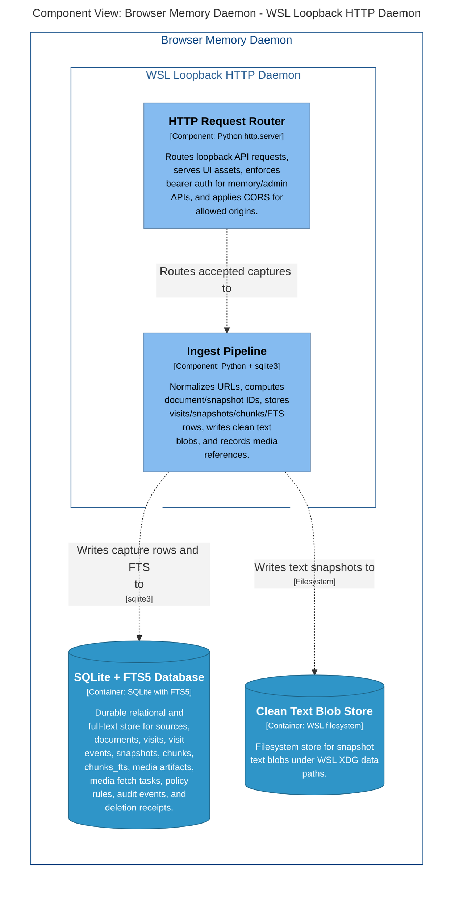

# Daemon Ingest Components

> Generated Markdown wrapper for C4 view `DaemonIngestComponents`. Canonical model: [`workspace.dsl`](../../workspace.dsl).

<!-- Generated from Structurizr Mermaid export; refresh from architecture/workspace.dsl. -->

## Derived artifacts

| Artifact | Link |
|---|---|
| Mermaid source | [`structurizr-DaemonIngestComponents.mmd`](../structurizr-DaemonIngestComponents.mmd) |
| Mermaid SVG | [`structurizr-DaemonIngestComponents.svg`](../structurizr-DaemonIngestComponents.svg) |
| Mermaid PNG | [`structurizr-DaemonIngestComponents.png`](../structurizr-DaemonIngestComponents.png) |
| DOT source | [`structurizr-DaemonIngestComponents.dot`](../dot/structurizr-DaemonIngestComponents.dot) |
| Graphviz SVG | [`structurizr-DaemonIngestComponents.svg`](../dot-rendered/structurizr-DaemonIngestComponents.svg) |
| Graphviz PNG | [`structurizr-DaemonIngestComponents.png`](../dot-rendered/structurizr-DaemonIngestComponents.png) |
