# Ops Containers

> Generated Markdown wrapper for C4 view `OpsContainers`. Canonical model: [`workspace.dsl`](../../workspace.dsl).

```mermaid
graph LR
  linkStyle default fill:#ffffff

  subgraph diagram ["Container View: Browser Memory Daemon"]
    style diagram fill:#ffffff,stroke:#ffffff

    subgraph 4 ["Browser Memory Daemon"]
      style 4 fill:#ffffff,stroke:#0b4884,color:#0b4884

      14["<div style='font-weight: bold'>WSL Loopback HTTP Daemon</div><div style='font-size: 70%; margin-top: 0px'>[Container: Python 3.11, ThreadingHTTPServer]</div><div style='font-size: 80%; margin-top:10px'>Authenticated loopback HTTP<br />API that handles capture,<br />visit events, media artifact<br />upload/fetch/purge, exact<br />search,<br />recent/timeline/detail,<br />policy rules, doctor, forget,<br />and static UI serving.</div>"]
      style 14 fill:#438dd5,stroke:#2e6295,color:#ffffff
      25["<div style='font-weight: bold'>Local Web UI</div><div style='font-size: 70%; margin-top: 0px'>[Container: HTML/CSS/JavaScript served by daemon]</div><div style='font-size: 80%; margin-top:10px'>Static browser UI for exact<br />search, recent/timeline<br />views, document/snapshot<br />detail, media artifact<br />opening, policy rules,<br />doctor, and forget-domain<br />operations.</div>"]
      style 25 fill:#438dd5,stroke:#2e6295,color:#ffffff
      26["<div style='font-weight: bold'>CLI</div><div style='font-size: 70%; margin-top: 0px'>[Container: Python argparse]</div><div style='font-size: 80%; margin-top:10px'>Command-line interface for<br />serving the daemon,<br />health/doctor/search/recent/timeline/detail,<br />policy/forget, capture<br />fixtures, media worker, and<br />media cache operations.</div>"]
      style 26 fill:#438dd5,stroke:#2e6295,color:#ffffff
      27[("<div style='font-weight: bold'>SQLite + FTS5 Database</div><div style='font-size: 70%; margin-top: 0px'>[Container: SQLite with FTS5]</div><div style='font-size: 80%; margin-top:10px'>Durable relational and<br />full-text store for sources,<br />documents, visits, visit<br />events, snapshots, chunks,<br />chunks_fts, media artifacts,<br />media fetch tasks, policy<br />rules, audit events, and<br />deletion receipts.</div>")]
      style 27 fill:#2f95c8,stroke:#20688c,color:#ffffff
      28[("<div style='font-weight: bold'>Clean Text Blob Store</div><div style='font-size: 70%; margin-top: 0px'>[Container: WSL filesystem]</div><div style='font-size: 80%; margin-top:10px'>Filesystem store for snapshot<br />text blobs under WSL XDG data<br />paths.</div>")]
      style 28 fill:#2f95c8,stroke:#20688c,color:#ffffff
      29[("<div style='font-weight: bold'>Media Blob Cache</div><div style='font-size: 70%; margin-top: 0px'>[Container: WSL filesystem]</div><div style='font-size: 80%; margin-top:10px'>Bounded and disposable<br />filesystem cache for stored<br />image/video/audio blobs with<br />purge and rehydrate<br />semantics.</div>")]
      style 29 fill:#2f95c8,stroke:#20688c,color:#ffffff
    end

    25-. "<div>Calls authenticated read,<br />admin, media, and forget APIs<br />on</div><div style='font-size: 70%'>[HTTP/JSON]</div>" .->14
    26-. "<div>Calls health, read, admin,<br />capture-fixture, and forget<br />APIs on</div><div style='font-size: 70%'>[HTTP/JSON]</div>" .->14
    26-. "<div>Runs media-worker and<br />media-cache commands against</div><div style='font-size: 70%'>[sqlite3]</div>" .->27
    26-. "<div>Purges and rehydrates media<br />blobs through</div><div style='font-size: 70%'>[Filesystem]</div>" .->29
    14-. "<div>Reads and writes metadata,<br />FTS, tasks, audit, and<br />receipts in</div><div style='font-size: 70%'>[sqlite3]</div>" .->27
    14-. "<div>Reads and writes text<br />snapshots in</div><div style='font-size: 70%'>[Filesystem]</div>" .->28
    14-. "<div>Stores, serves, purges, and<br />rehydrates media blobs in</div><div style='font-size: 70%'>[Filesystem]</div>" .->29

  end
```

<!-- Generated from Structurizr Mermaid export; refresh from architecture/workspace.dsl. -->

## Derived artifacts

| Artifact | Link |
|---|---|
| Mermaid source | [`structurizr-OpsContainers.mmd`](../structurizr-OpsContainers.mmd) |
| Mermaid SVG | [`structurizr-OpsContainers.svg`](../structurizr-OpsContainers.svg) |
| Mermaid PNG | [`structurizr-OpsContainers.png`](../structurizr-OpsContainers.png) |
| DOT source | [`structurizr-OpsContainers.dot`](../dot/structurizr-OpsContainers.dot) |
| Graphviz SVG | [`structurizr-OpsContainers.svg`](../dot-rendered/structurizr-OpsContainers.svg) |
| Graphviz PNG | [`structurizr-OpsContainers.png`](../dot-rendered/structurizr-OpsContainers.png) |
