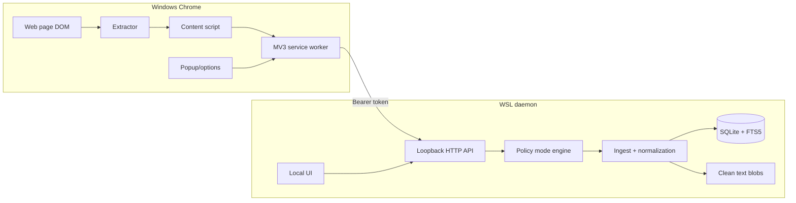

# Browser Memory Daemon Architecture — Windows Chrome to WSL Recall

> **Audience:** maintainers and future agents.
> **Mission:** provide local-first, searchable personal browser recall from Windows Chrome with durable storage in WSL.
> **Current default:** `policy_mode=all` for maximum recall.

---

## Mission and ConOps

The system shall enable Operator to reconstruct recently viewed web content by capturing Chrome page text locally, storing it in WSL, and exposing exact search, timeline, detail, lifecycle, and deletion tools without cloud dependency.

| Field | Current design |
|---|---|
| Operator | Operator only. |
| Browser surface | Windows Chrome daily-driver profile plus Chrome for Testing in e2e. |
| Capture path | MV3 extension → service worker → authenticated localhost HTTP. |
| Storage owner | WSL daemon. Chrome profile is not the durable memory store. |
| Search model | Exact SQLite FTS5 first. No embeddings yet. |
| Default policy posture | `all`: no daemon redaction or URL policy filtering, maximum recall, DOM extraction skip retained. |
| Deletion model | Forget by domain/URL with deletion receipts. |
| Validation target | Real Windows Chrome can capture, search, and forget synthetic pages through WSL. |

---

## Requirements trace

| ID | Requirement | Implementation | Verification |
|---|---|---|---|
| REQ-001 | Capture Chrome page text into WSL. | `extension/src/*`, `/capture`, `ingest.py` | `scripts/run-real-chrome-e2e.sh` |
| REQ-002 | Keep durable data out of repo and Chrome profile. | `RuntimeConfig`, XDG paths, `.gitignore` | `doctor`, secret scan, runtime-root tests |
| REQ-003 | Service worker owns daemon communication. | `service_worker.js` | extension unit tests + real e2e |
| REQ-004 | Authenticated loopback API. | `app.py`, bearer token | HTTP e2e unauthorized test |
| REQ-005 | Adjustable capture policy modes. | `policy.py`, `extractor.js`, options/popup | daemon + extension unit tests |
| REQ-006 | `all` mode disables URL filtering and daemon redaction while still skipping hidden/form/editable/script/style/no-script DOM text. | `policy_mode=all`, no-redaction ingest path | unit/integration + real e2e all-mode expectations |
| REQ-007 | Non-all modes preserve redaction and stricter policy options. | `redact_text`, `redact_url`, strict/balanced/recall | policy and ingest tests |
| REQ-008 | Exact search with citations. | `chunks_fts`, `search.py`, detail APIs | integration/e2e search tests |
| REQ-009 | Dedupe repeated unchanged captures. | normalized URLs + text hash snapshots | ingest tests |
| REQ-010 | Capture SPA/delayed pages. | content-script delayed passes + history hooks | real Chrome SPA fixture |
| REQ-011 | Track dwell/lifecycle metadata. | `/visit-events`, `lifecycle.py` | lifecycle tests + real e2e |
| REQ-012 | Local UI and CLI operations. | `ui/`, `cli.py`, admin APIs | admin/CLI e2e tests |
| REQ-013 | Delete stored memory with receipts. | `forget.py`, `deletion_receipts` | forget integration/e2e tests |
| REQ-014 | Real daily-driver install path. | `install-daily-driver.sh` | WSL + Windows health checks |

---

## Logical decomposition

| Component | Responsibility | Notes |
|---|---|---|
| Chrome manifest | Permission envelope and extension entrypoints. | Uses `<all_urls>` so `all` mode is meaningful. |
| Extractor | Traverse DOM and build capture payload. | Policy-aware; all modes skip hidden/form/editable/script/style/no-script DOM text. |
| Content script | Schedule initial/delayed/SPA captures and scroll tracking. | Reads `policyMode` from extension storage. |
| Service worker | Auth, queues, injection, lifecycle state, daemon POSTs. | Content scripts never call daemon directly. |
| Daemon API | Auth, CORS, routing, UI asset serving. | `/health` public loopback; memory APIs tokened. |
| Policy engine | Mode-specific allow/block/redact decisions. | `all`, `recall`, `balanced`, `strict`. |
| Ingest pipeline | Normalize, store visits/documents/snapshots/chunks/FTS plus related media artifact refs/blobs. | `all` bypasses redaction. |
| Lifecycle pipeline | Store metadata-only visit events and update dwell. | Uses policy mode for URL redaction/filtering. |
| Ops/read model | Search, recent, timeline, detail, doctor. | Captured text remains untrusted evidence. |
| Deletion pipeline | Domain/URL forget and receipt creation. | Removes DB rows, FTS rows, text/media blobs, lifecycle rows. |

---

## Data flow

---

## Policy mode semantics

| Mode | URL filtering | DOM filtering | URL/body redaction | Persistent block rules |
|---|---|---|---|---|
| `all` | Off. Allows any absolute URL accepted by runtime. | Skips hidden/form/editable/script/style/no-script. | Off. | Ignored. |
| `recall` | Blocks incognito/browser-internal/file/non-web schemes. | Skips hidden/form/editable/script/style/no-script. | On. | Applied. |
| `balanced` | `recall` plus private hosts, known high-risk domains, high-risk query keys. | Same as `recall`. | On. | Applied. |
| `strict` | Legacy broad keyword filters for domains/paths/query keys. | Same as `recall`. | On. | Applied. |

`all` still has platform limits: Chrome may refuse extension injection on browser-owned pages or pages outside extension permission/runtime access.

---

## Storage model

| Table/path | Role |
|---|---|
| `documents` | Stable normalized document identity. |
| `visits` | Each captured visit, original/stored URL, dwell, browser profile. |
| `visit_events` | Metadata-only lifecycle segments. |
| `snapshots` | Distinct text versions per document. |
| `chunks` / `chunks_fts` | Searchable text chunks and exact FTS index. |
| `privacy_rules` | Block rules for non-`all` modes. |
| `audit_events` | Metadata-only operational audit. |
| `deletion_receipts` | Forget receipts and counts. |
| `~/.local/share/browser-memory-daemon/blobs/clean-text/` | Stored text snapshots. |

---

## Trust and safety boundaries

- Retrieved page text is untrusted evidence. It must not drive agent actions without operator intent.
- The daemon binds to loopback and uses bearer auth for memory/admin endpoints.
- The daily-driver token lives in WSL config and is copied into the local extension artifact during install.
- `all` mode intentionally removes daemon redaction and URL policy filtering; this is a local personal-recall tradeoff, not a multi-user default.
- No cloud LLM/vector/embedding pipeline is implemented.

---

## Open architecture lanes

| Lane | Status |
|---|---|
| Native messaging hardening | Planned. HTTP loopback remains current transport. |
| Semantic search | Planned only after explicit approval. |
| Retention/export/backup | Planned. |
| MCP/Hermes tool integration | Planned. |
| Rich allow/redact/quarantine policies | Planned; current explicit rules are block-only and ignored in `all`. |
