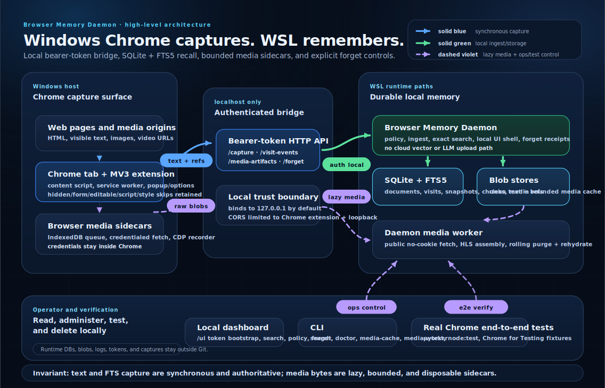

# Browser Memory Daemon Architecture — Windows Chrome to WSL Recall

> **Audience:** maintainers and future agents.
> **Mission:** provide local-first, searchable personal browser recall from Windows Chrome with durable storage in WSL.
> **Current default:** `policy_mode=all` for maximum recall.

---

## Mission and ConOps

The system shall enable Operator to reconstruct recently viewed web content by capturing Chrome page text locally, storing it in WSL, and exposing exact search, timeline, detail, lifecycle, and deletion tools without cloud dependency.

| Field | Current design |
|---|---|
| Operator | Operator only. |
| Browser surface | Windows Chrome daily-driver profile plus Chrome for Testing in e2e. |
| Capture path | MV3 extension → service worker → authenticated localhost HTTP. |
| Storage owner | WSL daemon owns local SQLite as complete text/provenance authority. Reconstructible derivatives stay under a separate local derivative root; disposable media may use a guarded WSL-mounted root plus an explicitly configured bounded local spool. Chrome profile is not the durable memory store. |
| Search model | Exact SQLite FTS5 first. No embeddings yet. |
| Default policy posture | `all`: no daemon redaction or URL policy filtering, maximum recall, DOM extraction skip retained. |
| Deletion model | Forget by domain/URL with same-transaction deletion receipts, durable blob tombstones, and retryable contained reconciliation. |
| Validation target | Real Windows Chrome can capture, search, and forget synthetic pages through WSL. |

## High-level architecture at a glance



Read the diagram as three contracts plus one operating surface:

| Lane | Meaning | Current implementation |
|---|---|---|
| Solid blue | Synchronous browser capture. | Chrome content script/service worker sends visible text, lifecycle events, and media references to the loopback API. |
| Solid green | Local authenticated ingest and storage. | The WSL daemon applies policy, commits complete cleaned text plus SQLite/FTS/provenance rows without touching blob storage, and serves token-gated read/delete APIs. |
| Dashed violet | Lazy media and operator/test control. | Browser/daemon sidecars fetch media bytes later; CLI, local dashboard, and real Chrome e2e exercise the same local surfaces. |

The fast path is text-first: complete cleaned page text, lifecycle metadata, and media references commit to local SQLite before any media bytes are fetched. Media sidecars run later in Chrome or the daemon; media bytes are bounded and disposable. New captures do not create clean-text filesystem sidecars. An unavailable external media root degrades media storage without blocking this transaction and never causes startup to create a shadow media tree.

Current storage topology:

- `BMD_DERIVATIVE_ROOT` owns reconstructible artifacts such as legacy clean-text sidecars. When unset, it remains at the legacy-compatible `BMD_BLOB_ROOT`; moving unresolved sidecars requires explicit migration.
- `BMD_MEDIA_ROOT` owns final media bytes. Explicit external roots require both a non-root mount and `.bmd-media-root-id` matching `BMD_MEDIA_ROOT_IDENTITY` before reads or writes.
- `BMD_MEDIA_SPOOL_ROOT` plus positive `BMD_MAX_MEDIA_SPOOL_BYTES` enables a local durable outage spool contained under the WSL data root. SQLite reservations count distinct in-flight writers while filesystem census counts committed and orphaned spool files.
- Migration version 10 records each artifact's `media-root` or `spool` tier. Dry-run-first spool draining streams and hash-verifies the destination, commits the tier transition, and only then removes the source.
- Migration version 11 adds durable `blob_storage_records`. Forget, purge, eviction, spool drain, replacement, and blob migration register committed/tombstoned lifecycle state before filesystem deletion; `failed`/`blocked` work remains pending and visible until `storage reconcile --execute` converges it.
- Migration version 12 performs one-time historical media-state correction. The steady-state worker runs only bounded current-state CDP/task reconciliation plus due-task leasing; budget skips require an explicit scoped `media-cache requeue` preview/execute operation.
- Migration version 13 adds expiring SQLite cache reservations. Admission counts committed plus active reserved bytes transactionally across daemon and worker processes, and publication replaces its reservation with the committed artifact row in the same transaction.
- `BMD_MAX_MEDIA_INFLIGHT_BYTES` and `BMD_MAX_MEDIA_CONCURRENT_REQUESTS` bound media bytes and active requests within each daemon or worker process. Raw upload, public HTTP/HLS fetch, artifact staging, and stored responses use bounded streams; queue status exposes aggregate lease counters.
- Text-first backup uses SQLite's online backup API plus a redaction-safe SHA-256 manifest. Restore verifies into an absent runtime root; media/spool/secrets remain excluded by default.

---

## Requirements trace

The machine-readable source of truth is [`../requirements/catalog.toml`](../requirements/catalog.toml). It preserves the architecture-owned meanings of `REQ-001` through `REQ-017`, assigns stable IDs to displaced test-plan meanings, and records explicit legacy aliases instead of silently renumbering or redefining requirements. The table below is generated by `scripts/generate_test_inventory.py`.

<!-- BEGIN GENERATED:requirements-trace -->
| ID | Rev | Status | Normative requirement | Owner | Aliases | Implementation | Validation |
|---|---:|---|---|---|---|---|---|
| REQ-001 | 1 | active | The system shall capture useful rendered page text, title, observed URL, timestamps, and constrained metadata. | Chrome MV3 Extension / WSL Daemon Ingest | — | `extension/src/content_script.js`<br>`extension/src/service_worker.js`<br>`daemon/src/browser_memory_daemon/ingest.py` | `scripts/run-real-chrome-e2e.sh` |
| REQ-002 | 1 | active | The system shall keep durable database and blob data outside the repository and browser profile. | WSL Daemon Configuration / Storage | — | `daemon/src/browser_memory_daemon/config.py`<br>`daemon/src/browser_memory_daemon/storage_paths.py`<br>`.gitignore` | `scripts/run-e2e.sh` |
| REQ-003 | 1 | active | The extension shall send captures to the local daemon over the authenticated loopback transport. | Chrome MV3 Extension / WSL HTTP Daemon | — | `extension/src/service_worker.js`<br>`daemon/src/browser_memory_daemon/app.py` | `scripts/run-real-chrome-e2e.sh` |
| REQ-004 | 1 | active | The daemon shall expose an authenticated HTTP API on the loopback boundary. | WSL HTTP Daemon | — | `daemon/src/browser_memory_daemon/app.py`<br>`daemon/src/browser_memory_daemon/config.py` | `daemon/tests/e2e/test_http_api.py` |
| REQ-005 | 1 | active | The system shall preserve the all, recall, balanced, and strict policy modes with all as the daily-driver default. | Static Policy Engine | — | `daemon/src/browser_memory_daemon/policy.py`<br>`daemon/src/browser_memory_daemon/config.py`<br>`extension/src/extractor.js` | `scripts/run-real-chrome-e2e.sh` |
| REQ-006 | 1 | active | The all policy mode shall disable built-in URL filtering and daemon redaction while retaining password, hidden, form, editable, script, style, noscript, and extension-UI DOM skip surfaces plus explicit local block rules. | Extension Extractor | — | `extension/src/extractor.js`<br>`extension/src/content_script.js` | `extension/tests/unit/extractor.test.js` |
| REQ-007 | 1 | active | The system shall apply URL, token, email, and identifier redaction before storage whenever the selected policy mode requires redaction. | Static Policy Engine / Ingest Pipeline | — | `daemon/src/browser_memory_daemon/policy.py`<br>`daemon/src/browser_memory_daemon/ingest.py` | `daemon/tests/integration/test_ingest_search_forget.py::test_metadata_redacted_before_fts_and_forget_by_original_url` |
| REQ-008 | 1 | active | The system shall support local FTS5 search with snippets, metadata filters, and source-backed detail retrieval. | SQLite/FTS Read Model | — | `daemon/src/browser_memory_daemon/search.py`<br>`daemon/src/browser_memory_daemon/ops.py` | `scripts/run-real-chrome-e2e.sh` |
| REQ-009 | 1 | active | The system shall deduplicate immutable snapshots by normalized document identity and cleaned-content hash. | Daemon Ingest Pipeline | — | `daemon/src/browser_memory_daemon/ingest.py`<br>`daemon/src/browser_memory_daemon/models.py` | `daemon/tests/integration/test_ingest_search_forget.py::test_repeat_capture_dedupes_snapshot_but_adds_visit` |
| REQ-010 | 1 | active | The extension shall recapture changed SPA and late-rendered page content using bounded observation behavior. | Extension Content Script / Service Worker | — | `extension/src/content_script.js`<br>`extension/src/service_worker.js` | `scripts/run-real-chrome-e2e.sh` |
| REQ-011 | 1 | active | The system shall record visit lifecycle events and apply bounded idempotent dwell updates. | Visit Lifecycle Pipeline | — | `daemon/src/browser_memory_daemon/lifecycle.py`<br>`extension/src/service_worker.js` | `daemon/tests/integration/test_visit_lifecycle.py` |
| REQ-012 | 1 | active | The system shall provide authenticated local UI and CLI workflows for search, recent activity, detail, health, policy, and destructive operations. | Local UI / CLI | — | `ui/app.js`<br>`daemon/src/browser_memory_daemon/cli.py` | `daemon/tests/e2e/test_admin_api.py` |
| REQ-013 | 1 | active | The system shall forget selected records with durable minimized deletion receipts and contained byte cleanup. | Forget Pipeline | — | `daemon/src/browser_memory_daemon/forget.py`<br>`daemon/src/browser_memory_daemon/db.py` | `daemon/tests/integration/test_ingest_search_forget.py` |
| REQ-014 | 1 | active | The repository shall provide a guarded and testable daily-driver installation path for the daemon, worker, extension build, and configuration. | Daily-driver Installer | — | `scripts/install-daily-driver.sh`<br>`daemon/src/browser_memory_daemon/daily_driver_health.py` | `daemon/tests/e2e/test_daily_driver_install.py` |
| REQ-015 | 1 | active | Text capture shall commit before asynchronous media acquisition while preserving durable media reference provenance. | Daemon Ingest / Media Task Pipeline | — | `daemon/src/browser_memory_daemon/ingest.py`<br>`daemon/src/browser_memory_daemon/media.py` | `daemon/tests/integration/test_media_worker.py` |
| REQ-016 | 1 | active | Credentialed media fetch shall remain inside Chrome and shall upload only explicit raw bytes and constrained metadata to the daemon. | Extension Media Bridge | — | `extension/src/service_worker.js`<br>`extension/src/cdp_recorder.js`<br>`extension/src/media_queue.js` | `scripts/run-real-chrome-e2e.sh` |
| REQ-017 | 1 | active | Media bytes shall be managed as a bounded disposable cache with status, provenance, purge, and rehydration behavior. | Media Artifact Store | — | `daemon/src/browser_memory_daemon/media.py`<br>`daemon/src/browser_memory_daemon/media_worker.py` | `daemon/tests/integration/test_ingest_search_forget.py::test_media_global_cache_rolls_oldest_blob_when_limit_would_be_exceeded` |
| REQ-018 | 1 | active | Durable mutation and security audit events shall be stored in SQLite with redaction-safe details. | Daemon Audit Store | — | `daemon/src/browser_memory_daemon/db.py`<br>`daemon/src/browser_memory_daemon/schema.sql` | `daemon/tests/e2e/test_http_api.py` |
| REQ-019 | 1 | active | The system shall provide fast health and doctor diagnostics with optional bounded storage census and redaction-safe output. | Doctor / Daily-driver Health | — | `daemon/src/browser_memory_daemon/ops.py`<br>`daemon/src/browser_memory_daemon/daily_driver_health.py` | `daemon/tests/unit/test_daily_driver_health.py` |
| REQ-020 | 1 | active | Tests, benchmarks, and normal repository commands shall not leave runtime databases, blobs, logs, tokens, or browser profiles in the repository. | Verification Harness | — | `.gitignore`<br>`scripts/run-e2e.sh`<br>`scripts/secret-scan.sh` | `daemon/tests/e2e/test_performance_benchmarks.py::test_performance_benchmark_subprocess_does_not_write_default_home_blob_root` |
| REQ-021 | 1 | active | Release verification shall exercise the unpacked extension against an isolated Chrome for Testing profile without using the operator Chrome profile. | Real Chrome E2E Harness | — | `scripts/run-real-chrome-e2e.sh`<br>`scripts/real-chrome-e2e.mjs` | `scripts/run-real-chrome-e2e.sh` |
| REQ-022 | 1 | active | Durable media sidecar tasks shall preserve provenance and terminal status independently from successful searchable text capture. | Extension and Daemon Media Pipelines | — | `extension/src/media_queue.js`<br>`daemon/src/browser_memory_daemon/media.py`<br>`daemon/src/browser_memory_daemon/media_worker.py` | `daemon/tests/integration/test_media_worker.py` |
| REQ-023 | 1 | active | The SQLite schema shall contain the documented authority tables, constraints, indexes, FTS structures, and audit records required by the current release. | SQLite Schema | — | `daemon/src/browser_memory_daemon/schema.sql` | `daemon/tests/integration/test_ingest_search_forget.py::test_schema_has_planned_core_tables` |
| REQ-024 | 1 | active | Search and detail responses shall cite source URL, title, document identity, snapshot identity, and stored text or snippet as applicable. | SQLite/FTS Read Model | — | `daemon/src/browser_memory_daemon/search.py`<br>`daemon/src/browser_memory_daemon/ops.py` | `daemon/tests/e2e/test_admin_api.py` |
| REQ-025 | 1 | active | The extension shall provide pause, resume, policy selection, queue status, and bounded local operational controls without exposing captured content. | Extension Popup / Options / Service Worker | — | `extension/src/popup.js`<br>`extension/src/options.js`<br>`extension/src/service_worker.js` | `extension/tests/unit/service_worker.test.js` |
| REQ-026 | 1 | active | Every test, benchmark, and fixture write shall be confined to an explicit temporary root. | Verification Harness | `HRD-001` | `daemon/src/browser_memory_daemon/performance_benchmarks.py`<br>`scripts/run-fast-gate.sh`<br>`scripts/run-e2e.sh` | `scripts/run-fast-gate.sh`<br>`daemon/tests/e2e/test_performance_benchmarks.py::test_performance_benchmark_subprocess_does_not_write_default_home_blob_root` |
| REQ-027 | 1 | active | Daemon-public network fetches shall contact only approved destinations and shall revalidate every redirect and HLS-derived request. | Guarded Media Fetch | `HRD-002` | `daemon/src/browser_memory_daemon/media_transport.py`<br>`daemon/src/browser_memory_daemon/media_fetch.py`<br>`daemon/src/browser_memory_daemon/media_hls.py`<br>`daemon/src/browser_memory_daemon/media.py`<br>`daemon/src/browser_memory_daemon/config.py` | `daemon/tests/integration/test_media_worker.py::test_guarded_public_fetch_revalidates_public_to_private_redirect`<br>`daemon/tests/integration/test_media_worker.py::test_guarded_hls_initial_redirect_claims_total_request_budget`<br>`daemon/tests/integration/test_media_worker.py::test_guarded_fetch_enforces_deadline_during_slow_response_body`<br>`daemon/tests/integration/test_media_worker.py::test_guarded_hls_enforces_initial_playlist_byte_budget` |
| REQ-028 | 1 | active | The daemon shall not expose a durable API token through a remotely reachable unauthenticated UI. | WSL HTTP Daemon | `HRD-003` | `daemon/src/browser_memory_daemon/app.py` | `daemon/tests/e2e/test_ui_dashboard_smoke.py::test_ui_dashboard_rejects_non_loopback_host_header` |
| REQ-029 | 1 | active | Every blob read, write, move, and delete shall resolve under its configured root and resist traversal and symlink escape. | Storage Path Boundary | `HRD-004` | `daemon/src/browser_memory_daemon/blob_store.py`<br>`daemon/src/browser_memory_daemon/storage_paths.py`<br>`daemon/src/browser_memory_daemon/ingest.py`<br>`daemon/src/browser_memory_daemon/media.py`<br>`daemon/src/browser_memory_daemon/forget.py`<br>`daemon/src/browser_memory_daemon/ops.py`<br>`daemon/src/browser_memory_daemon/app.py`<br>`daemon/src/browser_memory_daemon/blob_migration.py`<br>`daemon/src/browser_memory_daemon/migration_steps/v0008_add_relative_blob_locators.sql` | `daemon/tests/unit/test_blob_store.py::test_blob_store_stages_streams_verifies_hash_and_commits_atomically`<br>`daemon/tests/unit/test_blob_store.py::test_blob_store_rejects_traversal_symlink_escape_and_cross_root_stage`<br>`daemon/tests/integration/test_ingest_search_forget.py::test_blob_path_consumers_reject_db_paths_outside_configured_roots`<br>`daemon/tests/integration/test_migrations.py::test_version_eight_adds_nullable_relative_locators` |
| REQ-030 | 1 | planned | Destructive selectors shall be literal, validated, policy-aware, previewable, and bounded to the stated scope. | Forget Pipeline | `HRD-005` | `daemon/src/browser_memory_daemon/forget.py`<br>`daemon/src/browser_memory_daemon/cli.py` | — |
| REQ-031 | 1 | active | Deletion and eviction shall be crash-recoverable and shall not report full success while required bytes remain. | BlobStore / Forget / Media Store | `HRD-006` | `daemon/src/browser_memory_daemon/blob_lifecycle.py`<br>`daemon/src/browser_memory_daemon/storage_reconcile.py`<br>`daemon/src/browser_memory_daemon/forget.py`<br>`daemon/src/browser_memory_daemon/media.py`<br>`daemon/src/browser_memory_daemon/media_storage.py`<br>`daemon/src/browser_memory_daemon/schema.sql`<br>`daemon/src/browser_memory_daemon/migration_steps/v0011_add_blob_lifecycle_records.py` | `daemon/tests/integration/test_storage_reconcile.py::test_forget_persists_retryable_tombstone_before_database_cascade`<br>`daemon/tests/integration/test_storage_reconcile.py::test_media_purge_remains_pending_until_tombstoned_bytes_are_deleted`<br>`daemon/tests/integration/test_storage_reconcile.py::test_concurrent_tombstone_processors_delete_once_and_converge`<br>`daemon/tests/integration/test_storage_reconcile.py::test_storage_reconcile_reports_and_repairs_missing_orphan_and_stale_stage` |
| REQ-032 | 1 | active | Every supported database shall have an explicit version and ordered, auditable, restore-backed migrations. | Database Migration Kernel | `HRD-007` | `daemon/src/browser_memory_daemon/migrations.py`<br>`daemon/src/browser_memory_daemon/migration_steps`<br>`daemon/src/browser_memory_daemon/db.py` | `daemon/tests/integration/test_migrations.py::test_destructive_migration_creates_online_backup_that_restores_search`<br>`daemon/tests/integration/test_migrations.py::test_version_eight_adds_nullable_relative_locators`<br>`daemon/tests/integration/test_migrations.py::test_version_nine_backfills_hash_verified_chunks_and_new_ingest_uses_sqlite_authority`<br>`daemon/tests/integration/test_migrations.py::test_version_ten_adds_media_storage_tiers_and_spool_reservations`<br>`daemon/tests/integration/test_migrations.py::test_version_eleven_adds_and_backfills_blob_lifecycle_records` |
| REQ-033 | 1 | active | Visits, capture observations, snapshots, lifecycle events, and media provenance shall have explicit temporal relationships. | Capture Observation Model | `HRD-008` | `daemon/src/browser_memory_daemon/models.py`<br>`daemon/src/browser_memory_daemon/ingest.py`<br>`daemon/src/browser_memory_daemon/lifecycle.py`<br>`daemon/src/browser_memory_daemon/media.py`<br>`daemon/src/browser_memory_daemon/ops.py`<br>`daemon/src/browser_memory_daemon/migration_steps/v0004_capture_observations_and_url_claims.sql`<br>`daemon/src/browser_memory_daemon/migration_steps/v0005_backfill_historical_observations.py`<br>`daemon/src/browser_memory_daemon/migration_steps/v0006_link_media_artifacts_to_observations.py`<br>`daemon/src/browser_memory_daemon/migration_steps/v0007_add_claimed_visit_identity.sql`<br>`extension/src/service_worker.js` | `daemon/tests/integration/test_observation_reads.py::test_observation_first_reads_preserve_contemporaneous_snapshots_and_unique_visit_summary`<br>`daemon/tests/integration/test_visit_lifecycle.py::test_claimed_visit_identity_does_not_fall_back_by_url_and_reconciles_after_delayed_capture` |
| REQ-034 | 1 | active | The normalized observed browser URL shall control document identity while page-provided canonical and alternate URLs remain untrusted claims. | Document Identity / URL Claims | `HRD-009` | `daemon/src/browser_memory_daemon/models.py`<br>`daemon/src/browser_memory_daemon/ingest.py`<br>`daemon/src/browser_memory_daemon/migration_steps/v0004_capture_observations_and_url_claims.sql`<br>`daemon/src/browser_memory_daemon/migration_steps/v0005_backfill_historical_observations.py` | `daemon/tests/integration/test_capture_observations.py::test_cross_origin_canonical_is_a_non_authoritative_claim_and_visit_fk_survives_recapture` |
| REQ-035 | 1 | active | Searchable text and capture provenance shall commit locally without NAS or media dependency. | SQLite Text Authority / Ingest | `HRD-010` | `daemon/src/browser_memory_daemon/ingest.py`<br>`daemon/src/browser_memory_daemon/config.py`<br>`daemon/src/browser_memory_daemon/ops.py`<br>`daemon/src/browser_memory_daemon/text_authority.py`<br>`daemon/src/browser_memory_daemon/media_storage.py`<br>`daemon/src/browser_memory_daemon/migration_steps/v0009_add_sqlite_snapshot_text_authority.py`<br>`daemon/src/browser_memory_daemon/migration_steps/v0010_split_media_root_and_add_spool.py` | `daemon/tests/integration/test_text_authority.py::test_new_capture_commits_complete_sqlite_text_without_creating_blob_root`<br>`daemon/tests/integration/test_media_storage.py::test_text_and_provenance_commit_when_external_media_has_no_spool` |
| REQ-036 | 1 | active | Media transitions, cache admission, leases, retries, and resource budgets shall be closed, bounded, and concurrency-safe. | Media State Machine | `HRD-011` | `daemon/src/browser_memory_daemon/app.py`<br>`daemon/src/browser_memory_daemon/config.py`<br>`daemon/src/browser_memory_daemon/media.py`<br>`daemon/src/browser_memory_daemon/media_transport.py`<br>`daemon/src/browser_memory_daemon/media_models.py`<br>`daemon/src/browser_memory_daemon/media_tasks.py`<br>`daemon/src/browser_memory_daemon/media_store.py`<br>`daemon/src/browser_memory_daemon/media_fetch.py`<br>`daemon/src/browser_memory_daemon/media_hls.py`<br>`daemon/src/browser_memory_daemon/media_ops.py`<br>`daemon/src/browser_memory_daemon/media_resources.py`<br>`daemon/src/browser_memory_daemon/media_storage.py`<br>`daemon/src/browser_memory_daemon/media_worker.py`<br>`daemon/src/browser_memory_daemon/migration_steps/v0010_split_media_root_and_add_spool.py`<br>`daemon/src/browser_memory_daemon/migration_steps/v0012_normalize_historical_media_state.py`<br>`daemon/src/browser_memory_daemon/migration_steps/v0013_add_media_cache_reservations.py` | `daemon/tests/integration/test_media_tasks.py::test_media_task_repository_allows_only_one_concurrent_lease_owner`<br>`daemon/tests/unit/test_media_store.py::test_media_facade_preserves_admission_api_identity`<br>`daemon/tests/unit/test_media_store.py::test_media_facade_preserves_artifact_store_api_identity`<br>`daemon/tests/unit/test_media_resources.py`<br>`daemon/tests/unit/test_media_worker_claiming.py`<br>`daemon/tests/integration/test_storage_reconcile.py`<br>`daemon/tests/integration/test_media_storage.py::test_spool_reservations_serialize_concurrent_cap_checks`<br>`daemon/tests/integration/test_media_storage.py::test_cache_reservations_serialize_concurrent_global_admission`<br>`daemon/tests/integration/test_media_storage.py::test_cache_reservation_blocks_publication_until_released_and_expired_rows_are_reclaimed`<br>`daemon/tests/integration/test_media_storage.py::test_cancellation_like_stage_failure_releases_spool_and_cache_reservations`<br>`daemon/tests/integration/test_media_storage.py::test_failed_first_publication_removes_new_blob_and_spool_reservation`<br>`daemon/tests/integration/test_media_storage.py::test_failed_write_transaction_start_aborts_stage_and_releases_spool_reservation`<br>`daemon/tests/integration/test_media_storage.py::test_failed_replacement_preserves_previous_blob_and_removes_candidate`<br>`daemon/tests/e2e/test_http_api.py::test_http_upload_get_and_purge_use_bounded_spool_during_media_root_outage`<br>`daemon/tests/e2e/test_http_api.py::test_http_raw_media_upload_returns_503_when_global_byte_budget_cannot_admit_body`<br>`daemon/tests/integration/test_media_worker.py::test_media_worker_does_not_auto_requeue_terminal_budget_skips`<br>`daemon/tests/integration/test_media_worker.py::test_media_resource_pressure_does_not_roll_back_searchable_text`<br>`daemon/tests/integration/test_media_ops.py::test_media_requeue_is_scoped_and_dry_run_first`<br>`daemon/tests/integration/test_migrations.py::test_version_twelve_normalizes_historical_media_state_once`<br>`daemon/tests/integration/test_migrations.py::test_version_thirteen_adds_cache_reservations_from_exact_prior_schema` |
| REQ-037 | 1 | planned | Browser capture, lifecycle, and media queues shall be transactional, restart-safe, quota-aware, and never silently truncate. | Extension Durable Outboxes | `HRD-012` | `extension/src/service_worker.js`<br>`extension/src/media_queue.js` | — |
| REQ-038 | 1 | active | Dwell shall be derived from validated interval unions rather than additive overlapping reports. | Visit Lifecycle Pipeline | `HRD-013` | `daemon/src/browser_memory_daemon/lifecycle.py` | `daemon/tests/integration/test_visit_lifecycle.py::test_lifecycle_dwell_uses_interval_union_for_overlap_containment_adjacency_and_out_of_order` |
| REQ-039 | 1 | planned | DOM extraction shall follow a documented rendered-visibility contract verified in a real browser. | Extension Extractor | `HRD-014` | `extension/src/extractor.js` | — |
| REQ-040 | 1 | planned | HTTP behavior shall provide stable typed errors, request IDs, secure headers, and bounded streaming. | WSL HTTP Transport | `HRD-015` | `daemon/src/browser_memory_daemon/app.py` | — |
| REQ-041 | 1 | planned | Backup, restore, and staged install rollback shall be executable and verified before retention or destructive maintenance. | Operations / Installer | `HRD-016` | `daemon/src/browser_memory_daemon/backup_ops.py`<br>`daemon/src/browser_memory_daemon/cli.py`<br>`scripts/install-daily-driver.sh`<br>`docs/retention-compaction-backup.md` | `daemon/tests/integration/test_backup_restore.py::test_backup_create_is_dry_run_first_and_manifest_excludes_media_and_secrets`<br>`daemon/tests/integration/test_backup_restore.py::test_backup_restore_recreates_search_detail_and_forget_without_media_cache`<br>`daemon/tests/integration/test_backup_restore.py::test_restore_rejects_tampered_bundle_and_existing_destination_without_mutation`<br>`daemon/tests/integration/test_backup_restore.py::test_restore_rejects_traversal_and_symlinked_bundle_paths`<br>`daemon/tests/integration/test_backup_restore.py::test_restore_rejects_truncated_and_newer_schema_databases_after_manifest_verification`<br>`daemon/tests/integration/test_backup_restore.py::test_atomic_publication_refuses_a_destination_created_after_preflight`<br>`daemon/tests/integration/test_backup_restore.py::test_interrupted_restore_removes_staging_and_never_publishes_destination`<br>`daemon/tests/integration/test_backup_restore.py::test_backup_optionally_includes_only_referenced_contained_derivatives`<br>`daemon/tests/integration/test_backup_restore.py::test_backup_and_restore_force_private_tree_permissions_despite_umask`<br>`daemon/tests/integration/test_backup_restore.py::test_backup_rejects_symlinked_or_out_of_root_source_database`<br>`daemon/tests/integration/test_backup_restore.py::test_restore_rejects_symlinked_manifest_and_validates_database_during_dry_run`<br>`daemon/tests/integration/test_backup_restore.py::test_restore_rejects_malformed_or_incomplete_manifest_contract`<br>`daemon/tests/integration/test_backup_restore.py::test_restore_requires_derivative_manifest_to_match_database_and_rebases_legacy_reference`<br>`daemon/tests/integration/test_backup_restore.py::test_restore_dry_run_rejects_database_semantic_mismatch_matrix`<br>`daemon/tests/integration/test_backup_restore.py::test_default_bundle_excludes_populated_config_state_media_spool_and_secret_bytes`<br>`daemon/tests/integration/test_backup_restore.py::test_backup_interrupt_cleanup_and_post_publication_fsync_state_are_explicit`<br>`daemon/tests/integration/test_backup_restore.py::test_backup_cli_is_dry_run_first_for_create_and_restore`<br>`daemon/tests/e2e/test_cli_admin.py::test_cli_backup_create_and_restore_validate_then_execute` |
| REQ-042 | 1 | active | Requirement statements, implementation links, and verification evidence shall have one machine-readable source of truth. | Requirement Catalog / Verification Generator | `HRD-017` | `requirements/catalog.toml`<br>`scripts/generate_test_inventory.py` | `daemon/tests/e2e/test_generate_test_inventory.py::test_generate_test_inventory_reports_catalog_traceability_success` |
| REQ-043 | 1 | active | Local-first policy modes, explicit block rules, and the no-cloud processing boundary shall remain intact. | Policy Engine / System Boundary | `HRD-018` | `daemon/src/browser_memory_daemon/policy.py`<br>`daemon/src/browser_memory_daemon/policy_store.py`<br>`extension/src/extractor.js` | `daemon/tests/e2e/test_admin_api.py::test_policy_rule_blocks_future_capture_and_can_be_deleted` |

### Legacy alias reconciliation

| Source | Legacy ID | Disposition | Canonical ID(s) | Reason |
|---|---|---|---|---|
| docs/test-plan.md before catalog revision 1 | `REQ-006A` | superseded | `REQ-043` | Legacy test-plan REQ-006A isolated explicit block-rule behavior now covered by canonical boundary requirement REQ-043. |
| docs/test-plan.md before catalog revision 1 | `REQ-009` | superseded | `REQ-023` | Legacy test-plan REQ-009 meant schema completeness; architecture REQ-009 remains snapshot deduplication. |
| docs/test-plan.md before catalog revision 1 | `REQ-010` | superseded | `REQ-009` | Legacy test-plan REQ-010 meant snapshot deduplication. |
| docs/test-plan.md before catalog revision 1 | `REQ-011` | superseded | `REQ-010` | Legacy test-plan REQ-011 meant SPA and late-content recapture. |
| docs/test-plan.md before catalog revision 1 | `REQ-012` | superseded | `REQ-011` | Legacy test-plan REQ-012 meant lifecycle and dwell behavior. |
| docs/test-plan.md before catalog revision 1 | `REQ-013` | alias | `REQ-013` | Legacy test-plan and architecture REQ-013 both meant forget behavior. |
| docs/test-plan.md before catalog revision 1 | `REQ-014` | superseded | `REQ-024` | Legacy test-plan REQ-014 meant cited search/detail results; architecture REQ-014 remains installation. |
| docs/test-plan.md before catalog revision 1 | `REQ-015` | superseded | `REQ-025` | Legacy test-plan REQ-015 meant extension controls; architecture REQ-015 remains text-first media provenance. |
| docs/test-plan.md before catalog revision 1 | `REQ-015A` | superseded | `REQ-014` | Legacy test-plan REQ-015A installation consistency is covered by canonical installation REQ-014. |
| docs/test-plan.md before catalog revision 1 | `REQ-016` | superseded | `REQ-012` | Legacy test-plan REQ-016 local UI semantics are part of canonical operator-surface REQ-012. |
| docs/test-plan.md before catalog revision 1 | `REQ-017` | superseded | `REQ-012` | Legacy test-plan REQ-017 CLI semantics are part of canonical operator-surface REQ-012. |
<!-- END GENERATED:requirements-trace -->

---

## Logical decomposition

| Component | Responsibility | Notes |
|---|---|---|
| Chrome manifest | Permission envelope and extension entrypoints. | Uses `<all_urls>` so `all` mode is meaningful. |
| Extractor | Traverse DOM and build capture payload. | Policy-aware; all modes skip hidden/form/editable/script/style/no-script DOM text. |
| Content script | Schedule initial/delayed/SPA captures and scroll tracking. | Reads `policyMode` from extension storage. |
| Service worker | Auth, queues, injection, lifecycle state, stable observation/navigation identity, fast `/capture`, browser lazy media queue/drain, daemon POST/PUTs, CDP recorder orchestration. | Text capture does not wait on media bytes; decorated queued IDs survive retry/restart and rotate with tab/URL navigation state. |
| Extension media queue | Durable IndexedDB queue for credentialed media fetch/upload. | Stores fetched blobs until raw upload succeeds. |
| CDP recorder | Enabled-by-default, operator-disableable domain-gated Chrome DevTools Protocol recorder for X/Twitter media network responses. | Captures `video.twimg.com` HLS manifests/segments before they collapse into opaque `blob:` player refs, but Chrome shows a native debugging banner while attached. |
| Daemon API | Auth, CORS, routing, UI serving, token bootstrap, raw media blob upload, cache controls. | `/health` public loopback; `/ui` HTML gets same-origin token bootstrap; memory APIs tokened. |
| Migration kernel | Exact schema fingerprinting, ordered checksummed migrations, compatibility refusal, and backup-gated destructive steps. | Startup applies non-destructive steps; explicit `migrate --execute` owns destructive approval. |
| Capture observation / URL-claim model | Additive temporal observation, untrusted claim authority, explicit media-reference provenance, and observation-first activity reads in SQLite. | Version-4 tables, version-5 observation backfill, version-6 media-observation links, version-7 claimed lifecycle identity, browser-authored observation/navigation IDs, and contemporaneous recent/timeline/detail reads are current. |
| Policy engine | Mode-specific allow/block/redact decisions. | `all`, `recall`, `balanced`, `strict`. |
| Ingest pipeline | Normalize and atomically store complete cleaned text, visits/documents/snapshots/chunks/FTS, capture observations, and media references. | `all` bypasses redaction; normalized observed URLs own new document identity; accepted text/provenance commits to local SQLite without blob-root access. |
| Lifecycle pipeline | Store metadata-only visit events and derive dwell from validated interval unions. | Exact claimed visit IDs never fall back by URL; delayed captures reconcile pending events by claimed ID plus normalized observed URL, while no-ID legacy payloads remain explicitly labeled. |
| Daemon media worker | Durable public-media backfill with leases/backoff/retry, process request/byte budgets, and streamed HLS/audio sidecar assembly. | Does not receive or export Chrome cookies; claims one due task immediately before work; final and spool-backed media remain storage-tier aware. |
| Media cache manager | Applies size gates, transactional committed-plus-reserved cache admission, manual purge/rehydrate, oldest-first domain/global rolling eviction, guarded final-root selection, bounded local spool admission/drain, and retryable byte deletion. | Blob bytes are disposable; text, refs, hashes, and provenance remain durable. Failed purge/eviction stays unreadable, retryable, and included in admission accounting. |
| BlobStore and storage reconciler | Contains blob path resolution plus streaming stage, size/hash verification, atomic commit, lifecycle registration, tombstoned delete, and dry-run-first reconciliation. | SQLite records `committed`, `tombstoned`, `missing`, `deleted`, `blocked`, and `failed` outcomes. Reconciliation retries tombstones and detects missing references, in-root orphans, and stale stages without traversing unavailable or outside-root storage. |
| Ops/read model | Search, recent, timeline, detail, doctor. | Detail reads prefer complete SQLite text and expose its authority source; legacy sidecar/chunk fallback is limited to null authority rows. Captured text remains untrusted evidence. |
| Deletion pipeline | Domain/URL forget, same-transaction receipt/tombstone creation, and post-commit contained deletion. | Database memory is removed atomically; byte deletion reports complete only when every tombstone is `deleted` or `missing`, otherwise reconciliation owns the durable retry. |
| Backup/restore operator | Dry-run-first online SQLite bundle creation, optional referenced derivatives, strict manifest verification, and empty-root atomic restore. | Complete search/detail/forget survives without media cache; no service install, token copy, or live destination overwrite occurs. |

---

## Architecture diagrams

The canonical C4 model lives in [`architecture/workspace.dsl`](architecture/workspace.dsl). It labels implemented components `Current`; planned target boundaries remain `planned` catalog requirements until they are explicitly modeled with a `Target` tag. Use the generated single-file atlas at [`architecture/c4-diagrams.md`](architecture/c4-diagrams.md) for architecture topology.

| Question | C4 view |
|---|---|
| What is the system boundary? | `SystemContext` |
| How does fast capture move from Chrome to WSL storage? | `CaptureContainers`, `ExtensionCaptureComponents`, `DaemonIngestComponents`, `FastCaptureFlow` |
| How do browser-side media sidecars work at architecture level? | `BrowserMediaContainers`, `ExtensionMediaComponents`, `CredentialedMediaSidecarFlow` |
| How does daemon-public media backfill and bounded streaming work? | `DaemonMediaWorkerContainers`, `DaemonMediaComponents`, `DaemonMediaTransportComponents`, `DaemonMediaResourceComponents`, `DaemonPublicMediaWorkerFlow` |
| How do read/search/forget/doctor operations reach storage? | `OpsContainers`, `DaemonReadComponents`, `DaemonForgetComponents`, `DaemonDoctorComponents` |
| How is SQLite version compatibility and migration recovery controlled? | `DaemonMigrationComponents` |
| How are text-first backup bundles created and restored? | `CliBackupRestoreComponents` |
| What runs where on the daily-driver workstation? | `DailyDriverDeployment` |

Hand-authored Mermaid diagrams for behavior that C4 intentionally omits — policy ladders, redaction branches, state machines, dedupe formulas, endpoint maps, media status/cache semantics, and delete cascades — live in [`DIAGRAMS.md`](DIAGRAMS.md).

---

## Durable media sidecar architecture

The media lane is built around one invariant:

```text
fast text sidecar owns recall correctness
lazy media sidecars own byte completeness
media blobs are a bounded disposable cache
text/FTS/media refs remain authoritative
```

`/capture` stores page text, FTS chunks, visits/snapshots, and media reference rows first. Binary media work is explicitly asynchronous so slow videos, signed URLs, or worker suspension cannot break text recall.

### Media lanes

| Lane | Purpose | Current files |
|---|---|---|
| Fast capture | Store text, FTS, visits/snapshots, and media refs immediately. | `extension/src/content_script.js`, `extension/src/service_worker.js`, `daemon/src/browser_memory_daemon/ingest.py`, `media.py` |
| Browser lazy sidecar | Fetch credentialed media inside Chrome and upload raw blobs. | `extension/src/media_queue.js`, `service_worker.js` |
| Inline/blob upload | Let the content script read transient `blob:` / `data:` bytes while page context is alive. | `extension/src/content_script.js`, `service_worker.js` |
| CDP recorder | Enabled-by-default capture of X/Twitter `video.twimg.com` HLS manifests/segments before only opaque `blob:` player URLs remain, with an options-page disable control. | `extension/src/cdp_recorder.js`, `service_worker.js` |
| Daemon lazy sidecar | Public unauthenticated backfill with atomic just-in-time leases, backoff, streamed guarded HLS assembly, process resource budgets, and status classification. | `daemon/src/browser_memory_daemon/media_worker.py`, `media_tasks.py`, `media_models.py`, `media_transport.py`, `media_fetch.py`, `media_hls.py`, `media_resources.py`, `media.py` compatibility facade |
| Cache management | Transactional SQLite reservations plus purge/rehydrate controls and oldest-first rolling eviction for snapshot/domain/global caps. | `media_store.py`, migration version 13, `media.py` compatibility facade, `cli.py`, `/media-artifacts/*` |

Media status vocabulary and ordinary transition matrices live in `media_models.py`. Durable task identity, terminal-state preservation, atomic just-in-time leasing, stale-lease recovery, and retry/backoff live in `media_tasks.py`. Artifact publication, row ownership, contained streamed reads, transactional cache reservation/admission, purge, oldest-first eviction, and tombstone-backed deletion outcomes live in `media_store.py`. `media_transport.py` owns acyclic direct-versus-HLS coordination, aggregate request budgeting from the initial open, and bounded playlist sniffing. Guarded streamed HTTP/data transport, per-read deadlines, and redirect/address policy live in `media_fetch.py`; bounded streamed HLS parsing and assembly live in `media_hls.py`, which calls the guard without a reverse dependency. `media_resources.py` owns process-local request/byte leases and aggregate telemetry. `media_ops.py` owns bounded current-state repair and scoped dry-run-first budget requeue; historical correction runs once in migration 12 rather than every worker pass. `media.py` remains the stable compatibility surface.

### Visual references

| Need | Diagram/doc |
|---|---|
| Architecture-level media topology | [`architecture/c4-diagrams.md`](architecture/c4-diagrams.md): `BrowserMediaContainers`, `ExtensionMediaComponents`, `DaemonMediaWorkerContainers`, `DaemonMediaComponents` |
| Browser credentialed sidecar scenario | [`architecture/c4-diagrams.md`](architecture/c4-diagrams.md): `CredentialedMediaSidecarFlow` |
| Daemon-public worker scenario | [`architecture/c4-diagrams.md`](architecture/c4-diagrams.md): `DaemonPublicMediaWorkerFlow` |
| Parallel browser/daemon sidecar sequence, status reasons, HLS/CDP details | [`media-artifacts.md`](media-artifacts.md#capture-flow) |
| Cache/status behavior and provenance-preserving purge | [`DIAGRAMS.md`](DIAGRAMS.md#4-durable-media-sidecars-and-cache-outcomes) |

### Requirements resolved by the current media design

| Requirement | Current implementation status |
|---|---|
| Text/FTS must not wait on media bytes. | `/capture` stores refs and returns artifact IDs before lazy binary work. |
| Every discovered media candidate should produce a durable row. | Implemented subject to the per-capture ref cap; video refs are prioritized over lower-priority images. |
| Browser media work must survive service-worker suspension. | IndexedDB tasks/blobs plus stale-task requeue. |
| Credentialed media fetch must stay inside Chrome. | Browser lazy sidecar uses Chrome's credential envelope; WSL daemon never receives Chrome cookies. |
| Raw binary upload should avoid base64 inflation. | Primary path is `PUT /media-artifacts/{artifact_id}/blob`; JSON/base64 is compatibility-only. |
| Daemon public backfill should use durable leases/backoff. | `media_fetch_tasks` stores leases, attempts, retry time, worker kind, and terminal status. |
| X/Twitter video should be recoverable when the DOM only exposes `blob:` player URLs. | Enabled-by-default domain-gated CDP recorder captures `video.twimg.com` manifests/segments and tags related rows with `cdp_recorder=true`; the options page can disable it to avoid Chrome's debugging banner. |
| HLS audio/video should be stored when technically feasible. | Worker resolves master/media playlists, assembles segments under caps, and stores audio-only renditions as `audio/*` sidecars while preserving video provenance. |
| Blob video refs should not remain ambiguous. | Same-document or same-snapshot CDP-covered refs become `covered-by-cdp-recorder`; residual unreadable refs become `opaque-browser-blob`. |
| Media blobs must be bounded and disposable. | Per-artifact/snapshot/domain/global gates plus manual purge/rehydrate and oldest-first rolling eviction. |
| Purged blobs should be rehydratable when remote URLs still work. | Cache purge can reset eligible daemon-public tasks to `pending` for best-effort refetch. |

### Media state and cache semantics

| State/reason | Meaning |
|---|---|
| `referenced` | Durable ref exists; bytes are absent by design, not a failure. |
| `metadata-only` | CDP/browser/compat path recorded a row without local bytes yet. |
| `stored` | Local blob exists under `blobs/media/`. |
| `retrying` | Transient fetch condition with future retry. |
| `skipped` | Classified terminal non-storage condition, such as over-size, unsupported MIME, or policy gate. |
| `expired` | Remote signed/dated media disappeared before fetch. |
| `purged` | Blob bytes were intentionally removed while ref/hash/provenance stayed durable. |
| `failed` | Reserved for unexpected/unclassified bugs; normal remote/cache outcomes should not land here. |

Current default media gates come from `RuntimeConfig`:

| Gate | Default |
|---|---:|
| Max artifact bytes | 250 MB |
| Per-snapshot media bytes | 1 GB |
| Per-domain media bytes | 10 GB |
| Global media cache bytes | 100 GB |
| Media refs per capture | 50 |
| Daemon public fetches per capture | 12 |
| Manual `/fetch-pending` API call limit | 100 |
| Worker service interval / batch | 30 seconds / 25 items |

Domain/global gates are rolling caches. When a new blob would exceed either cap, the daemon evicts the oldest stored blobs in that scope first and preserves rows as:

```text
capture_status = purged
status_reason  = cache-evicted:domain-oldest
# or
status_reason  = cache-evicted:global-oldest
```

### Explicit media non-goals

- OCR or media-derived text indexing.
- DRM/EME capture.
- General DASH/MSE capture when Chrome exposes no readable blob, direct URL, or public HLS manifest.
- Always-on screenshots for every page.

---

## Policy mode semantics

| Mode | URL filtering | DOM filtering | URL/body redaction | Persistent block rules |
|---|---|---|---|---|
| `all` | Built-in filters off. Allows any absolute URL accepted by runtime unless explicitly blocked. | Skips hidden/form/editable/script/style/no-script. | Off. | Applied. |
| `recall` | Blocks incognito/browser-internal/file/non-web schemes. | Skips hidden/form/editable/script/style/no-script. | On. | Applied. |
| `balanced` | `recall` plus private hosts, known high-risk domains, high-risk query keys. | Same as `recall`. | On. | Applied. |
| `strict` | Legacy broad keyword filters for domains/paths/query keys. | Same as `recall`. | On. | Applied. |

`all` still has platform limits: Chrome may refuse extension injection on browser-owned pages or pages outside extension permission/runtime access.

---

## Storage model

| Table/path | Role |
|---|---|
| `documents` | Stable normalized document identity. |
| `visits` | Each captured visit, original/stored URL, dwell, browser profile. |
| `capture_observations` | Additive extraction records with idempotency, visit/document/snapshot time relationships, observed URL, capture semantics, and provenance quality. Recent/timeline/document/snapshot reads use observations first and retain an explicit ambiguous legacy-visit fallback. |
| `document_url_claims` | Canonical/alternate/Open Graph/historical URL claims with origin, same-origin assessment, and explicit non-authoritative identity effect. New ingest writes canonical claims and version 5 records ambiguous historical authority without speculative merges/splits. |
| `media_artifact_observations` | Exact current-ingest and evidence-bounded historical links between capture observations and deduplicated media artifacts. Multi-candidate history remains unlinked rather than guessed. |
| `visit_events` | Metadata-only lifecycle segments with claimed/resolved visit identity, explicit attachment method, and interval-union dwell evidence. |
| `snapshots` | Distinct text versions per document. |
| `chunks` / `chunks_fts` | Searchable text chunks and exact FTS index. |
| `schema_migrations` + `PRAGMA user_version` | Ordered migration version, immutable name/checksum ledger, and compatibility invariant; see ADR-0028. |
| SQLite WAL sidecars (`*.sqlite3-wal`, `*.sqlite3-shm`) | Expected live companions for concurrent local reads/writes; see ADR-0014. |
| `media_artifacts` | Related image/video refs, current blob status, provenance, purge state. |
| `media_fetch_tasks` | Durable daemon-public media backfill leases/retries/status. |
| `privacy_rules` | Explicit local block rules applied in every policy mode; `(rule_type, pattern, action)` is unique after normalization. |
| `audit_events` | Metadata-only operational audit. |
| `deletion_receipts` | Forget receipts and counts. |
| `snapshots.cleaned_text` | Complete cleaned snapshot text; authoritative local SQLite content for detail/search/backup. |
| `${BMD_DERIVATIVE_ROOT:-${BMD_BLOB_ROOT}}/clean-text/` | Optional reconstructible legacy sidecars; new capture does not write them. |
| `BMD_MEDIA_ROOT` | Final disposable media bytes. Explicit external roots require mount and identity-marker proof. |
| `BMD_MEDIA_SPOOL_ROOT` | Optional bounded local outage buffer; excluded from backup authority. |

Retention/backup posture is governed by [`retention-compaction-backup.md`](retention-compaction-backup.md) and ADR-0019: text/FTS recall remains durable by default, media bytes remain bounded cache, and backups must be WAL-aware local bundles or snapshots with explicit manifests.

---

## Trust and safety boundaries

- Retrieved page text is untrusted evidence. It must not drive agent actions without operator intent.
- The daemon binds to loopback and uses bearer auth for memory/admin endpoints.
- The daily-driver token lives in WSL config, is copied into the local extension artifact during install, and is embedded into daemon-served `/ui` HTML for same-origin dashboard bootstrap; static UI assets stay token-free.
- `all` mode intentionally removes daemon redaction and URL policy filtering; this is a local personal-recall tradeoff, not a multi-user default.
- No cloud LLM/vector/embedding pipeline is implemented.

---

## Open architecture lanes

| Lane | Status |
|---|---|
| Native messaging hardening | Planned. HTTP loopback remains current transport. |
| Semantic search | Planned only after explicit approval. |
| Retention/export/backup | Planned. |
| MCP/Hermes tool integration | Planned. |
| Rich allow/redact/quarantine policies | Planned; current explicit rules are block-only and applied in every mode. |
