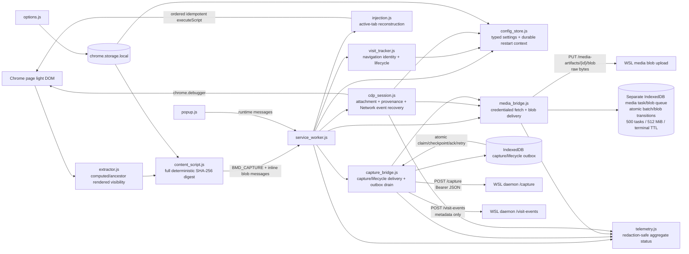
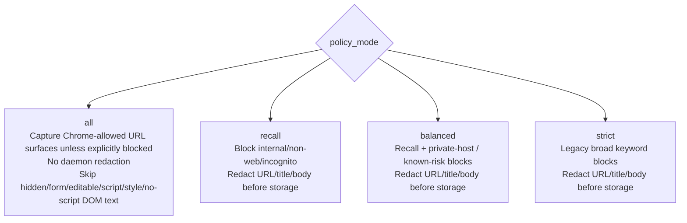
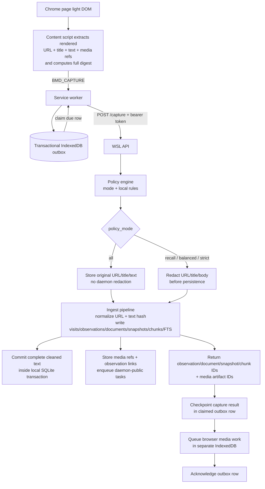
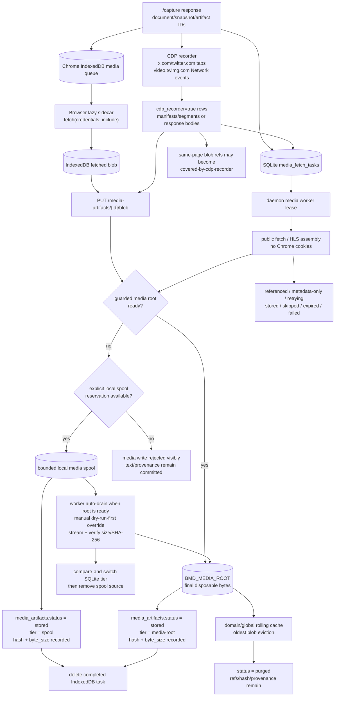
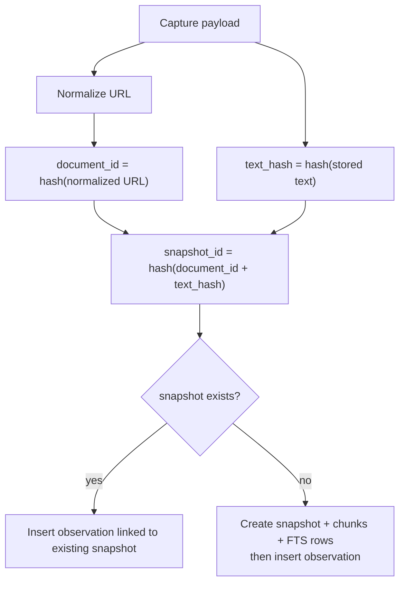
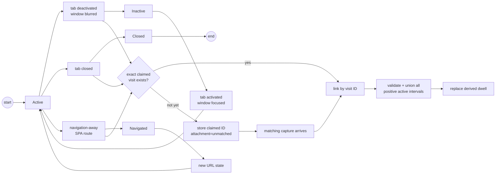
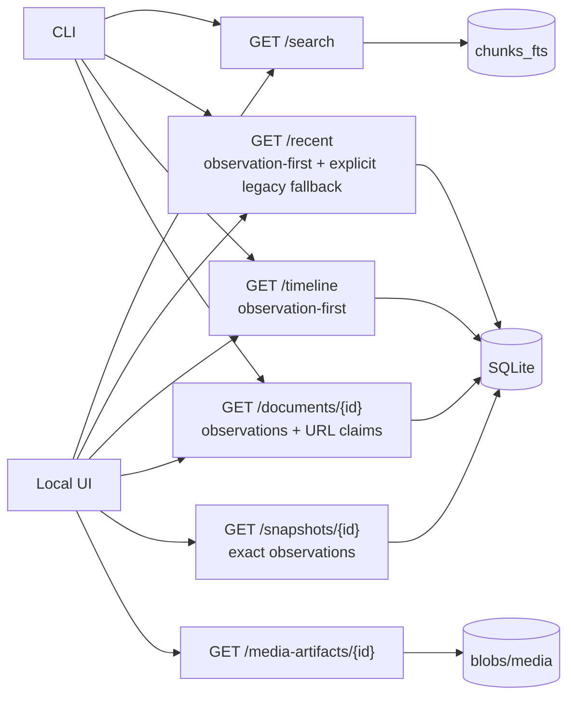
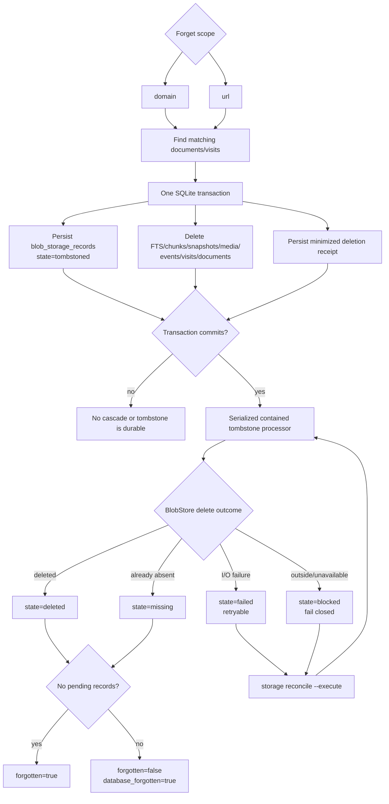

# Browser Memory Daemon Behavioral Diagrams

> **Audience:** maintainers and future agents.
> **Purpose:** preserve hand-authored Mermaid diagrams for behavior that should not be forced into C4.
> **Architecture atlas:** [`architecture/c4-diagrams.md`](architecture/c4-diagrams.md).
> **C4 source of truth:** [`architecture/workspace.dsl`](architecture/workspace.dsl).

---

## Diagram ownership

C4 owns the architecture topology: systems, containers, components, deployment, and major scenario views. This file keeps lower-level behavior that C4 intentionally omits or only summarizes.

| Need | Canonical home |
|---|---|
| System context, container topology, component topology, deployment | [`architecture/c4-diagrams.md`](architecture/c4-diagrams.md) |
| Exact endpoint/message names, redaction branches, state machines, algorithms, cache/status semantics, delete cascades | This file and the relevant feature docs |
| Durable media sidecar protocol details | [`media-artifacts.md`](media-artifacts.md) plus the media diagrams below |
| Policy/security posture | [`security-model.md`](security-model.md) plus the policy ladder below |
| HTTP payload shapes and route index | [`api.md`](api.md) plus the endpoint maps below |

Topological diagrams previously in this atlas were folded into C4. The diagrams below remain because they carry behavior/state/API semantics not cleanly represented by C4.

---

## 1. Extension protocol boundary

C4 shows the extension, service worker, browser storage, and daemon containers/components. This diagram keeps protocol names, endpoint names, and popup/options/storage wiring in one place.

---

## 2. Policy mode ladder

Operator posture: start at `all` for maximum recall; move upward only when filtering becomes more important than recall completeness.

---

## 3. Capture ingest and redaction branch

Text/FTS recall completes before media bytes. Media sidecars are best-effort and asynchronous.

---

## 4. Durable media sidecars and cache outcomes

The final media cache is bounded and disposable. The optional local spool has a separate hard byte cap covering committed/orphaned files plus distinct in-flight reservations. Each worker pass checks guarded-root readiness and automatically drains at most one bounded batch before claiming new fetch work; the manual command remains a dry-run-first override. SQLite version 13 also reserves snapshot/domain/global cache capacity transactionally across processes, while process-local request and byte leases bound concurrent streaming HTTP/HLS/upload/download work. Text, FTS rows, media refs, hashes, status reasons, and provenance remain authoritative when bytes are absent, spooled, purged, or delayed by resource pressure.

---

## 5. Dedupe and versioning

Repeated unchanged extractions add observations without duplicating text or replacing the visit. Changed text at the same normalized observed URL creates another snapshot under the same document, and each observation retains its contemporaneous snapshot.

---

## 6. Lifecycle telemetry

Lifecycle events carry claimed visit identity, URL, timezone-qualified timestamps, active seconds, and max-scroll percent. Identity-bearing events never fall back to the latest same-URL visit; delayed capture reconciles by claimed ID plus normalized observed URL. Dwell is the union of valid positive-active intervals, not an additive counter. `/visit-events` is metadata-only; body text only flows through `/capture`.

---

## 7. Local read endpoint map

The read model is exact-search-first. Semantic search and agent/MCP tools are later lanes, not current runtime architecture.

---

## 8. Forget/delete cascade

Forget returns database counts plus durable deletion state. It cannot report complete success while required bytes remain failed or blocked.

---

## Provenance

| Diagram | Primary source files/docs |
|---|---|
| Extension protocol boundary | `manifest.json`, `extension/src/extractor.js`, `content_script.js`, `service_worker.js`, `popup.js`, `options.js`, `media_queue.js` |
| Policy mode ladder | `docs/security-model.md`, `daemon/src/browser_memory_daemon/policy.py`, `policy_store.py`, `extension/src/extractor.js` |
| Capture ingest and redaction branch | `docs/api.md`, `daemon/src/browser_memory_daemon/http_server.py`, `application.py`, `ingest.py`, `policy.py`, `schema.sql`, `extension/src/service_worker.js` |
| Durable media sidecars and cache outcomes | `docs/media-artifacts.md`, `daemon/src/browser_memory_daemon/media.py`, `media_worker.py`, `schema.sql`, `extension/src/media_queue.js`, `cdp_recorder.js`, `service_worker.js` |
| Dedupe and versioning | `daemon/src/browser_memory_daemon/ingest.py`, `schema.sql`, ingest tests |
| Lifecycle telemetry | `docs/api.md`, `daemon/src/browser_memory_daemon/lifecycle.py`, `schema.sql`, `extension/src/service_worker.js` |
| Local read endpoint map | `docs/api.md`, `daemon/src/browser_memory_daemon/search.py`, `ops.py`, `ui/`, `cli.py` |
| Forget/delete cascade | `docs/api.md`, `daemon/src/browser_memory_daemon/forget.py`, `schema.sql`, forget tests |
