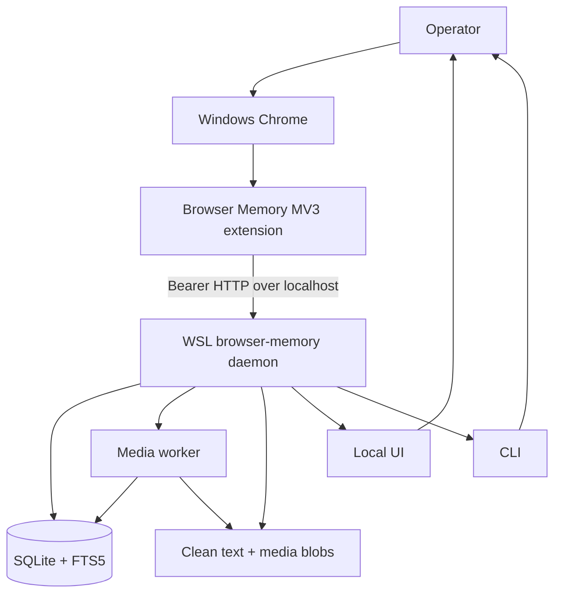
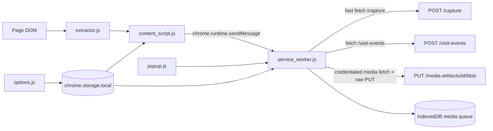
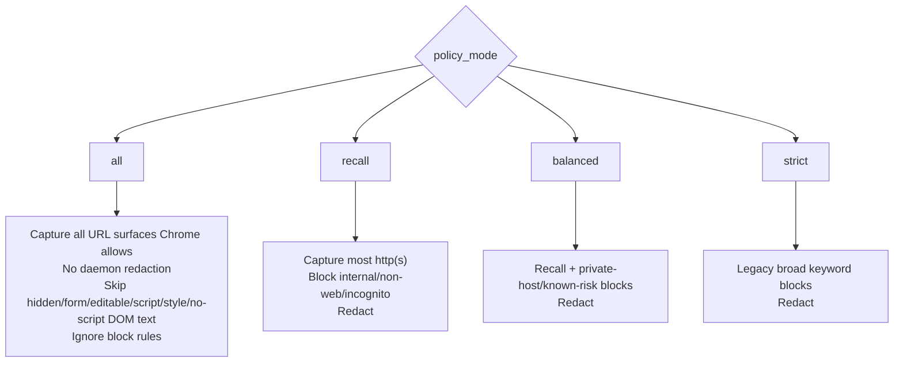
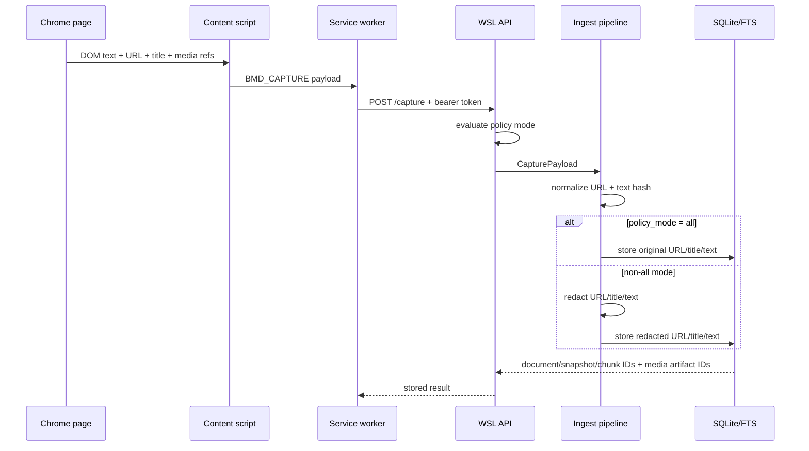
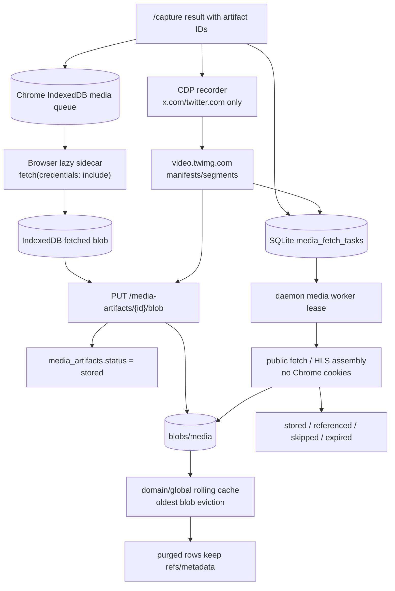
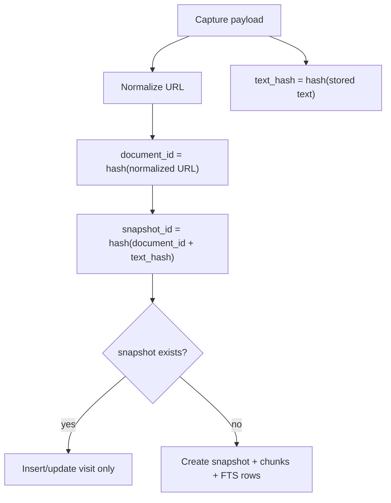
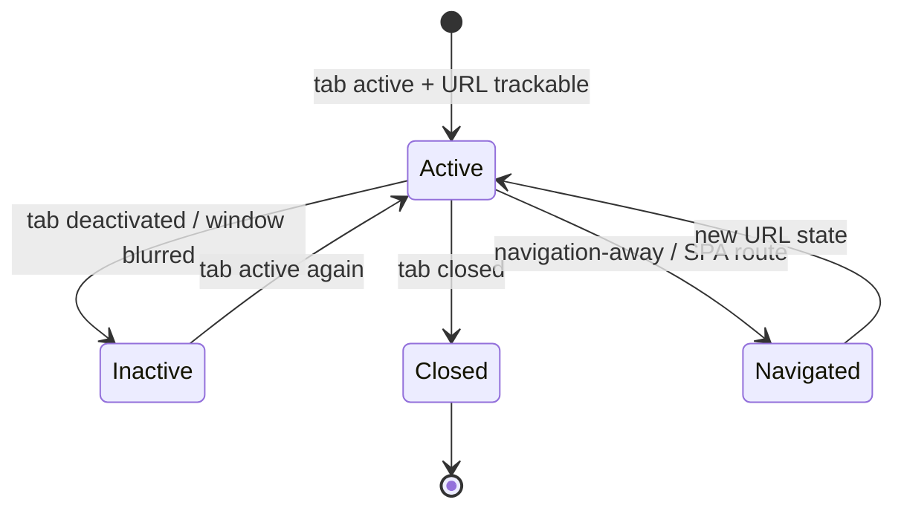
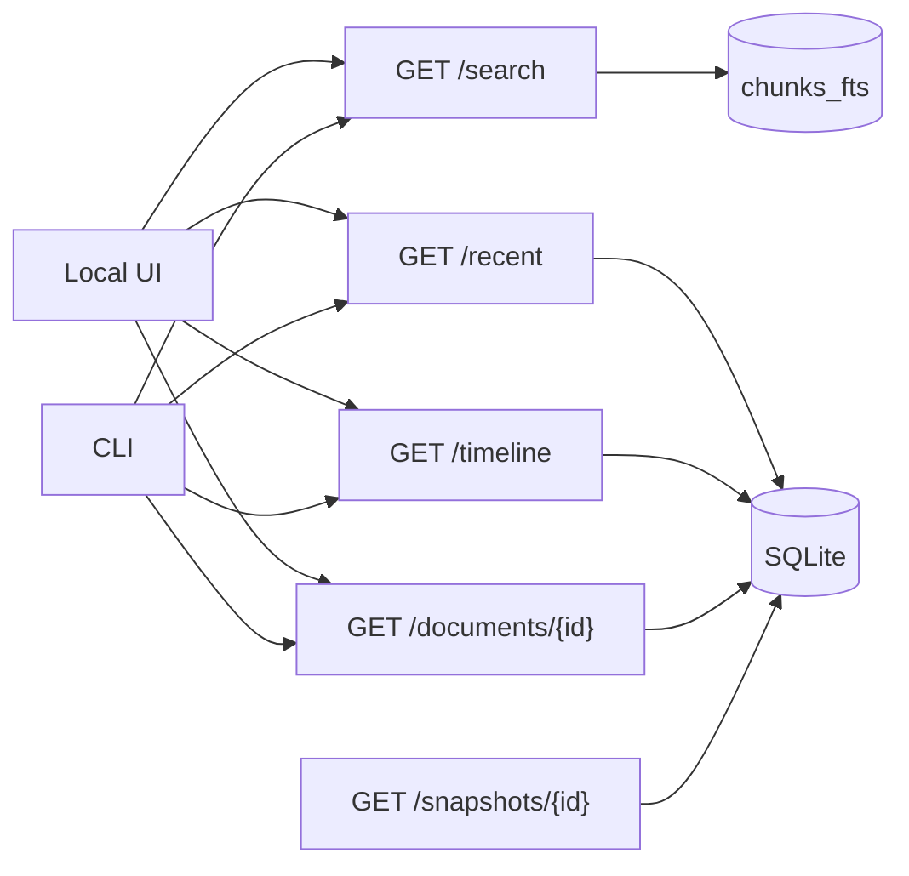
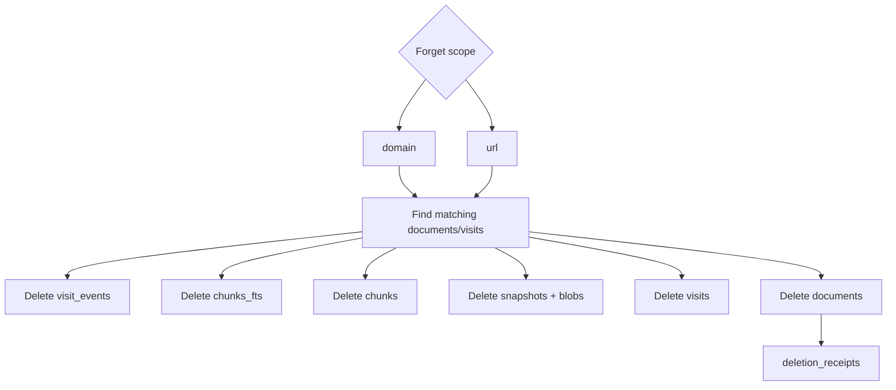

# Browser Memory Daemon Diagrams — Visual Atlas

> **Audience:** maintainers and future agents.
> **Format:** Mermaid diagrams embedded in Markdown.
> **Scope:** current Windows Chrome + WSL implementation.

---

## 1. System context

This is a local-first single-operator system. The browser surface is Windows Chrome; durable data and search live in WSL.

---

## 2. Extension runtime boundary

Content scripts extract and message; they do not call the daemon directly. The service worker owns auth, queues, tab state, and daemon transport.

---

## 3. Policy mode ladder

The operator can start at `all` and move upward only if recall completeness becomes less important than filtering.

---

## 4. Capture ingest pipeline

`all` bypasses redaction. Other modes redact before DB/FTS/blob storage. Media binary fetch is intentionally outside this fast path.

---

## 5. Durable media sidecars

This is the core durability split: text/FTS capture completes first; media bytes are best-effort sidecars with explicit states and cache controls.

---

## 6. Dedupe and versioning

Repeated unchanged captures add visits without duplicating text. Changed text at the same normalized URL creates another snapshot under the same document.

---

## 7. Lifecycle telemetry

Lifecycle events carry URL, timestamps, active seconds, and max-scroll percent. Body text only flows through `/capture`.

---

## 8. Local read model

The read model is exact-search-first. Semantic search and agent/MCP tools are later lanes.

---

## 9. Forget/delete cascade

Forget returns counts so the operator can verify which stores were affected.

---

## Provenance

These diagrams trace to current implementation files:

| Diagram | Source files |
|---|---|
| System/context | `README.md`, `config.py`, `app.py` |
| Extension boundary | `manifest.json`, `extractor.js`, `content_script.js`, `service_worker.js` |
| Policy ladder | `policy.py`, `extractor.js`, `options.js`, `install-daily-driver.sh` |
| Ingest pipeline | `models.py`, `ingest.py`, `schema.sql`, `media.py` |
| Media sidecars | `service_worker.js`, `media_queue.js`, `media.py`, `media_worker.py`, `schema.sql` |
| Lifecycle | `service_worker.js`, `lifecycle.py`, `schema.sql` |
| Read model | `search.py`, `ops.py`, `ui/`, `cli.py` |
| Forget/delete | `forget.py`, `schema.sql` |
