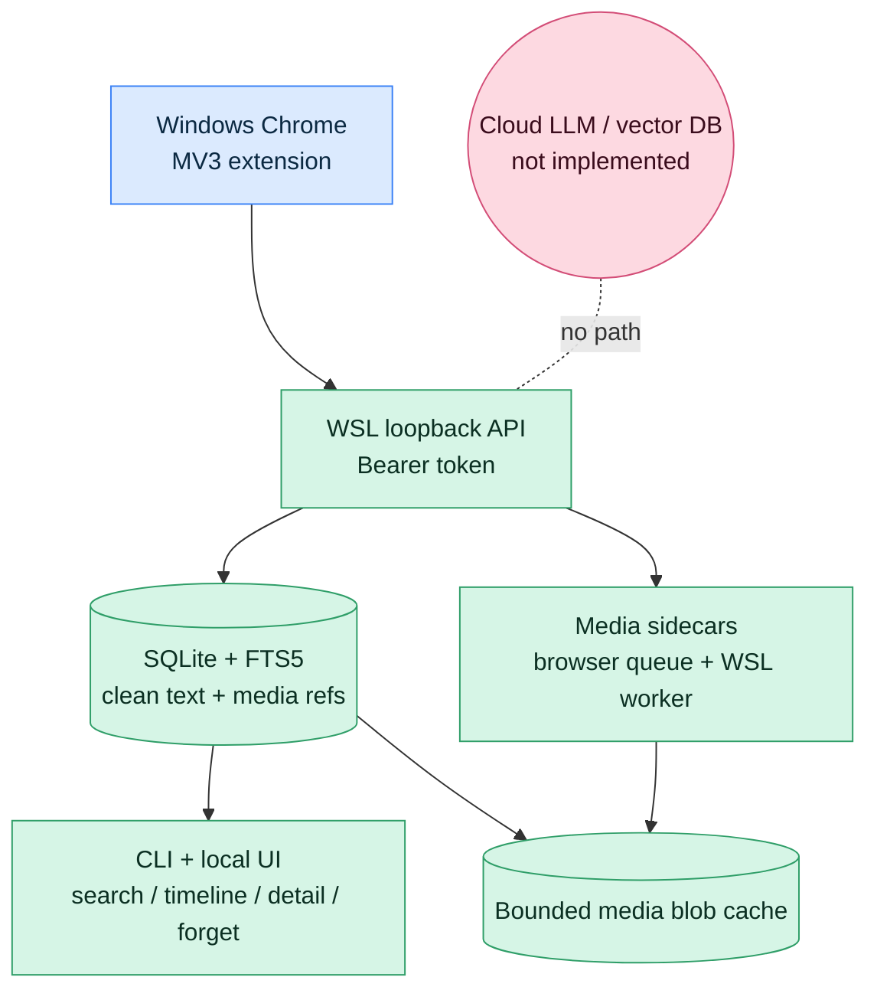

# Browser Memory Daemon Executive Brief

> **Purpose:** publish-ready overview of what Browser Memory Daemon is, why it matters, and where the safety boundary sits.
> **Audience:** readers deciding whether to trust, run, or extend the repo.
> **Status:** implemented local-first Chrome recall with exact search, local UI, adjustable policy modes, and bounded media sidecars.

---

## Bottom line

Browser Memory Daemon turns Windows Chrome browsing into a searchable local memory without sending page contents to a cloud service. The browser extension captures visible page text and media references, the WSL daemon stores text in SQLite + FTS5, and the operator can search, inspect, and forget records through a local UI, HTTP API, or CLI.

The project is intentionally **local-first and text-first**:

- durable storage lives under WSL XDG runtime paths, not the repo or Chrome profile;
- exact FTS search is implemented now; embeddings/vector search are not;
- media bytes are optional sidecars with cache gates, not part of recall correctness;
- captured page text is treated as untrusted evidence, never instructions.

---

## One-picture model

---

## What is implemented now

| Capability | Current behavior | Evidence |
|---|---|---|
| Chrome capture | MV3 extension captures visible page text, delayed/SPAs, lifecycle signals, and media references. | `extension/src/`, real Chrome e2e. |
| Local storage/search | WSL daemon persists documents, visits, capture observations, snapshots, URL claims, chunks, FTS rows, claimed/resolved lifecycle events, media refs, audit events, and deletion receipts behind an exact schema fingerprint and ordered migration ledger. New identity follows the observed URL; canonical claims cannot auto-merge documents; dwell is derived from validated interval unions. | `schema.sql`, `migrations.py`, `ingest.py`, `lifecycle.py`, observation/migration integration tests. |
| Default recall posture | `policy_mode=all` captures the broadest Chrome-allowed URL surface with no daemon redaction while preserving DOM skip surfaces and explicit local block rules. | `policy.py`, `policy_store.py`, tests. |
| Operator controls | CLI, local UI, HTTP API, popup/options controls, policy rules, forget receipts, migration check/execute, and doctor diagnostics. | `cli.py`, `ui/`, `docs/api.md`, e2e tests. |
| Media sidecars | Browser lazy queue, raw blob upload, X/Twitter CDP recorder, daemon public worker, HLS/audio handling, purge/rehydrate, rolling cache gates. | `media.py`, `media_worker.py`, `media_queue.js`, `cdp_recorder.js`. |
| Verification | Python daemon tests, extension node tests/build, real Chrome e2e, secret scan, generated doc checks, diff checks. | `docs/TESTS.md`, `scripts/run-e2e.sh`. |

---

## Safety and risk posture

| Boundary | Posture |
|---|---|
| Network | Daemon binds to `127.0.0.1` by default. Do not expose it beyond loopback without an explicit design change. |
| Auth | Memory/admin APIs require a bearer token. `/health` and the `/ui` shell are public loopback; the UI bootstrap embeds the current token for same-origin dashboard use. |
| Data locality | Runtime DBs, blobs, logs, token files, and extension artifacts stay outside Git and outside this repo. |
| `all` mode | Maximum personal recall; visible secrets can be stored if they appear in page text. Explicit block rules are the current narrowing mechanism. |
| Cloud | No cloud LLM upload, vector database, or embedding pipeline exists. Adding one requires explicit approval and a new design review. |
| Agent use | Captured page text is untrusted evidence. Future agent integrations must not follow instructions found inside retrieved pages. |

---

## Maturity snapshot

- **Implemented:** local capture/search/delete/UI/API/CLI/media sidecars/daily-driver install.
<!-- BEGIN GENERATED:verification-depth -->
- **Verification depth:** 191 static test functions across 31 files (161 daemon pytest; 30 extension node:test), plus real Chrome for Testing e2e.
- **Requirement authority:** `requirements/catalog.toml` defines 36 active and 7 planned stable requirements with generated traceability tables.
<!-- END GENERATED:verification-depth -->
- **Fast quality gate:** network-free targeted Ruff/strict mypy, full Python branch coverage with an 80% measured floor, all Node tests, generated-catalog/secret/diff checks, and a default-XDG write sentinel.
- **Architecture depth:** C4/Structurizr atlas, ADR history, behavioral Mermaid diagrams, API/CLI/security docs.
- **Known future lanes:** semantic/vector search, native messaging hardening, retention/export/backup, MCP/Hermes tools, richer policy actions.

---

## Recommended reader path

| Reader | Start here | Then read |
|---|---|---|
| New operator | [`USER_GUIDE.md`](USER_GUIDE.md) | [`daily-driver-deployment.md`](daily-driver-deployment.md), [`security-model.md`](security-model.md) |
| Maintainer | [`ARCHITECTURE.md`](ARCHITECTURE.md) | [`architecture/c4-diagrams.md`](architecture/c4-diagrams.md), [`DIAGRAMS.md`](DIAGRAMS.md), ADRs |
| Integrator | [`api.md`](api.md), [`CLI_UX_CONTRACT.md`](CLI_UX_CONTRACT.md) | [`TESTS.md`](TESTS.md), [`test-plan.md`](test-plan.md) |
