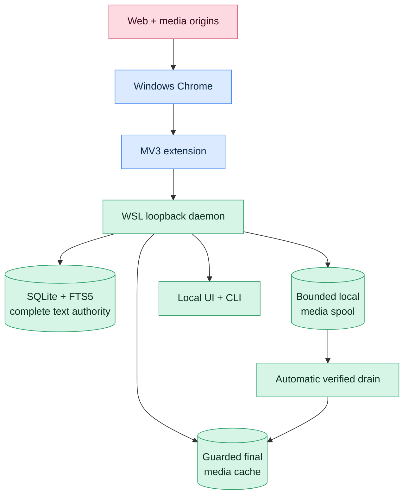

# Browser Memory Daemon Architecture Model

This directory contains the C4 model-as-code for the Browser Memory Daemon repo.

- Canonical source: [`workspace.dsl`](workspace.dsl)
- Single-file C4 Markdown atlas: [`c4-diagrams.md`](c4-diagrams.md)
- Generated diagram artifact index: [`diagrams/README.md`](diagrams/README.md)
- Per-view Markdown diagrams: [`diagrams/markdown/`](diagrams/markdown/)
- Lightweight text exports: [`diagrams/*.mmd`](diagrams/) after Mermaid export
- Visual-review exports: [`diagrams/*.png`](diagrams/), [`diagrams/*.svg`](diagrams/), and Graphviz renders under [`diagrams/dot-rendered/`](diagrams/dot-rendered/)
- Narrative architecture: [`../ARCHITECTURE.md`](../ARCHITECTURE.md)
- Behavioral Mermaid diagrams for non-C4 mechanics: [`../DIAGRAMS.md`](../DIAGRAMS.md)

## Architecture at a glance



## Scope

The model covers the current local daily-driver architecture:

```text
Windows Chrome MV3 extension
  -> WSL loopback HTTP daemon
  -> SQLite + FTS5 complete-text authority
  -> guarded media cache + bounded local recovery spool
  -> local UI / CLI / media worker
```

The system boundary is **Browser Memory Daemon**, including the owned Chrome extension, WSL daemon, WSL media worker, local UI, CLI, database, legacy derivative store, guarded media cache, and bounded local spool. Windows Chrome and web/media origins are modeled as external systems.

Every implemented component in `workspace.dsl` carries the `Current` tag. Versioned migrations through schema 14, immutable observation ingest sequence, query-only X observation export, capture observations, BlobStore, media decomposition, transactional capture/lifecycle outbox, thin HTTP application layer, backup/restore, and staged installer rollback are current. Any future design-review boundary added before implementation must carry the `Target` tag and remain visually distinct from the current system; requirement status is canonical in [`../../requirements/catalog.toml`](../../requirements/catalog.toml).

## Diagram ownership

- `workspace.dsl` is the canonical C4 source for systems, containers, components, deployment, and major scenario flows.
- `c4-diagrams.md` is the generated all-views C4 atlas and preferred architecture diagram entrypoint.
- `../DIAGRAMS.md` keeps hand-authored Mermaid diagrams for non-C4 mechanics: policy ladders, redaction branches, state machines, identity formulas, endpoint maps, media cache/status semantics, and delete cascades.
- Do not duplicate broad topology in `../DIAGRAMS.md`; add missing architecture topology to this C4 model instead.

## Views

| View key | C4 level | Purpose |
|---|---|---|
| `SystemContext` | C1 System Context | Operator, Chrome runtime, web/media origins, and the Browser Memory Daemon boundary. |
| `CaptureContainers` | C2 Container | Fast capture/storage path: Chrome, extension, extension browser storage, daemon, SQLite/FTS complete-text authority, and legacy derivative compatibility. |
| `BrowserMediaContainers` | C2 Container | Browser-side media path: extension browser storage, daemon media APIs, SQLite artifact rows, media cache, and web/media origins. |
| `DaemonMediaWorkerContainers` | C2 Container | Daemon-public media worker path: worker, SQLite tasks, media cache, and public web/media origins. |
| `MediaWorkerComponents` | C3 Component | In-process worker ordering: bounded automatic spool recovery first, then guarded public-media task leasing/fetch/publication without an HTTP-daemon hop. |
| `OpsContainers` | C2 Container | Operator surfaces and stores: local UI, CLI, daemon, SQLite/FTS, legacy derivatives, guarded media cache, and bounded spool. |
| `ExtensionCaptureComponents` | C3 Component | MV3 extension capture internals: manifest, extractor, content script, service worker, popup/options controls, daemon delivery, and browser queue. |
| `ExtensionOutboxComponents` | C3 Component | Transactional capture/lifecycle outbox admission, checkpoint, retry, telemetry, and browser storage boundaries. |
| `ExtensionMediaComponents` | C3 Component | MV3 extension media internals: service worker, media queue adapter, CDP recorder, Chrome APIs, browser queue, and daemon upload. |
| `DaemonPolicyComponents` | C3 Component | WSL daemon policy internals: router/auth, static policy engine, and persistent block rules. |
| `DaemonIngestComponents` | C3 Component | WSL daemon ingest internals: router, application use case, ingest pipeline, and SQLite/FTS complete-text authority. |
| `DaemonLifecycleComponents` | C3 Component | WSL daemon lifecycle internals: router, lifecycle pipeline, and SQLite dwell/event rows. |
| `DaemonMediaComponents` | C3 Component | WSL daemon media internals: router, compatibility manager, state model, durable task repository, artifact admission/eviction store, SQLite rows, BlobStore, reconciliation, and guarded media cache/spool. |
| `DaemonMediaTransportComponents` | C3 Component | Direct/HLS transport coordination, guarded network fetch, request budgeting, and bounded assembly. |
| `DaemonMediaResourceComponents` | C3 Component | Process request/byte leases plus persistent cache reservations across upload, fetch, assembly, publication, and response paths. |
| `CliMediaOpsComponents` | C3 Component | Direct CLI scoped dry-run-first budget requeue; worker current-state reconciliation is shown inside `MediaWorkerComponents`. |
| `DaemonReadComponents` | C3 Component | WSL daemon read internals: router, search/read model, authenticated query-only HTTP X export adapter, SQLite/FTS, legacy derivatives, guarded media cache, and spool. |
| `DaemonForgetComponents` | C3 Component | WSL daemon deletion internals: router, forget pipeline, SQLite receipts, durable reconciliation, legacy derivatives, guarded media cache, and spool. |
| `DaemonDoctorComponents` | C3 Component | WSL daemon diagnostics internals: router, doctor/audit, SQLite checks, lifecycle health, and derivative/media/spool counts. |
| `CliStorageReconcileComponents` | C3 Component | Direct CLI durable tombstone retry, missing/corrupt/recovered references, contained orphan detection, and stale-stage cleanup without an HTTP-daemon dependency. |
| `CliBackupRestoreComponents` | C3 Component | CLI online SQLite backup, redaction-safe manifest, optional derivative inclusion, and verified absent-root restore publication. |
| `CliXObservationExportComponents` | C3 Component | Standalone query-only X observation export adapter, SQLite source authority, and downstream body-safe consumer boundary. |
| `DailyDriverHealthFlow` | Dynamic | Daily-driver readiness, database, guarded-root, spool, service/journal, protected artifact, and Windows extension-copy checks without unrelated daemon-store edges. |
| `DaemonMigrationComponents` | C3 Component | WSL daemon migration internals: exact fingerprint, ordered checksum ledger, transactional steps, and SQLite backup boundary. |
| `FastCaptureFlow` | Dynamic | Fast text/ref capture path that stores FTS recall, returns IDs, and queues lazy media work before media bytes arrive. |
| `CredentialedMediaSidecarFlow` | Dynamic | Browser-side media fetch/upload path that keeps Chrome cookies inside Chrome. |
| `DaemonPublicMediaWorkerFlow` | Dynamic | Public no-cookie daemon media backfill path. |
| `AutomaticSpoolRecoveryFlow` | Dynamic | Guarded-root recovery path that verifies destination bytes, commits the tier switch, and only then removes the local source. |
| `XObservationExportFlow` | Dynamic | Authenticated HTTP and standalone CLI paths to the same query-only, versioned body-safe observation export contract. |
| `DailyDriverDeployment` | Deployment | Local daily-driver topology: Windows Chrome, WSL systemd user services, and WSL XDG data paths. |

## Render and validate

Using Structurizr CLI:

```bash
STRUCTURIZR_CLI=${STRUCTURIZR_CLI:-/tmp/structurizr-cli/structurizr.sh}
C4_SKILL_DIR="${C4_SKILL_DIR:-$HOME/.hermes/skills/software-development/c4-structurizr-architecture}"
"$STRUCTURIZR_CLI" validate -workspace docs/architecture/workspace.dsl

# Mermaid text exports plus SVG/PNG renders.
find docs/architecture/diagrams -maxdepth 1 -type f \( -name '*.mmd' -o -name '*.svg' -o -name '*.png' \) -delete
JAVA_TOOL_OPTIONS='-Djava.awt.headless=true' \
  "$STRUCTURIZR_CLI" export -workspace docs/architecture/workspace.dsl -format mermaid -output docs/architecture/diagrams

cat > /tmp/bmd-mermaid-config.json <<'JSON'
{"securityLevel":"loose","htmlLabels":true}
JSON
for f in docs/architecture/diagrams/*.mmd; do
  npx --yes @mermaid-js/mermaid-cli -c /tmp/bmd-mermaid-config.json -i "$f" -o "${f%.mmd}.svg"
  npx --yes @mermaid-js/mermaid-cli -c /tmp/bmd-mermaid-config.json -i "$f" -o "${f%.mmd}.png" -b transparent
done

# Graphviz/DOT exports for stakeholder-readable relationship-label placement.
rm -rf docs/architecture/diagrams/dot docs/architecture/diagrams/dot-rendered
mkdir -p docs/architecture/diagrams/dot docs/architecture/diagrams/dot-rendered
JAVA_TOOL_OPTIONS='-Djava.awt.headless=true' \
  "$STRUCTURIZR_CLI" export -workspace docs/architecture/workspace.dsl -format dot -output docs/architecture/diagrams/dot
python3 "$C4_SKILL_DIR/scripts/graphviz-edge-label-backgrounds.py" \
  docs/architecture/diagrams/dot
for file in docs/architecture/diagrams/dot/*.dot; do
  base=$(basename "$file" .dot)
  dot -Tsvg "$file" -o "docs/architecture/diagrams/dot-rendered/$base.svg"
  dot -Tpng "$file" -o "docs/architecture/diagrams/dot-rendered/$base.png"
done

# Markdown wrappers display the cleanest render first, keep Mermaid source collapsed,
# and generate the top-level all-views atlas.
rm -rf docs/architecture/diagrams/markdown docs/architecture/diagrams/README.md docs/architecture/c4-diagrams.md
python3 "$C4_SKILL_DIR/scripts/structurizr-diagrams-to-markdown.py" \
  --diagrams-dir docs/architecture/diagrams \
  --workspace docs/architecture/workspace.dsl \
  --title "Browser Memory Daemon Architecture C4 Diagrams"
```

The Mermaid, DOT, SVG, PNG, and Markdown exports are derived artifacts. Refresh them from `workspace.dsl`; do not treat them as the source of truth. Use `c4-diagrams.md` as the single-file Markdown atlas for all generated views. `diagrams/README.md` and `diagrams/markdown/*.md` remain generated artifact/per-view navigation surfaces. These Markdown pages embed Graphviz SVG renders with white-backed relationship labels when available and keep Mermaid source collapsed for text review. The `JAVA_TOOL_OPTIONS` setting keeps Structurizr CLI export headless-friendly under WSL.

## Source grounding

Primary source evidence used for this model:

| Claim | Evidence |
|---|---|
| Windows Chrome is the browser surface and WSL owns durable storage. | `AGENTS.md`, `README.md`, `docs/ARCHITECTURE.md`, `docs/daily-driver-deployment.md` |
| Default policy mode is `all`; non-all modes add built-in filtering/redaction while explicit local block rules apply in every mode. | `README.md`, `docs/security-model.md`, `daemon/src/browser_memory_daemon/policy.py`, `daemon/src/browser_memory_daemon/policy_store.py`, `extension/src/extractor.js` |
| Capture transport is extension service worker to authenticated loopback HTTP, using JSON for metadata/capture APIs and raw `PUT` for blob uploads. | `docs/api.md`, `daemon/src/browser_memory_daemon/http_server.py`, `daemon/src/browser_memory_daemon/application.py`, `daemon/src/browser_memory_daemon/app.py`, `extension/src/service_worker.js` |
| Fast capture stores documents, visits, snapshots, chunks, FTS rows, and media refs. | `daemon/src/browser_memory_daemon/ingest.py`, `daemon/src/browser_memory_daemon/schema.sql` |
| Extension browser storage keeps transactional capture/lifecycle outbox rows and durable specialized media tasks/blobs in IndexedDB; `chrome.storage.local` retains configuration, lifecycle tab state, aggregate telemetry, and a one-version queue fallback. | `extension/src/outbox.js`, `extension/src/service_worker.js`, `extension/src/media_queue.js`, ADR-0048 |
| Credentialed media fetch stays inside Chrome; raw blobs upload to WSL. | `docs/media-artifacts.md`, `extension/src/service_worker.js`, `daemon/src/browser_memory_daemon/media.py` |
| Daemon media worker loads media/storage modules in-process, performs one bounded automatic spool-recovery batch before public task work, and never calls the HTTP daemon for that workflow. | `daemon/src/browser_memory_daemon/media_worker.py`, `daemon/src/browser_memory_daemon/media_storage.py`, `daemon/src/browser_memory_daemon/media.py` |
| SQLite schema evolution uses an exact version-1 fingerprint, contiguous ledger checksums, and backup-gated destructive steps. | `daemon/src/browser_memory_daemon/migrations.py`, `daemon/src/browser_memory_daemon/migration_steps/`, `docs/database-migrations.md` |
| Final media uses an independently guarded root; an opt-in bounded local spool uses per-writer SQLite reservations, tier-aware reads/deletes, dry-run-first operator draining, and automatic verified worker recovery after the root returns. | `daemon/src/browser_memory_daemon/media_storage.py`, `daemon/src/browser_memory_daemon/media_worker.py`, `daemon/src/browser_memory_daemon/migration_steps/v0010_split_media_root_and_add_spool.sql`, ADR-0061 |
| Blob deletion intent is durable before filesystem side effects; failed/blocked work is unreadable, capacity-accounted, and retryable through dry-run-first reconciliation. | `daemon/src/browser_memory_daemon/blob_lifecycle.py`, `daemon/src/browser_memory_daemon/storage_reconcile.py`, `daemon/src/browser_memory_daemon/migration_steps/v0011_add_blob_lifecycle_records.sql`, ADR-0040 |
| Forget selection validates literal policy-aware URL/domain scope, previews cross-authority counts without mutation, and refuses execution above an explicit selected-record bound. | `daemon/src/browser_memory_daemon/forget.py`, `daemon/src/browser_memory_daemon/application.py`, `daemon/src/browser_memory_daemon/cli.py`, ADR-0057 |
| HTTP and standalone CLI adapters expose the same query-only, versioned body-safe X observation contract; the consumer receives no capture, migration, or mutation authority. | `daemon/src/browser_memory_daemon/x_observation_export.py`, `daemon/src/browser_memory_daemon/http_server.py`, `daemon/src/browser_memory_daemon/cli.py`, ADR-0060 |
| Text-first backup uses SQLite online backup plus a redaction-safe hash manifest and restores into an absent runtime root without API token/config, Chrome profile/extension copy, media cache, or spool. | `daemon/src/browser_memory_daemon/backup_ops.py`, `daemon/src/browser_memory_daemon/cli.py`, `daemon/tests/integration/test_backup_restore.py`, ADR-0041 |
| Local UI and CLI are operator surfaces; CLI read/admin commands use daemon APIs, while media-worker/cache/spool/storage-reconcile/backup commands also run direct SQLite/filesystem paths. | `ui/app.js`, `daemon/src/browser_memory_daemon/cli.py`, `docs/daily-driver-deployment.md` |
| Daily-driver health checks daemon/worker readiness, database and spool state, guarded-root identity/headroom, systemd restart/journal budgets, protected token/env/unit artifacts, and Windows extension-copy consistency without exposing secrets. | `daemon/src/browser_memory_daemon/daily_driver_health.py`, `daemon/tests/unit/test_daily_driver_health.py`, `docs/daily-driver-deployment.md` |
| Daily-driver deployment validates and atomically swaps a sibling extension stage, restarts daemon then worker through readiness gates without a hard external-media-mount dependency, and restores prior artifacts/service state on caught failure. | `scripts/install-daily-driver.sh`, `daemon/tests/e2e/test_install_daily_driver.py`, `docs/daily-driver-deployment.md`, ADR-0058, ADR-0061 |

## Assumptions and TBDs

- Deployment view is limited to the documented **Daily-driver local** workstation topology. No separate staging/production topology is modeled.
- Non-runtime deployment artifacts such as the Windows unpacked extension copy and protected token/env files are modeled in the DSL but excluded from the rendered deployment view to keep the runtime topology legible. Durable audit events live in SQLite; there is no separate `audit.jsonl` deployment node. The WSL CLI and in-browser extension storage are also excluded from the deployment render because their relationships are covered in focused C2/C3/dynamic views and made the deployment topology unreadable. `DailyDriverHealthFlow` records systemd and protected-artifact checks without pretending those files are independent runtime services.
- Semantic/vector search, MCP/Hermes integration, native messaging transport, encrypted/signed backup bundles, automated backup retention, and multi-source importers are explicitly pending and are not modeled as current runtime containers. Manifest-backed text-first backup/empty-root restore and migration-only online backup are current.
- Chrome extension manual Load unpacked/Reload is an operational step, not a runtime container.
- Final media blobs are modeled as a bounded disposable cache, and the local spool as bounded durable outage buffering; text/FTS/media refs remain authoritative.
- Captured page text is untrusted evidence and must not be treated as agent instructions.
