# Browser Memory Daemon Architecture Diagrams

> Single-file generated C4 diagram atlas. Canonical model: [`workspace.dsl`](workspace.dsl).

## Reading notes

- This file intentionally includes every generated C4 view in one Markdown document.
- Diagrams prefer Graphviz SVG with white-backed relationship labels.
- Mermaid source is retained under each diagram for text review and diffability.

## Diagram index

| View | Section | Preferred render | Per-view page |
|---|---|---|---|
| `BrowserMediaContainers` | [`BrowserMediaContainers`](#browser-media-containers) | [`Graphviz SVG`](diagrams/dot-rendered/structurizr-BrowserMediaContainers.svg) | [`BrowserMediaContainers.md`](diagrams/markdown/BrowserMediaContainers.md) |
| `CaptureContainers` | [`CaptureContainers`](#capture-containers) | [`Graphviz SVG`](diagrams/dot-rendered/structurizr-CaptureContainers.svg) | [`CaptureContainers.md`](diagrams/markdown/CaptureContainers.md) |
| `CredentialedMediaSidecarFlow` | [`CredentialedMediaSidecarFlow`](#credentialed-media-sidecar-flow) | [`Graphviz SVG`](diagrams/dot-rendered/structurizr-CredentialedMediaSidecarFlow.svg) | [`CredentialedMediaSidecarFlow.md`](diagrams/markdown/CredentialedMediaSidecarFlow.md) |
| `DaemonDoctorComponents` | [`DaemonDoctorComponents`](#daemon-doctor-components) | [`Graphviz SVG`](diagrams/dot-rendered/structurizr-DaemonDoctorComponents.svg) | [`DaemonDoctorComponents.md`](diagrams/markdown/DaemonDoctorComponents.md) |
| `DaemonForgetComponents` | [`DaemonForgetComponents`](#daemon-forget-components) | [`Graphviz SVG`](diagrams/dot-rendered/structurizr-DaemonForgetComponents.svg) | [`DaemonForgetComponents.md`](diagrams/markdown/DaemonForgetComponents.md) |
| `DaemonIngestComponents` | [`DaemonIngestComponents`](#daemon-ingest-components) | [`Graphviz SVG`](diagrams/dot-rendered/structurizr-DaemonIngestComponents.svg) | [`DaemonIngestComponents.md`](diagrams/markdown/DaemonIngestComponents.md) |
| `DaemonLifecycleComponents` | [`DaemonLifecycleComponents`](#daemon-lifecycle-components) | [`Graphviz SVG`](diagrams/dot-rendered/structurizr-DaemonLifecycleComponents.svg) | [`DaemonLifecycleComponents.md`](diagrams/markdown/DaemonLifecycleComponents.md) |
| `DaemonMediaComponents` | [`DaemonMediaComponents`](#daemon-media-components) | [`Graphviz SVG`](diagrams/dot-rendered/structurizr-DaemonMediaComponents.svg) | [`DaemonMediaComponents.md`](diagrams/markdown/DaemonMediaComponents.md) |
| `DaemonMediaWorkerContainers` | [`DaemonMediaWorkerContainers`](#daemon-media-worker-containers) | [`Graphviz SVG`](diagrams/dot-rendered/structurizr-DaemonMediaWorkerContainers.svg) | [`DaemonMediaWorkerContainers.md`](diagrams/markdown/DaemonMediaWorkerContainers.md) |
| `DaemonMigrationComponents` | [`DaemonMigrationComponents`](#daemon-migration-components) | [`Graphviz SVG`](diagrams/dot-rendered/structurizr-DaemonMigrationComponents.svg) | [`DaemonMigrationComponents.md`](diagrams/markdown/DaemonMigrationComponents.md) |
| `DaemonPolicyComponents` | [`DaemonPolicyComponents`](#daemon-policy-components) | [`Graphviz SVG`](diagrams/dot-rendered/structurizr-DaemonPolicyComponents.svg) | [`DaemonPolicyComponents.md`](diagrams/markdown/DaemonPolicyComponents.md) |
| `DaemonPublicMediaWorkerFlow` | [`DaemonPublicMediaWorkerFlow`](#daemon-public-media-worker-flow) | [`Graphviz SVG`](diagrams/dot-rendered/structurizr-DaemonPublicMediaWorkerFlow.svg) | [`DaemonPublicMediaWorkerFlow.md`](diagrams/markdown/DaemonPublicMediaWorkerFlow.md) |
| `DaemonReadComponents` | [`DaemonReadComponents`](#daemon-read-components) | [`Graphviz SVG`](diagrams/dot-rendered/structurizr-DaemonReadComponents.svg) | [`DaemonReadComponents.md`](diagrams/markdown/DaemonReadComponents.md) |
| `DaemonStorageReconcileComponents` | [`DaemonStorageReconcileComponents`](#daemon-storage-reconcile-components) | [`Graphviz SVG`](diagrams/dot-rendered/structurizr-DaemonStorageReconcileComponents.svg) | [`DaemonStorageReconcileComponents.md`](diagrams/markdown/DaemonStorageReconcileComponents.md) |
| `DailyDriverDeployment` | [`DailyDriverDeployment`](#daily-driver-deployment) | [`Graphviz SVG`](diagrams/dot-rendered/structurizr-DailyDriverDeployment.svg) | [`DailyDriverDeployment.md`](diagrams/markdown/DailyDriverDeployment.md) |
| `ExtensionCaptureComponents` | [`ExtensionCaptureComponents`](#extension-capture-components) | [`Graphviz SVG`](diagrams/dot-rendered/structurizr-ExtensionCaptureComponents.svg) | [`ExtensionCaptureComponents.md`](diagrams/markdown/ExtensionCaptureComponents.md) |
| `ExtensionMediaComponents` | [`ExtensionMediaComponents`](#extension-media-components) | [`Graphviz SVG`](diagrams/dot-rendered/structurizr-ExtensionMediaComponents.svg) | [`ExtensionMediaComponents.md`](diagrams/markdown/ExtensionMediaComponents.md) |
| `FastCaptureFlow` | [`FastCaptureFlow`](#fast-capture-flow) | [`Graphviz SVG`](diagrams/dot-rendered/structurizr-FastCaptureFlow.svg) | [`FastCaptureFlow.md`](diagrams/markdown/FastCaptureFlow.md) |
| `OpsContainers` | [`OpsContainers`](#ops-containers) | [`Graphviz SVG`](diagrams/dot-rendered/structurizr-OpsContainers.svg) | [`OpsContainers.md`](diagrams/markdown/OpsContainers.md) |
| `SystemContext` | [`SystemContext`](#system-context) | [`Graphviz SVG`](diagrams/dot-rendered/structurizr-SystemContext.svg) | [`SystemContext.md`](diagrams/markdown/SystemContext.md) |

---

## Browser Media Containers

> C4 view `BrowserMediaContainers`.

### Diagram

_Preferred Markdown display: Graphviz SVG. Mermaid source is retained below for text review._

Mermaid source

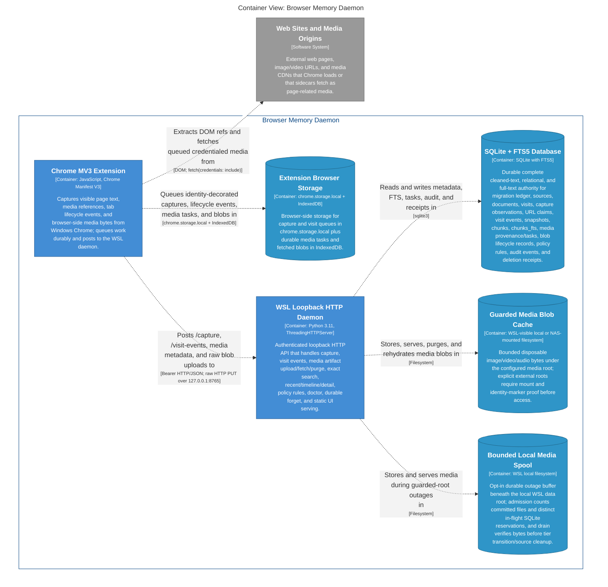
```mermaid
graph TB
  linkStyle default fill:#ffffff

  subgraph diagram ["Container View: Browser Memory Daemon"]
    style diagram fill:#ffffff,stroke:#ffffff

    3["<div style='font-weight: bold'>Web Sites and Media Origins</div><div style='font-size: 70%; margin-top: 0px'>[Software System]</div><div style='font-size: 80%; margin-top:10px'>External web pages,<br />image/video URLs, and media<br />CDNs that Chrome loads or<br />that sidecars fetch as<br />page-related media.</div>"]
    style 3 fill:#999999,stroke:#6b6b6b,color:#ffffff

    subgraph 4 ["Browser Memory Daemon"]
      style 4 fill:#ffffff,stroke:#0b4884,color:#0b4884

      13[("<div style='font-weight: bold'>Extension Browser Storage</div><div style='font-size: 70%; margin-top: 0px'>[Container: chrome.storage.local + IndexedDB]</div><div style='font-size: 80%; margin-top:10px'>Browser-side storage for<br />capture and visit queues in<br />chrome.storage.local plus<br />durable media tasks and<br />fetched blobs in IndexedDB.</div>")]
      style 13 fill:#2f95c8,stroke:#20688c,color:#ffffff
      14["<div style='font-weight: bold'>WSL Loopback HTTP Daemon</div><div style='font-size: 70%; margin-top: 0px'>[Container: Python 3.11, ThreadingHTTPServer]</div><div style='font-size: 80%; margin-top:10px'>Authenticated loopback HTTP<br />API that handles capture,<br />visit events, media artifact<br />upload/fetch/purge, exact<br />search,<br />recent/timeline/detail,<br />policy rules, doctor, durable<br />forget, and static UI<br />serving.</div>"]
      style 14 fill:#438dd5,stroke:#2e6295,color:#ffffff
      30[("<div style='font-weight: bold'>SQLite + FTS5 Database</div><div style='font-size: 70%; margin-top: 0px'>[Container: SQLite with FTS5]</div><div style='font-size: 80%; margin-top:10px'>Durable complete<br />cleaned-text, relational, and<br />full-text authority for<br />migration ledger, sources,<br />documents, visits, capture<br />observations, URL claims,<br />visit events, snapshots,<br />chunks, chunks_fts, media<br />provenance/tasks, blob<br />lifecycle records, policy<br />rules, audit events, and<br />deletion receipts.</div>")]
      style 30 fill:#2f95c8,stroke:#20688c,color:#ffffff
      32[("<div style='font-weight: bold'>Guarded Media Blob Cache</div><div style='font-size: 70%; margin-top: 0px'>[Container: WSL-visible local or NAS-mounted filesystem]</div><div style='font-size: 80%; margin-top:10px'>Bounded disposable<br />image/video/audio bytes under<br />the configured media root;<br />explicit external roots<br />require mount and<br />identity-marker proof before<br />access.</div>")]
      style 32 fill:#2f95c8,stroke:#20688c,color:#ffffff
      33[("<div style='font-weight: bold'>Bounded Local Media Spool</div><div style='font-size: 70%; margin-top: 0px'>[Container: WSL local filesystem]</div><div style='font-size: 80%; margin-top:10px'>Opt-in durable outage buffer<br />beneath the local WSL data<br />root; admission counts<br />committed files and distinct<br />in-flight SQLite<br />reservations, and drain<br />verifies bytes before tier<br />transition/source cleanup.</div>")]
      style 33 fill:#2f95c8,stroke:#20688c,color:#ffffff
      5["<div style='font-weight: bold'>Chrome MV3 Extension</div><div style='font-size: 70%; margin-top: 0px'>[Container: JavaScript, Chrome Manifest V3]</div><div style='font-size: 80%; margin-top:10px'>Captures visible page text,<br />media references, tab<br />lifecycle events, and<br />browser-side media bytes from<br />Windows Chrome; queues work<br />durably and posts to the WSL<br />daemon.</div>"]
      style 5 fill:#438dd5,stroke:#2e6295,color:#ffffff
    end

    5-. "<div>Extracts DOM refs and fetches<br />queued credentialed media<br />from</div><div style='font-size: 70%'>[DOM; fetch(credentials: include)]</div>" .->3
    5-. "<div>Queues identity-decorated<br />captures, lifecycle events,<br />media tasks, and blobs in</div><div style='font-size: 70%'>[chrome.storage.local + IndexedDB]</div>" .->13
    5-. "<div>Posts /capture,<br />/visit-events, media<br />metadata, and raw blob<br />uploads to</div><div style='font-size: 70%'>[Bearer HTTP/JSON; raw HTTP PUT over 127.0.0.1:8765]</div>" .->14
    14-. "<div>Reads and writes metadata,<br />FTS, tasks, audit, and<br />receipts in</div><div style='font-size: 70%'>[sqlite3]</div>" .->30
    14-. "<div>Stores, serves, purges, and<br />rehydrates media blobs in</div><div style='font-size: 70%'>[Filesystem]</div>" .->32
    14-. "<div>Stores and serves media<br />during guarded-root outages<br />in</div><div style='font-size: 70%'>[Filesystem]</div>" .->33

  end
```

### Derived artifacts

| Artifact | Link |
|---|---|
| Mermaid source | [`structurizr-BrowserMediaContainers.mmd`](diagrams/structurizr-BrowserMediaContainers.mmd) |
| Mermaid SVG | [`structurizr-BrowserMediaContainers.svg`](diagrams/structurizr-BrowserMediaContainers.svg) |
| Mermaid PNG | [`structurizr-BrowserMediaContainers.png`](diagrams/structurizr-BrowserMediaContainers.png) |
| DOT source | [`structurizr-BrowserMediaContainers.dot`](diagrams/dot/structurizr-BrowserMediaContainers.dot) |
| Graphviz SVG | [`structurizr-BrowserMediaContainers.svg`](diagrams/dot-rendered/structurizr-BrowserMediaContainers.svg) |
| Graphviz PNG | [`structurizr-BrowserMediaContainers.png`](diagrams/dot-rendered/structurizr-BrowserMediaContainers.png) |

---

## Capture Containers

> C4 view `CaptureContainers`.

### Diagram

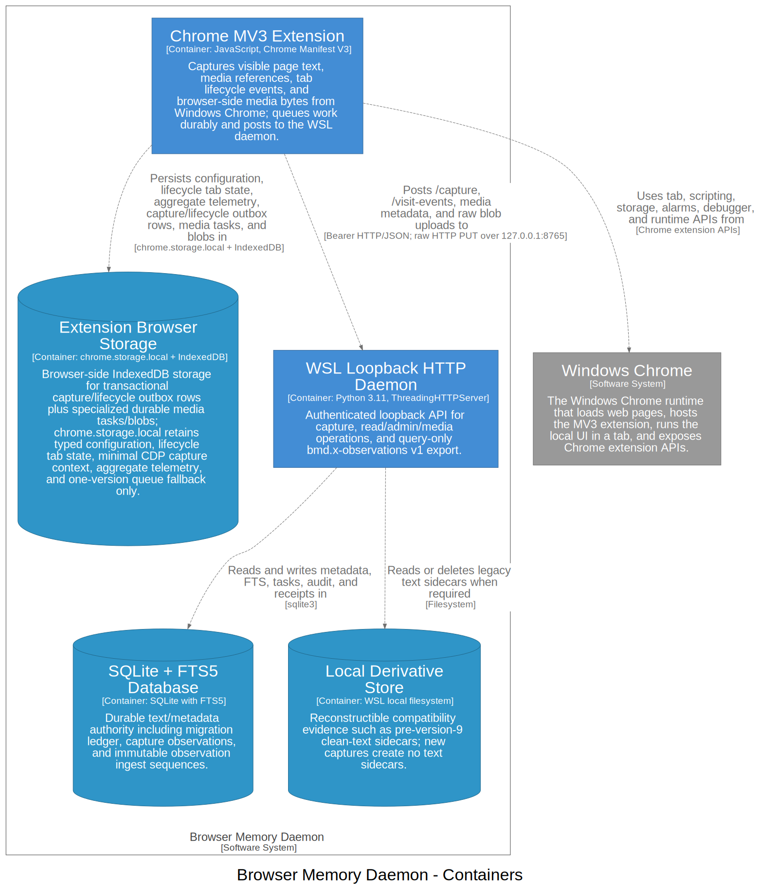

_Preferred Markdown display: Graphviz SVG. Mermaid source is retained below for text review._

Mermaid source

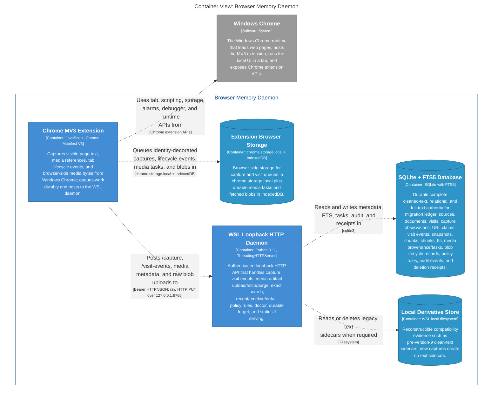
```mermaid
graph TB
  linkStyle default fill:#ffffff

  subgraph diagram ["Container View: Browser Memory Daemon"]
    style diagram fill:#ffffff,stroke:#ffffff

    2["<div style='font-weight: bold'>Windows Chrome</div><div style='font-size: 70%; margin-top: 0px'>[Software System]</div><div style='font-size: 80%; margin-top:10px'>The Windows Chrome runtime<br />that loads web pages, hosts<br />the MV3 extension, runs the<br />local UI in a tab, and<br />exposes Chrome extension<br />APIs.</div>"]
    style 2 fill:#999999,stroke:#6b6b6b,color:#ffffff

    subgraph 4 ["Browser Memory Daemon"]
      style 4 fill:#ffffff,stroke:#0b4884,color:#0b4884

      13[("<div style='font-weight: bold'>Extension Browser Storage</div><div style='font-size: 70%; margin-top: 0px'>[Container: chrome.storage.local + IndexedDB]</div><div style='font-size: 80%; margin-top:10px'>Browser-side storage for<br />capture and visit queues in<br />chrome.storage.local plus<br />durable media tasks and<br />fetched blobs in IndexedDB.</div>")]
      style 13 fill:#2f95c8,stroke:#20688c,color:#ffffff
      14["<div style='font-weight: bold'>WSL Loopback HTTP Daemon</div><div style='font-size: 70%; margin-top: 0px'>[Container: Python 3.11, ThreadingHTTPServer]</div><div style='font-size: 80%; margin-top:10px'>Authenticated loopback HTTP<br />API that handles capture,<br />visit events, media artifact<br />upload/fetch/purge, exact<br />search,<br />recent/timeline/detail,<br />policy rules, doctor, durable<br />forget, and static UI<br />serving.</div>"]
      style 14 fill:#438dd5,stroke:#2e6295,color:#ffffff
      30[("<div style='font-weight: bold'>SQLite + FTS5 Database</div><div style='font-size: 70%; margin-top: 0px'>[Container: SQLite with FTS5]</div><div style='font-size: 80%; margin-top:10px'>Durable complete<br />cleaned-text, relational, and<br />full-text authority for<br />migration ledger, sources,<br />documents, visits, capture<br />observations, URL claims,<br />visit events, snapshots,<br />chunks, chunks_fts, media<br />provenance/tasks, blob<br />lifecycle records, policy<br />rules, audit events, and<br />deletion receipts.</div>")]
      style 30 fill:#2f95c8,stroke:#20688c,color:#ffffff
      31[("<div style='font-weight: bold'>Local Derivative Store</div><div style='font-size: 70%; margin-top: 0px'>[Container: WSL local filesystem]</div><div style='font-size: 80%; margin-top:10px'>Reconstructible compatibility<br />evidence such as<br />pre-version-9 clean-text<br />sidecars; new captures create<br />no text sidecars.</div>")]
      style 31 fill:#2f95c8,stroke:#20688c,color:#ffffff
      5["<div style='font-weight: bold'>Chrome MV3 Extension</div><div style='font-size: 70%; margin-top: 0px'>[Container: JavaScript, Chrome Manifest V3]</div><div style='font-size: 80%; margin-top:10px'>Captures visible page text,<br />media references, tab<br />lifecycle events, and<br />browser-side media bytes from<br />Windows Chrome; queues work<br />durably and posts to the WSL<br />daemon.</div>"]
      style 5 fill:#438dd5,stroke:#2e6295,color:#ffffff
    end

    5-. "<div>Uses tab, scripting, storage,<br />alarms, debugger, and runtime<br />APIs from</div><div style='font-size: 70%'>[Chrome extension APIs]</div>" .->2
    5-. "<div>Queues identity-decorated<br />captures, lifecycle events,<br />media tasks, and blobs in</div><div style='font-size: 70%'>[chrome.storage.local + IndexedDB]</div>" .->13
    5-. "<div>Posts /capture,<br />/visit-events, media<br />metadata, and raw blob<br />uploads to</div><div style='font-size: 70%'>[Bearer HTTP/JSON; raw HTTP PUT over 127.0.0.1:8765]</div>" .->14
    14-. "<div>Reads and writes metadata,<br />FTS, tasks, audit, and<br />receipts in</div><div style='font-size: 70%'>[sqlite3]</div>" .->30
    14-. "<div>Reads or deletes legacy text<br />sidecars when required</div><div style='font-size: 70%'>[Filesystem]</div>" .->31

  end
```

### Derived artifacts

| Artifact | Link |
|---|---|
| Mermaid source | [`structurizr-CaptureContainers.mmd`](diagrams/structurizr-CaptureContainers.mmd) |
| Mermaid SVG | [`structurizr-CaptureContainers.svg`](diagrams/structurizr-CaptureContainers.svg) |
| Mermaid PNG | [`structurizr-CaptureContainers.png`](diagrams/structurizr-CaptureContainers.png) |
| DOT source | [`structurizr-CaptureContainers.dot`](diagrams/dot/structurizr-CaptureContainers.dot) |
| Graphviz SVG | [`structurizr-CaptureContainers.svg`](diagrams/dot-rendered/structurizr-CaptureContainers.svg) |
| Graphviz PNG | [`structurizr-CaptureContainers.png`](diagrams/dot-rendered/structurizr-CaptureContainers.png) |

---

## Credentialed Media Sidecar Flow

> C4 view `CredentialedMediaSidecarFlow`.

### Diagram

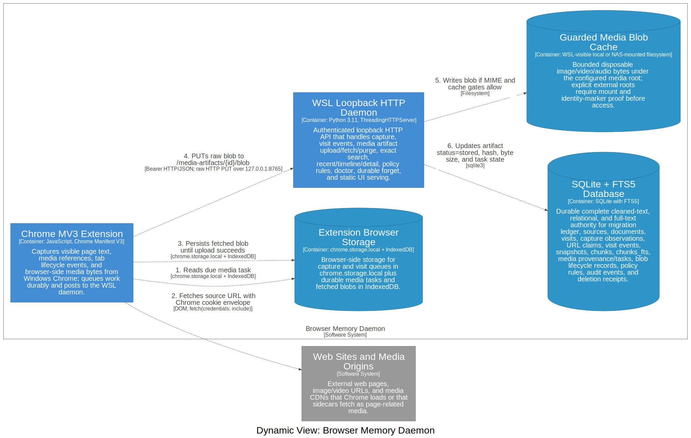

_Preferred Markdown display: Graphviz SVG. Mermaid source is retained below for text review._

Mermaid source

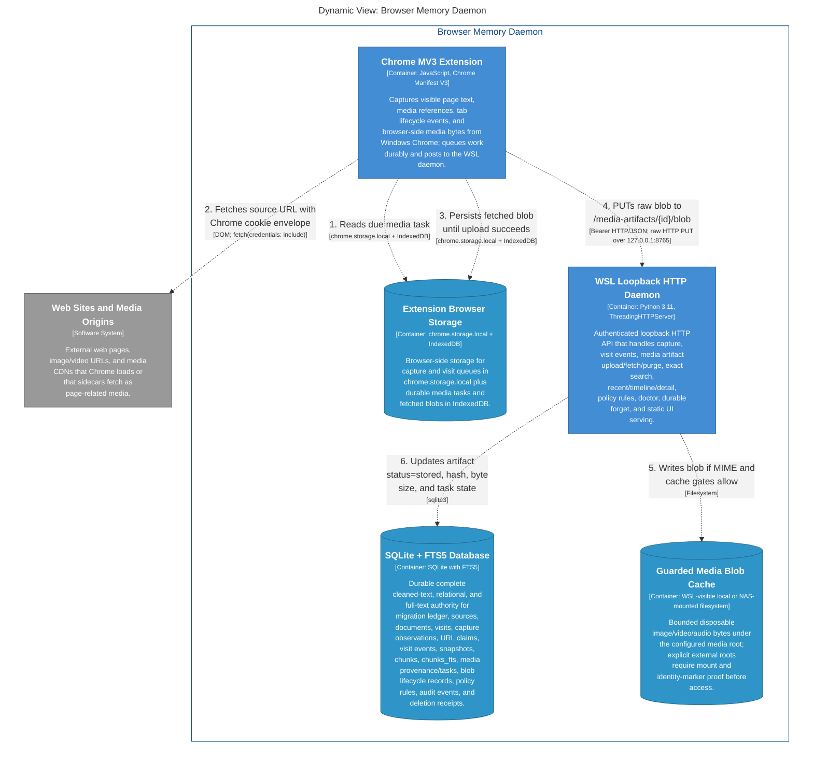
```mermaid
graph LR
  linkStyle default fill:#ffffff

  subgraph diagram ["Dynamic View: Browser Memory Daemon"]
    style diagram fill:#ffffff,stroke:#ffffff

    subgraph 4 ["Browser Memory Daemon"]
      style 4 fill:#ffffff,stroke:#0b4884,color:#0b4884

      13[("<div style='font-weight: bold'>Extension Browser Storage</div><div style='font-size: 70%; margin-top: 0px'>[Container: chrome.storage.local + IndexedDB]</div><div style='font-size: 80%; margin-top:10px'>Browser-side storage for<br />capture and visit queues in<br />chrome.storage.local plus<br />durable media tasks and<br />fetched blobs in IndexedDB.</div>")]
      style 13 fill:#2f95c8,stroke:#20688c,color:#ffffff
      14["<div style='font-weight: bold'>WSL Loopback HTTP Daemon</div><div style='font-size: 70%; margin-top: 0px'>[Container: Python 3.11, ThreadingHTTPServer]</div><div style='font-size: 80%; margin-top:10px'>Authenticated loopback HTTP<br />API that handles capture,<br />visit events, media artifact<br />upload/fetch/purge, exact<br />search,<br />recent/timeline/detail,<br />policy rules, doctor, durable<br />forget, and static UI<br />serving.</div>"]
      style 14 fill:#438dd5,stroke:#2e6295,color:#ffffff
      30[("<div style='font-weight: bold'>SQLite + FTS5 Database</div><div style='font-size: 70%; margin-top: 0px'>[Container: SQLite with FTS5]</div><div style='font-size: 80%; margin-top:10px'>Durable complete<br />cleaned-text, relational, and<br />full-text authority for<br />migration ledger, sources,<br />documents, visits, capture<br />observations, URL claims,<br />visit events, snapshots,<br />chunks, chunks_fts, media<br />provenance/tasks, blob<br />lifecycle records, policy<br />rules, audit events, and<br />deletion receipts.</div>")]
      style 30 fill:#2f95c8,stroke:#20688c,color:#ffffff
      32[("<div style='font-weight: bold'>Guarded Media Blob Cache</div><div style='font-size: 70%; margin-top: 0px'>[Container: WSL-visible local or NAS-mounted filesystem]</div><div style='font-size: 80%; margin-top:10px'>Bounded disposable<br />image/video/audio bytes under<br />the configured media root;<br />explicit external roots<br />require mount and<br />identity-marker proof before<br />access.</div>")]
      style 32 fill:#2f95c8,stroke:#20688c,color:#ffffff
      5["<div style='font-weight: bold'>Chrome MV3 Extension</div><div style='font-size: 70%; margin-top: 0px'>[Container: JavaScript, Chrome Manifest V3]</div><div style='font-size: 80%; margin-top:10px'>Captures visible page text,<br />media references, tab<br />lifecycle events, and<br />browser-side media bytes from<br />Windows Chrome; queues work<br />durably and posts to the WSL<br />daemon.</div>"]
      style 5 fill:#438dd5,stroke:#2e6295,color:#ffffff
    end

    3["<div style='font-weight: bold'>Web Sites and Media Origins</div><div style='font-size: 70%; margin-top: 0px'>[Software System]</div><div style='font-size: 80%; margin-top:10px'>External web pages,<br />image/video URLs, and media<br />CDNs that Chrome loads or<br />that sidecars fetch as<br />page-related media.</div>"]
    style 3 fill:#999999,stroke:#6b6b6b,color:#ffffff

    5-. "<div>1. Reads due media task</div><div style='font-size: 70%'>[chrome.storage.local + IndexedDB]</div>" .->13
    5-. "<div>2. Fetches source URL with<br />Chrome cookie envelope</div><div style='font-size: 70%'>[DOM; fetch(credentials: include)]</div>" .->3
    5-. "<div>3. Persists fetched blob<br />until upload succeeds</div><div style='font-size: 70%'>[chrome.storage.local + IndexedDB]</div>" .->13
    5-. "<div>4. PUTs raw blob to<br />/media-artifacts/{id}/blob</div><div style='font-size: 70%'>[Bearer HTTP/JSON; raw HTTP PUT over 127.0.0.1:8765]</div>" .->14
    14-. "<div>5. Writes blob if MIME and<br />cache gates allow</div><div style='font-size: 70%'>[Filesystem]</div>" .->32
    14-. "<div>6. Updates artifact<br />status=stored, hash, byte<br />size, and task state</div><div style='font-size: 70%'>[sqlite3]</div>" .->30

  end
```

### Derived artifacts

| Artifact | Link |
|---|---|
| Mermaid source | [`structurizr-CredentialedMediaSidecarFlow.mmd`](diagrams/structurizr-CredentialedMediaSidecarFlow.mmd) |
| Mermaid SVG | [`structurizr-CredentialedMediaSidecarFlow.svg`](diagrams/structurizr-CredentialedMediaSidecarFlow.svg) |
| Mermaid PNG | [`structurizr-CredentialedMediaSidecarFlow.png`](diagrams/structurizr-CredentialedMediaSidecarFlow.png) |
| DOT source | [`structurizr-CredentialedMediaSidecarFlow.dot`](diagrams/dot/structurizr-CredentialedMediaSidecarFlow.dot) |
| Graphviz SVG | [`structurizr-CredentialedMediaSidecarFlow.svg`](diagrams/dot-rendered/structurizr-CredentialedMediaSidecarFlow.svg) |
| Graphviz PNG | [`structurizr-CredentialedMediaSidecarFlow.png`](diagrams/dot-rendered/structurizr-CredentialedMediaSidecarFlow.png) |

---

## Daemon Doctor Components

> C4 view `DaemonDoctorComponents`.

### Diagram

_Preferred Markdown display: Graphviz SVG. Mermaid source is retained below for text review._

Mermaid source

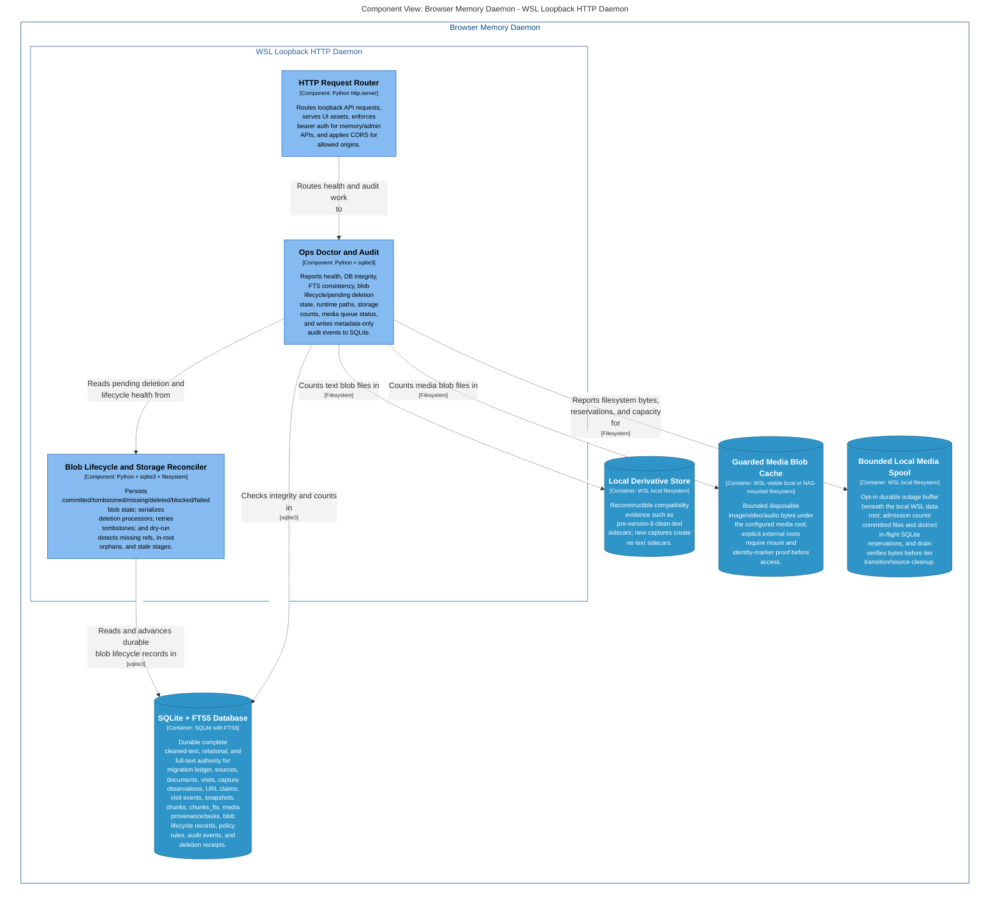
```mermaid
graph LR
  linkStyle default fill:#ffffff

  subgraph diagram ["Component View: Browser Memory Daemon - WSL Loopback HTTP Daemon"]
    style diagram fill:#ffffff,stroke:#ffffff

    subgraph 4 ["Browser Memory Daemon"]
      style 4 fill:#ffffff,stroke:#0b4884,color:#0b4884

      subgraph 14 ["WSL Loopback HTTP Daemon"]
        style 14 fill:#ffffff,stroke:#2e6295,color:#2e6295

        15["<div style='font-weight: bold'>HTTP Request Router</div><div style='font-size: 70%; margin-top: 0px'>[Component: Python http.server]</div><div style='font-size: 80%; margin-top:10px'>Routes loopback API requests,<br />serves UI assets, enforces<br />bearer auth for memory/admin<br />APIs, and applies CORS for<br />allowed origins.</div>"]
        style 15 fill:#85bbf0,stroke:#1168bd,color:#000000
        23["<div style='font-weight: bold'>Blob Lifecycle and Storage Reconciler</div><div style='font-size: 70%; margin-top: 0px'>[Component: Python + sqlite3 + filesystem]</div><div style='font-size: 80%; margin-top:10px'>Persists<br />committed/tombstoned/missing/deleted/blocked/failed<br />blob state; serializes<br />deletion processors; retries<br />tombstones; and dry-run<br />detects missing refs, in-root<br />orphans, and stale stages.</div>"]
        style 23 fill:#85bbf0,stroke:#1168bd,color:#000000
        26["<div style='font-weight: bold'>Ops Doctor and Audit</div><div style='font-size: 70%; margin-top: 0px'>[Component: Python + sqlite3]</div><div style='font-size: 80%; margin-top:10px'>Reports health, DB integrity,<br />FTS consistency, blob<br />lifecycle/pending deletion<br />state, runtime paths, storage<br />counts, media queue status,<br />and writes metadata-only<br />audit events to SQLite.</div>"]
        style 26 fill:#85bbf0,stroke:#1168bd,color:#000000
      end

      30[("<div style='font-weight: bold'>SQLite + FTS5 Database</div><div style='font-size: 70%; margin-top: 0px'>[Container: SQLite with FTS5]</div><div style='font-size: 80%; margin-top:10px'>Durable complete<br />cleaned-text, relational, and<br />full-text authority for<br />migration ledger, sources,<br />documents, visits, capture<br />observations, URL claims,<br />visit events, snapshots,<br />chunks, chunks_fts, media<br />provenance/tasks, blob<br />lifecycle records, policy<br />rules, audit events, and<br />deletion receipts.</div>")]
      style 30 fill:#2f95c8,stroke:#20688c,color:#ffffff
      31[("<div style='font-weight: bold'>Local Derivative Store</div><div style='font-size: 70%; margin-top: 0px'>[Container: WSL local filesystem]</div><div style='font-size: 80%; margin-top:10px'>Reconstructible compatibility<br />evidence such as<br />pre-version-9 clean-text<br />sidecars; new captures create<br />no text sidecars.</div>")]
      style 31 fill:#2f95c8,stroke:#20688c,color:#ffffff
      32[("<div style='font-weight: bold'>Guarded Media Blob Cache</div><div style='font-size: 70%; margin-top: 0px'>[Container: WSL-visible local or NAS-mounted filesystem]</div><div style='font-size: 80%; margin-top:10px'>Bounded disposable<br />image/video/audio bytes under<br />the configured media root;<br />explicit external roots<br />require mount and<br />identity-marker proof before<br />access.</div>")]
      style 32 fill:#2f95c8,stroke:#20688c,color:#ffffff
      33[("<div style='font-weight: bold'>Bounded Local Media Spool</div><div style='font-size: 70%; margin-top: 0px'>[Container: WSL local filesystem]</div><div style='font-size: 80%; margin-top:10px'>Opt-in durable outage buffer<br />beneath the local WSL data<br />root; admission counts<br />committed files and distinct<br />in-flight SQLite<br />reservations, and drain<br />verifies bytes before tier<br />transition/source cleanup.</div>")]
      style 33 fill:#2f95c8,stroke:#20688c,color:#ffffff
    end

    15-. "<div>Routes health and audit work<br />to</div><div style='font-size: 70%'></div>" .->26
    23-. "<div>Reads and advances durable<br />blob lifecycle records in</div><div style='font-size: 70%'>[sqlite3]</div>" .->30
    26-. "<div>Checks integrity and counts<br />in</div><div style='font-size: 70%'>[sqlite3]</div>" .->30
    26-. "<div>Reads pending deletion and<br />lifecycle health from</div><div style='font-size: 70%'></div>" .->23
    26-. "<div>Counts text blob files in</div><div style='font-size: 70%'>[Filesystem]</div>" .->31
    26-. "<div>Counts media blob files in</div><div style='font-size: 70%'>[Filesystem]</div>" .->32
    26-. "<div>Reports filesystem bytes,<br />reservations, and capacity<br />for</div><div style='font-size: 70%'>[Filesystem]</div>" .->33

  end
```

### Derived artifacts

| Artifact | Link |
|---|---|
| Mermaid source | [`structurizr-DaemonDoctorComponents.mmd`](diagrams/structurizr-DaemonDoctorComponents.mmd) |
| Mermaid SVG | [`structurizr-DaemonDoctorComponents.svg`](diagrams/structurizr-DaemonDoctorComponents.svg) |
| Mermaid PNG | [`structurizr-DaemonDoctorComponents.png`](diagrams/structurizr-DaemonDoctorComponents.png) |
| DOT source | [`structurizr-DaemonDoctorComponents.dot`](diagrams/dot/structurizr-DaemonDoctorComponents.dot) |
| Graphviz SVG | [`structurizr-DaemonDoctorComponents.svg`](diagrams/dot-rendered/structurizr-DaemonDoctorComponents.svg) |
| Graphviz PNG | [`structurizr-DaemonDoctorComponents.png`](diagrams/dot-rendered/structurizr-DaemonDoctorComponents.png) |

---

## Daemon Forget Components

> C4 view `DaemonForgetComponents`.

### Diagram

_Preferred Markdown display: Graphviz SVG. Mermaid source is retained below for text review._

Mermaid source

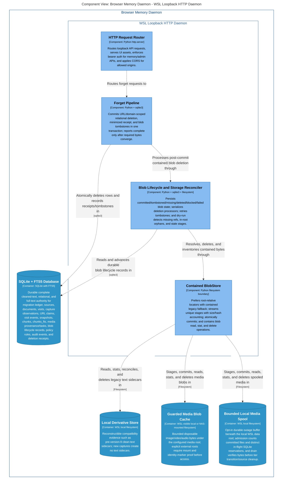
```mermaid
graph LR
  linkStyle default fill:#ffffff

  subgraph diagram ["Component View: Browser Memory Daemon - WSL Loopback HTTP Daemon"]
    style diagram fill:#ffffff,stroke:#ffffff

    subgraph 4 ["Browser Memory Daemon"]
      style 4 fill:#ffffff,stroke:#0b4884,color:#0b4884

      subgraph 14 ["WSL Loopback HTTP Daemon"]
        style 14 fill:#ffffff,stroke:#2e6295,color:#2e6295

        15["<div style='font-weight: bold'>HTTP Request Router</div><div style='font-size: 70%; margin-top: 0px'>[Component: Python http.server]</div><div style='font-size: 80%; margin-top:10px'>Routes loopback API requests,<br />serves UI assets, enforces<br />bearer auth for memory/admin<br />APIs, and applies CORS for<br />allowed origins.</div>"]
        style 15 fill:#85bbf0,stroke:#1168bd,color:#000000
        22["<div style='font-weight: bold'>Contained BlobStore</div><div style='font-size: 70%; margin-top: 0px'>[Component: Python filesystem boundary]</div><div style='font-size: 80%; margin-top:10px'>Prefers root-relative<br />locators with contained<br />legacy fallback; streams<br />unique stages with size/hash<br />accounting; atomically<br />commits; and contains blob<br />read, stat, and delete<br />operations.</div>"]
        style 22 fill:#85bbf0,stroke:#1168bd,color:#000000
        23["<div style='font-weight: bold'>Blob Lifecycle and Storage Reconciler</div><div style='font-size: 70%; margin-top: 0px'>[Component: Python + sqlite3 + filesystem]</div><div style='font-size: 80%; margin-top:10px'>Persists<br />committed/tombstoned/missing/deleted/blocked/failed<br />blob state; serializes<br />deletion processors; retries<br />tombstones; and dry-run<br />detects missing refs, in-root<br />orphans, and stale stages.</div>"]
        style 23 fill:#85bbf0,stroke:#1168bd,color:#000000
        25["<div style='font-weight: bold'>Forget Pipeline</div><div style='font-size: 70%; margin-top: 0px'>[Component: Python + sqlite3]</div><div style='font-size: 80%; margin-top:10px'>Commits URL/domain-scoped<br />relational deletion,<br />minimized receipt, and blob<br />tombstones in one<br />transaction; reports complete<br />only after required bytes<br />converge.</div>"]
        style 25 fill:#85bbf0,stroke:#1168bd,color:#000000
      end

      30[("<div style='font-weight: bold'>SQLite + FTS5 Database</div><div style='font-size: 70%; margin-top: 0px'>[Container: SQLite with FTS5]</div><div style='font-size: 80%; margin-top:10px'>Durable complete<br />cleaned-text, relational, and<br />full-text authority for<br />migration ledger, sources,<br />documents, visits, capture<br />observations, URL claims,<br />visit events, snapshots,<br />chunks, chunks_fts, media<br />provenance/tasks, blob<br />lifecycle records, policy<br />rules, audit events, and<br />deletion receipts.</div>")]
      style 30 fill:#2f95c8,stroke:#20688c,color:#ffffff
      31[("<div style='font-weight: bold'>Local Derivative Store</div><div style='font-size: 70%; margin-top: 0px'>[Container: WSL local filesystem]</div><div style='font-size: 80%; margin-top:10px'>Reconstructible compatibility<br />evidence such as<br />pre-version-9 clean-text<br />sidecars; new captures create<br />no text sidecars.</div>")]
      style 31 fill:#2f95c8,stroke:#20688c,color:#ffffff
      32[("<div style='font-weight: bold'>Guarded Media Blob Cache</div><div style='font-size: 70%; margin-top: 0px'>[Container: WSL-visible local or NAS-mounted filesystem]</div><div style='font-size: 80%; margin-top:10px'>Bounded disposable<br />image/video/audio bytes under<br />the configured media root;<br />explicit external roots<br />require mount and<br />identity-marker proof before<br />access.</div>")]
      style 32 fill:#2f95c8,stroke:#20688c,color:#ffffff
      33[("<div style='font-weight: bold'>Bounded Local Media Spool</div><div style='font-size: 70%; margin-top: 0px'>[Container: WSL local filesystem]</div><div style='font-size: 80%; margin-top:10px'>Opt-in durable outage buffer<br />beneath the local WSL data<br />root; admission counts<br />committed files and distinct<br />in-flight SQLite<br />reservations, and drain<br />verifies bytes before tier<br />transition/source cleanup.</div>")]
      style 33 fill:#2f95c8,stroke:#20688c,color:#ffffff
    end

    15-. "<div>Routes forget requests to</div><div style='font-size: 70%'></div>" .->25
    25-. "<div>Atomically deletes rows and<br />records receipts/tombstones<br />in</div><div style='font-size: 70%'>[sqlite3]</div>" .->30
    25-. "<div>Processes post-commit<br />contained blob deletion<br />through</div><div style='font-size: 70%'></div>" .->23
    23-. "<div>Reads and advances durable<br />blob lifecycle records in</div><div style='font-size: 70%'>[sqlite3]</div>" .->30
    23-. "<div>Resolves, deletes, and<br />inventories contained bytes<br />through</div><div style='font-size: 70%'></div>" .->22
    22-. "<div>Reads, stats, reconciles, and<br />deletes legacy text sidecars<br />in</div><div style='font-size: 70%'>[Filesystem]</div>" .->31
    22-. "<div>Stages, commits, reads,<br />stats, and deletes media<br />blobs in</div><div style='font-size: 70%'>[Filesystem]</div>" .->32
    22-. "<div>Stages, commits, reads,<br />stats, and deletes spooled<br />media in</div><div style='font-size: 70%'>[Filesystem]</div>" .->33

  end
```

### Derived artifacts

| Artifact | Link |
|---|---|
| Mermaid source | [`structurizr-DaemonForgetComponents.mmd`](diagrams/structurizr-DaemonForgetComponents.mmd) |
| Mermaid SVG | [`structurizr-DaemonForgetComponents.svg`](diagrams/structurizr-DaemonForgetComponents.svg) |
| Mermaid PNG | [`structurizr-DaemonForgetComponents.png`](diagrams/structurizr-DaemonForgetComponents.png) |
| DOT source | [`structurizr-DaemonForgetComponents.dot`](diagrams/dot/structurizr-DaemonForgetComponents.dot) |
| Graphviz SVG | [`structurizr-DaemonForgetComponents.svg`](diagrams/dot-rendered/structurizr-DaemonForgetComponents.svg) |
| Graphviz PNG | [`structurizr-DaemonForgetComponents.png`](diagrams/dot-rendered/structurizr-DaemonForgetComponents.png) |

---

## Daemon Ingest Components

> C4 view `DaemonIngestComponents`.

### Diagram

_Preferred Markdown display: Graphviz SVG. Mermaid source is retained below for text review._

Mermaid source

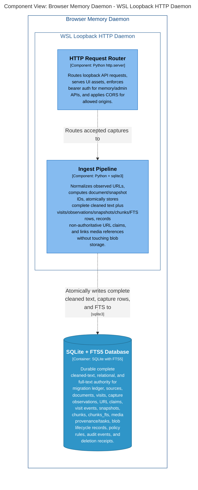
```mermaid
graph LR
  linkStyle default fill:#ffffff

  subgraph diagram ["Component View: Browser Memory Daemon - WSL Loopback HTTP Daemon"]
    style diagram fill:#ffffff,stroke:#ffffff

    subgraph 4 ["Browser Memory Daemon"]
      style 4 fill:#ffffff,stroke:#0b4884,color:#0b4884

      subgraph 14 ["WSL Loopback HTTP Daemon"]
        style 14 fill:#ffffff,stroke:#2e6295,color:#2e6295

        15["<div style='font-weight: bold'>HTTP Request Router</div><div style='font-size: 70%; margin-top: 0px'>[Component: Python http.server]</div><div style='font-size: 80%; margin-top:10px'>Routes loopback API requests,<br />serves UI assets, enforces<br />bearer auth for memory/admin<br />APIs, and applies CORS for<br />allowed origins.</div>"]
        style 15 fill:#85bbf0,stroke:#1168bd,color:#000000
        19["<div style='font-weight: bold'>Ingest Pipeline</div><div style='font-size: 70%; margin-top: 0px'>[Component: Python + sqlite3]</div><div style='font-size: 80%; margin-top:10px'>Normalizes observed URLs,<br />computes document/snapshot<br />IDs, atomically stores<br />complete cleaned text plus<br />visits/observations/snapshots/chunks/FTS<br />rows, records<br />non-authoritative URL claims,<br />and links media references<br />without touching blob<br />storage.</div>"]
        style 19 fill:#85bbf0,stroke:#1168bd,color:#000000
      end

      30[("<div style='font-weight: bold'>SQLite + FTS5 Database</div><div style='font-size: 70%; margin-top: 0px'>[Container: SQLite with FTS5]</div><div style='font-size: 80%; margin-top:10px'>Durable complete<br />cleaned-text, relational, and<br />full-text authority for<br />migration ledger, sources,<br />documents, visits, capture<br />observations, URL claims,<br />visit events, snapshots,<br />chunks, chunks_fts, media<br />provenance/tasks, blob<br />lifecycle records, policy<br />rules, audit events, and<br />deletion receipts.</div>")]
      style 30 fill:#2f95c8,stroke:#20688c,color:#ffffff
    end

    15-. "<div>Routes accepted captures to</div><div style='font-size: 70%'></div>" .->19
    19-. "<div>Atomically writes complete<br />cleaned text, capture rows,<br />and FTS to</div><div style='font-size: 70%'>[sqlite3]</div>" .->30

  end
```

### Derived artifacts

| Artifact | Link |
|---|---|
| Mermaid source | [`structurizr-DaemonIngestComponents.mmd`](diagrams/structurizr-DaemonIngestComponents.mmd) |
| Mermaid SVG | [`structurizr-DaemonIngestComponents.svg`](diagrams/structurizr-DaemonIngestComponents.svg) |
| Mermaid PNG | [`structurizr-DaemonIngestComponents.png`](diagrams/structurizr-DaemonIngestComponents.png) |
| DOT source | [`structurizr-DaemonIngestComponents.dot`](diagrams/dot/structurizr-DaemonIngestComponents.dot) |
| Graphviz SVG | [`structurizr-DaemonIngestComponents.svg`](diagrams/dot-rendered/structurizr-DaemonIngestComponents.svg) |
| Graphviz PNG | [`structurizr-DaemonIngestComponents.png`](diagrams/dot-rendered/structurizr-DaemonIngestComponents.png) |

---

## Daemon Lifecycle Components

> C4 view `DaemonLifecycleComponents`.

### Diagram

_Preferred Markdown display: Graphviz SVG. Mermaid source is retained below for text review._

Mermaid source

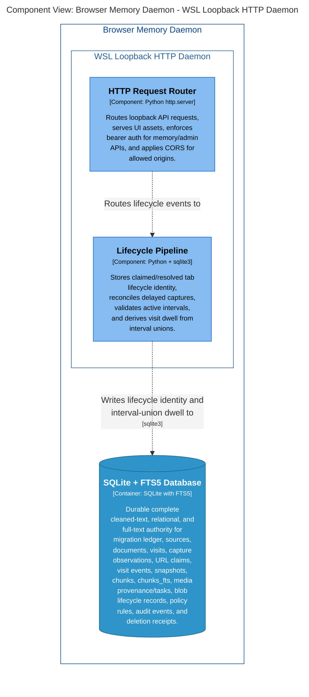
```mermaid
graph LR
  linkStyle default fill:#ffffff

  subgraph diagram ["Component View: Browser Memory Daemon - WSL Loopback HTTP Daemon"]
    style diagram fill:#ffffff,stroke:#ffffff

    subgraph 4 ["Browser Memory Daemon"]
      style 4 fill:#ffffff,stroke:#0b4884,color:#0b4884

      subgraph 14 ["WSL Loopback HTTP Daemon"]
        style 14 fill:#ffffff,stroke:#2e6295,color:#2e6295

        15["<div style='font-weight: bold'>HTTP Request Router</div><div style='font-size: 70%; margin-top: 0px'>[Component: Python http.server]</div><div style='font-size: 80%; margin-top:10px'>Routes loopback API requests,<br />serves UI assets, enforces<br />bearer auth for memory/admin<br />APIs, and applies CORS for<br />allowed origins.</div>"]
        style 15 fill:#85bbf0,stroke:#1168bd,color:#000000
        20["<div style='font-weight: bold'>Lifecycle Pipeline</div><div style='font-size: 70%; margin-top: 0px'>[Component: Python + sqlite3]</div><div style='font-size: 80%; margin-top:10px'>Stores claimed/resolved tab<br />lifecycle identity,<br />reconciles delayed captures,<br />validates active intervals,<br />and derives visit dwell from<br />interval unions.</div>"]
        style 20 fill:#85bbf0,stroke:#1168bd,color:#000000
      end

      30[("<div style='font-weight: bold'>SQLite + FTS5 Database</div><div style='font-size: 70%; margin-top: 0px'>[Container: SQLite with FTS5]</div><div style='font-size: 80%; margin-top:10px'>Durable complete<br />cleaned-text, relational, and<br />full-text authority for<br />migration ledger, sources,<br />documents, visits, capture<br />observations, URL claims,<br />visit events, snapshots,<br />chunks, chunks_fts, media<br />provenance/tasks, blob<br />lifecycle records, policy<br />rules, audit events, and<br />deletion receipts.</div>")]
      style 30 fill:#2f95c8,stroke:#20688c,color:#ffffff
    end

    15-. "<div>Routes lifecycle events to</div><div style='font-size: 70%'></div>" .->20
    20-. "<div>Writes lifecycle identity and<br />interval-union dwell to</div><div style='font-size: 70%'>[sqlite3]</div>" .->30

  end
```

### Derived artifacts

| Artifact | Link |
|---|---|
| Mermaid source | [`structurizr-DaemonLifecycleComponents.mmd`](diagrams/structurizr-DaemonLifecycleComponents.mmd) |
| Mermaid SVG | [`structurizr-DaemonLifecycleComponents.svg`](diagrams/structurizr-DaemonLifecycleComponents.svg) |
| Mermaid PNG | [`structurizr-DaemonLifecycleComponents.png`](diagrams/structurizr-DaemonLifecycleComponents.png) |
| DOT source | [`structurizr-DaemonLifecycleComponents.dot`](diagrams/dot/structurizr-DaemonLifecycleComponents.dot) |
| Graphviz SVG | [`structurizr-DaemonLifecycleComponents.svg`](diagrams/dot-rendered/structurizr-DaemonLifecycleComponents.svg) |
| Graphviz PNG | [`structurizr-DaemonLifecycleComponents.png`](diagrams/dot-rendered/structurizr-DaemonLifecycleComponents.png) |

---

## Daemon Media Components

> C4 view `DaemonMediaComponents`.

### Diagram

_Preferred Markdown display: Graphviz SVG. Mermaid source is retained below for text review._

Mermaid source

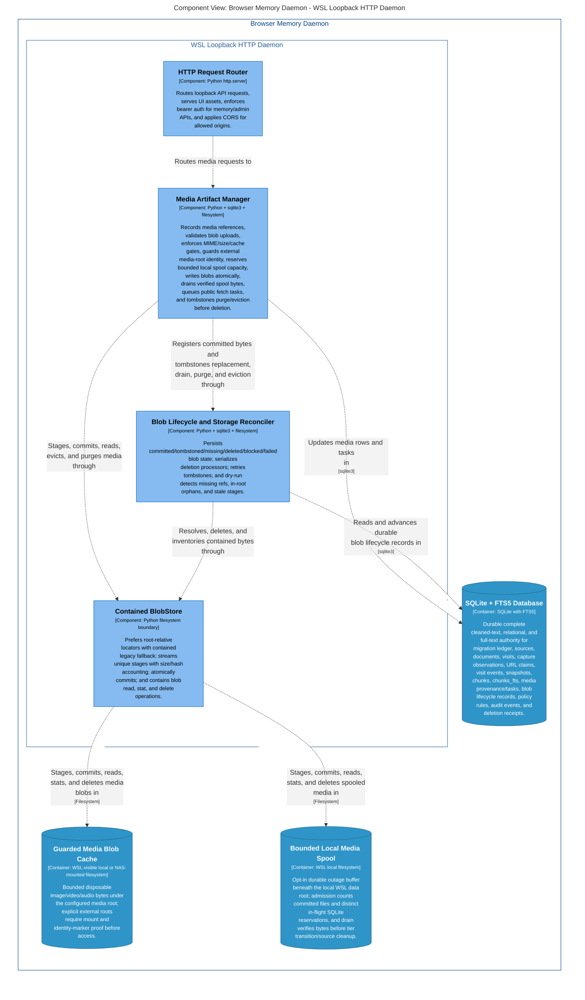
```mermaid
graph LR
  linkStyle default fill:#ffffff

  subgraph diagram ["Component View: Browser Memory Daemon - WSL Loopback HTTP Daemon"]
    style diagram fill:#ffffff,stroke:#ffffff

    subgraph 4 ["Browser Memory Daemon"]
      style 4 fill:#ffffff,stroke:#0b4884,color:#0b4884

      subgraph 14 ["WSL Loopback HTTP Daemon"]
        style 14 fill:#ffffff,stroke:#2e6295,color:#2e6295

        15["<div style='font-weight: bold'>HTTP Request Router</div><div style='font-size: 70%; margin-top: 0px'>[Component: Python http.server]</div><div style='font-size: 80%; margin-top:10px'>Routes loopback API requests,<br />serves UI assets, enforces<br />bearer auth for memory/admin<br />APIs, and applies CORS for<br />allowed origins.</div>"]
        style 15 fill:#85bbf0,stroke:#1168bd,color:#000000
        21["<div style='font-weight: bold'>Media Artifact Manager</div><div style='font-size: 70%; margin-top: 0px'>[Component: Python + sqlite3 + filesystem]</div><div style='font-size: 80%; margin-top:10px'>Records media references,<br />validates blob uploads,<br />enforces MIME/size/cache<br />gates, guards external<br />media-root identity, reserves<br />bounded local spool capacity,<br />writes blobs atomically,<br />drains verified spool bytes,<br />queues public fetch tasks,<br />and tombstones purge/eviction<br />before deletion.</div>"]
        style 21 fill:#85bbf0,stroke:#1168bd,color:#000000
        22["<div style='font-weight: bold'>Contained BlobStore</div><div style='font-size: 70%; margin-top: 0px'>[Component: Python filesystem boundary]</div><div style='font-size: 80%; margin-top:10px'>Prefers root-relative<br />locators with contained<br />legacy fallback; streams<br />unique stages with size/hash<br />accounting; atomically<br />commits; and contains blob<br />read, stat, and delete<br />operations.</div>"]
        style 22 fill:#85bbf0,stroke:#1168bd,color:#000000
        23["<div style='font-weight: bold'>Blob Lifecycle and Storage Reconciler</div><div style='font-size: 70%; margin-top: 0px'>[Component: Python + sqlite3 + filesystem]</div><div style='font-size: 80%; margin-top:10px'>Persists<br />committed/tombstoned/missing/deleted/blocked/failed<br />blob state; serializes<br />deletion processors; retries<br />tombstones; and dry-run<br />detects missing refs, in-root<br />orphans, and stale stages.</div>"]
        style 23 fill:#85bbf0,stroke:#1168bd,color:#000000
      end

      30[("<div style='font-weight: bold'>SQLite + FTS5 Database</div><div style='font-size: 70%; margin-top: 0px'>[Container: SQLite with FTS5]</div><div style='font-size: 80%; margin-top:10px'>Durable complete<br />cleaned-text, relational, and<br />full-text authority for<br />migration ledger, sources,<br />documents, visits, capture<br />observations, URL claims,<br />visit events, snapshots,<br />chunks, chunks_fts, media<br />provenance/tasks, blob<br />lifecycle records, policy<br />rules, audit events, and<br />deletion receipts.</div>")]
      style 30 fill:#2f95c8,stroke:#20688c,color:#ffffff
      32[("<div style='font-weight: bold'>Guarded Media Blob Cache</div><div style='font-size: 70%; margin-top: 0px'>[Container: WSL-visible local or NAS-mounted filesystem]</div><div style='font-size: 80%; margin-top:10px'>Bounded disposable<br />image/video/audio bytes under<br />the configured media root;<br />explicit external roots<br />require mount and<br />identity-marker proof before<br />access.</div>")]
      style 32 fill:#2f95c8,stroke:#20688c,color:#ffffff
      33[("<div style='font-weight: bold'>Bounded Local Media Spool</div><div style='font-size: 70%; margin-top: 0px'>[Container: WSL local filesystem]</div><div style='font-size: 80%; margin-top:10px'>Opt-in durable outage buffer<br />beneath the local WSL data<br />root; admission counts<br />committed files and distinct<br />in-flight SQLite<br />reservations, and drain<br />verifies bytes before tier<br />transition/source cleanup.</div>")]
      style 33 fill:#2f95c8,stroke:#20688c,color:#ffffff
    end

    15-. "<div>Routes media requests to</div><div style='font-size: 70%'></div>" .->21
    21-. "<div>Updates media rows and tasks<br />in</div><div style='font-size: 70%'>[sqlite3]</div>" .->30
    21-. "<div>Stages, commits, reads,<br />evicts, and purges media<br />through</div><div style='font-size: 70%'></div>" .->22
    21-. "<div>Registers committed bytes and<br />tombstones replacement,<br />drain, purge, and eviction<br />through</div><div style='font-size: 70%'></div>" .->23
    23-. "<div>Reads and advances durable<br />blob lifecycle records in</div><div style='font-size: 70%'>[sqlite3]</div>" .->30
    23-. "<div>Resolves, deletes, and<br />inventories contained bytes<br />through</div><div style='font-size: 70%'></div>" .->22
    22-. "<div>Stages, commits, reads,<br />stats, and deletes media<br />blobs in</div><div style='font-size: 70%'>[Filesystem]</div>" .->32
    22-. "<div>Stages, commits, reads,<br />stats, and deletes spooled<br />media in</div><div style='font-size: 70%'>[Filesystem]</div>" .->33

  end
```

### Derived artifacts

| Artifact | Link |
|---|---|
| Mermaid source | [`structurizr-DaemonMediaComponents.mmd`](diagrams/structurizr-DaemonMediaComponents.mmd) |
| Mermaid SVG | [`structurizr-DaemonMediaComponents.svg`](diagrams/structurizr-DaemonMediaComponents.svg) |
| Mermaid PNG | [`structurizr-DaemonMediaComponents.png`](diagrams/structurizr-DaemonMediaComponents.png) |
| DOT source | [`structurizr-DaemonMediaComponents.dot`](diagrams/dot/structurizr-DaemonMediaComponents.dot) |
| Graphviz SVG | [`structurizr-DaemonMediaComponents.svg`](diagrams/dot-rendered/structurizr-DaemonMediaComponents.svg) |
| Graphviz PNG | [`structurizr-DaemonMediaComponents.png`](diagrams/dot-rendered/structurizr-DaemonMediaComponents.png) |

---

## Daemon Media Worker Containers

> C4 view `DaemonMediaWorkerContainers`.

### Diagram

_Preferred Markdown display: Graphviz SVG. Mermaid source is retained below for text review._

Mermaid source

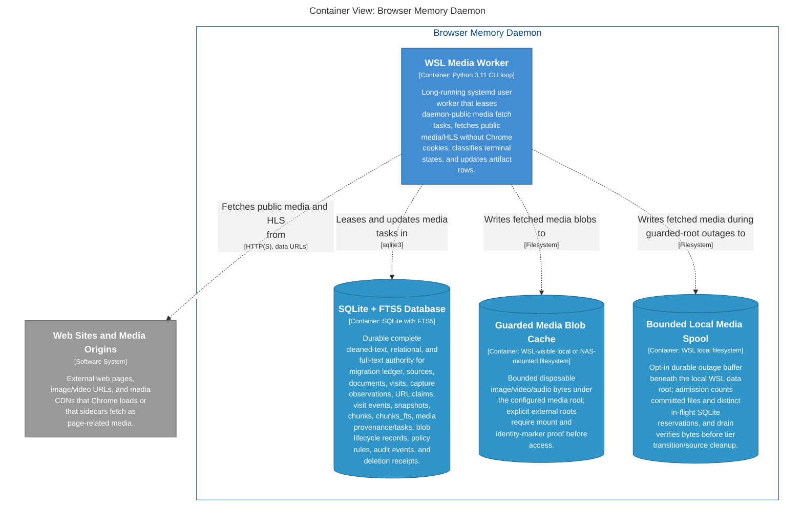
```mermaid
graph LR
  linkStyle default fill:#ffffff

  subgraph diagram ["Container View: Browser Memory Daemon"]
    style diagram fill:#ffffff,stroke:#ffffff

    3["<div style='font-weight: bold'>Web Sites and Media Origins</div><div style='font-size: 70%; margin-top: 0px'>[Software System]</div><div style='font-size: 80%; margin-top:10px'>External web pages,<br />image/video URLs, and media<br />CDNs that Chrome loads or<br />that sidecars fetch as<br />page-related media.</div>"]
    style 3 fill:#999999,stroke:#6b6b6b,color:#ffffff

    subgraph 4 ["Browser Memory Daemon"]
      style 4 fill:#ffffff,stroke:#0b4884,color:#0b4884

      27["<div style='font-weight: bold'>WSL Media Worker</div><div style='font-size: 70%; margin-top: 0px'>[Container: Python 3.11 CLI loop]</div><div style='font-size: 80%; margin-top:10px'>Long-running systemd user<br />worker that leases<br />daemon-public media fetch<br />tasks, fetches public<br />media/HLS without Chrome<br />cookies, classifies terminal<br />states, and updates artifact<br />rows.</div>"]
      style 27 fill:#438dd5,stroke:#2e6295,color:#ffffff
      30[("<div style='font-weight: bold'>SQLite + FTS5 Database</div><div style='font-size: 70%; margin-top: 0px'>[Container: SQLite with FTS5]</div><div style='font-size: 80%; margin-top:10px'>Durable complete<br />cleaned-text, relational, and<br />full-text authority for<br />migration ledger, sources,<br />documents, visits, capture<br />observations, URL claims,<br />visit events, snapshots,<br />chunks, chunks_fts, media<br />provenance/tasks, blob<br />lifecycle records, policy<br />rules, audit events, and<br />deletion receipts.</div>")]
      style 30 fill:#2f95c8,stroke:#20688c,color:#ffffff
      32[("<div style='font-weight: bold'>Guarded Media Blob Cache</div><div style='font-size: 70%; margin-top: 0px'>[Container: WSL-visible local or NAS-mounted filesystem]</div><div style='font-size: 80%; margin-top:10px'>Bounded disposable<br />image/video/audio bytes under<br />the configured media root;<br />explicit external roots<br />require mount and<br />identity-marker proof before<br />access.</div>")]
      style 32 fill:#2f95c8,stroke:#20688c,color:#ffffff
      33[("<div style='font-weight: bold'>Bounded Local Media Spool</div><div style='font-size: 70%; margin-top: 0px'>[Container: WSL local filesystem]</div><div style='font-size: 80%; margin-top:10px'>Opt-in durable outage buffer<br />beneath the local WSL data<br />root; admission counts<br />committed files and distinct<br />in-flight SQLite<br />reservations, and drain<br />verifies bytes before tier<br />transition/source cleanup.</div>")]
      style 33 fill:#2f95c8,stroke:#20688c,color:#ffffff
    end

    27-. "<div>Leases and updates media<br />tasks in</div><div style='font-size: 70%'>[sqlite3]</div>" .->30
    27-. "<div>Fetches public media and HLS<br />from</div><div style='font-size: 70%'>[HTTP(S), data URLs]</div>" .->3
    27-. "<div>Writes fetched media blobs to</div><div style='font-size: 70%'>[Filesystem]</div>" .->32
    27-. "<div>Writes fetched media during<br />guarded-root outages to</div><div style='font-size: 70%'>[Filesystem]</div>" .->33

  end
```

### Derived artifacts

| Artifact | Link |
|---|---|
| Mermaid source | [`structurizr-DaemonMediaWorkerContainers.mmd`](diagrams/structurizr-DaemonMediaWorkerContainers.mmd) |
| Mermaid SVG | [`structurizr-DaemonMediaWorkerContainers.svg`](diagrams/structurizr-DaemonMediaWorkerContainers.svg) |
| Mermaid PNG | [`structurizr-DaemonMediaWorkerContainers.png`](diagrams/structurizr-DaemonMediaWorkerContainers.png) |
| DOT source | [`structurizr-DaemonMediaWorkerContainers.dot`](diagrams/dot/structurizr-DaemonMediaWorkerContainers.dot) |
| Graphviz SVG | [`structurizr-DaemonMediaWorkerContainers.svg`](diagrams/dot-rendered/structurizr-DaemonMediaWorkerContainers.svg) |
| Graphviz PNG | [`structurizr-DaemonMediaWorkerContainers.png`](diagrams/dot-rendered/structurizr-DaemonMediaWorkerContainers.png) |

---

## Daemon Migration Components

> C4 view `DaemonMigrationComponents`.

### Diagram

_Preferred Markdown display: Graphviz SVG. Mermaid source is retained below for text review._

Mermaid source

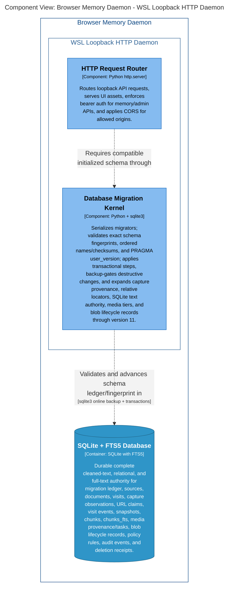
```mermaid
graph LR
  linkStyle default fill:#ffffff

  subgraph diagram ["Component View: Browser Memory Daemon - WSL Loopback HTTP Daemon"]
    style diagram fill:#ffffff,stroke:#ffffff

    subgraph 4 ["Browser Memory Daemon"]
      style 4 fill:#ffffff,stroke:#0b4884,color:#0b4884

      subgraph 14 ["WSL Loopback HTTP Daemon"]
        style 14 fill:#ffffff,stroke:#2e6295,color:#2e6295

        15["<div style='font-weight: bold'>HTTP Request Router</div><div style='font-size: 70%; margin-top: 0px'>[Component: Python http.server]</div><div style='font-size: 80%; margin-top:10px'>Routes loopback API requests,<br />serves UI assets, enforces<br />bearer auth for memory/admin<br />APIs, and applies CORS for<br />allowed origins.</div>"]
        style 15 fill:#85bbf0,stroke:#1168bd,color:#000000
        16["<div style='font-weight: bold'>Database Migration Kernel</div><div style='font-size: 70%; margin-top: 0px'>[Component: Python + sqlite3]</div><div style='font-size: 80%; margin-top:10px'>Serializes migrators;<br />validates exact schema<br />fingerprints, ordered<br />names/checksums, and PRAGMA<br />user_version; applies<br />transactional steps,<br />backup-gates destructive<br />changes, and expands capture<br />provenance, relative<br />locators, SQLite text<br />authority, media tiers, and<br />blob lifecycle records<br />through version 11.</div>"]
        style 16 fill:#85bbf0,stroke:#1168bd,color:#000000
      end

      30[("<div style='font-weight: bold'>SQLite + FTS5 Database</div><div style='font-size: 70%; margin-top: 0px'>[Container: SQLite with FTS5]</div><div style='font-size: 80%; margin-top:10px'>Durable complete<br />cleaned-text, relational, and<br />full-text authority for<br />migration ledger, sources,<br />documents, visits, capture<br />observations, URL claims,<br />visit events, snapshots,<br />chunks, chunks_fts, media<br />provenance/tasks, blob<br />lifecycle records, policy<br />rules, audit events, and<br />deletion receipts.</div>")]
      style 30 fill:#2f95c8,stroke:#20688c,color:#ffffff
    end

    15-. "<div>Requires compatible<br />initialized schema through</div><div style='font-size: 70%'></div>" .->16
    16-. "<div>Validates and advances schema<br />ledger/fingerprint in</div><div style='font-size: 70%'>[sqlite3 online backup + transactions]</div>" .->30

  end
```

### Derived artifacts

| Artifact | Link |
|---|---|
| Mermaid source | [`structurizr-DaemonMigrationComponents.mmd`](diagrams/structurizr-DaemonMigrationComponents.mmd) |
| Mermaid SVG | [`structurizr-DaemonMigrationComponents.svg`](diagrams/structurizr-DaemonMigrationComponents.svg) |
| Mermaid PNG | [`structurizr-DaemonMigrationComponents.png`](diagrams/structurizr-DaemonMigrationComponents.png) |
| DOT source | [`structurizr-DaemonMigrationComponents.dot`](diagrams/dot/structurizr-DaemonMigrationComponents.dot) |
| Graphviz SVG | [`structurizr-DaemonMigrationComponents.svg`](diagrams/dot-rendered/structurizr-DaemonMigrationComponents.svg) |
| Graphviz PNG | [`structurizr-DaemonMigrationComponents.png`](diagrams/dot-rendered/structurizr-DaemonMigrationComponents.png) |

---

## Daemon Policy Components

> C4 view `DaemonPolicyComponents`.

### Diagram

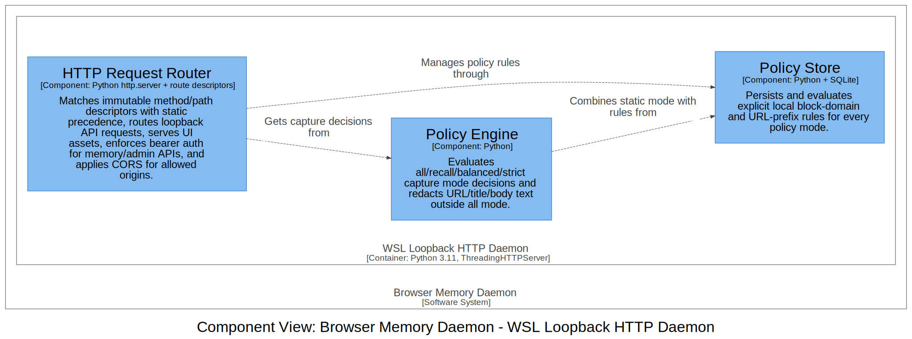

_Preferred Markdown display: Graphviz SVG. Mermaid source is retained below for text review._

Mermaid source

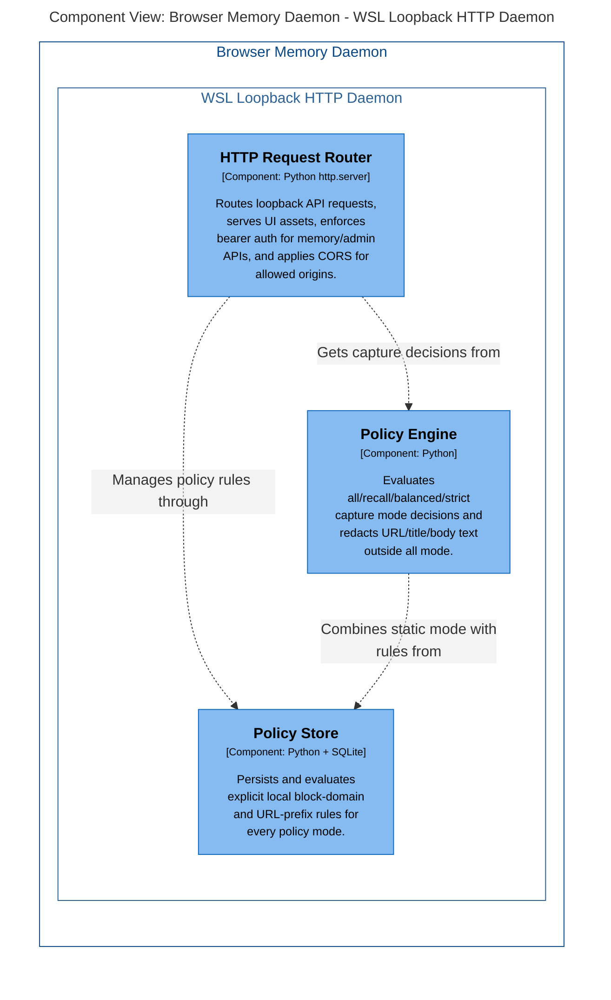
```mermaid
graph LR
  linkStyle default fill:#ffffff

  subgraph diagram ["Component View: Browser Memory Daemon - WSL Loopback HTTP Daemon"]
    style diagram fill:#ffffff,stroke:#ffffff

    subgraph 4 ["Browser Memory Daemon"]
      style 4 fill:#ffffff,stroke:#0b4884,color:#0b4884

      subgraph 14 ["WSL Loopback HTTP Daemon"]
        style 14 fill:#ffffff,stroke:#2e6295,color:#2e6295

        15["<div style='font-weight: bold'>HTTP Request Router</div><div style='font-size: 70%; margin-top: 0px'>[Component: Python http.server]</div><div style='font-size: 80%; margin-top:10px'>Routes loopback API requests,<br />serves UI assets, enforces<br />bearer auth for memory/admin<br />APIs, and applies CORS for<br />allowed origins.</div>"]
        style 15 fill:#85bbf0,stroke:#1168bd,color:#000000
        17["<div style='font-weight: bold'>Policy Engine</div><div style='font-size: 70%; margin-top: 0px'>[Component: Python]</div><div style='font-size: 80%; margin-top:10px'>Evaluates<br />all/recall/balanced/strict<br />capture mode decisions and<br />redacts URL/title/body text<br />outside all mode.</div>"]
        style 17 fill:#85bbf0,stroke:#1168bd,color:#000000
        18["<div style='font-weight: bold'>Policy Store</div><div style='font-size: 70%; margin-top: 0px'>[Component: Python + SQLite]</div><div style='font-size: 80%; margin-top:10px'>Persists and evaluates<br />explicit local block-domain<br />and URL-prefix rules for<br />every policy mode.</div>"]
        style 18 fill:#85bbf0,stroke:#1168bd,color:#000000
      end

    end

    15-. "<div>Gets capture decisions from</div><div style='font-size: 70%'></div>" .->17
    15-. "<div>Manages policy rules through</div><div style='font-size: 70%'></div>" .->18
    17-. "<div>Combines static mode with<br />rules from</div><div style='font-size: 70%'></div>" .->18

  end
```

### Derived artifacts

| Artifact | Link |
|---|---|
| Mermaid source | [`structurizr-DaemonPolicyComponents.mmd`](diagrams/structurizr-DaemonPolicyComponents.mmd) |
| Mermaid SVG | [`structurizr-DaemonPolicyComponents.svg`](diagrams/structurizr-DaemonPolicyComponents.svg) |
| Mermaid PNG | [`structurizr-DaemonPolicyComponents.png`](diagrams/structurizr-DaemonPolicyComponents.png) |
| DOT source | [`structurizr-DaemonPolicyComponents.dot`](diagrams/dot/structurizr-DaemonPolicyComponents.dot) |
| Graphviz SVG | [`structurizr-DaemonPolicyComponents.svg`](diagrams/dot-rendered/structurizr-DaemonPolicyComponents.svg) |
| Graphviz PNG | [`structurizr-DaemonPolicyComponents.png`](diagrams/dot-rendered/structurizr-DaemonPolicyComponents.png) |

---

## Daemon Public Media Worker Flow

> C4 view `DaemonPublicMediaWorkerFlow`.

### Diagram

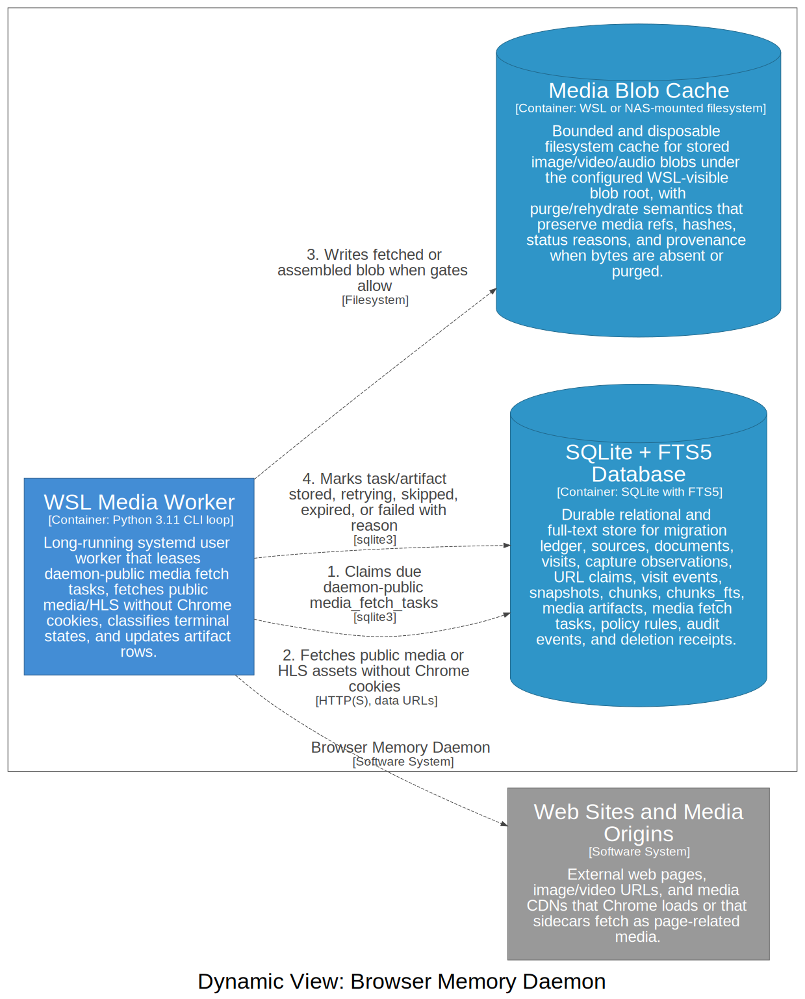

_Preferred Markdown display: Graphviz SVG. Mermaid source is retained below for text review._

Mermaid source

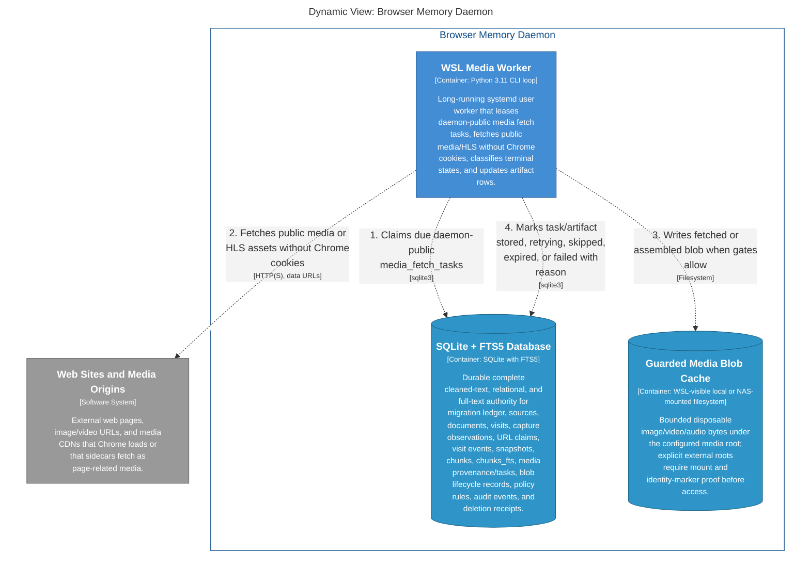
```mermaid
graph LR
  linkStyle default fill:#ffffff

  subgraph diagram ["Dynamic View: Browser Memory Daemon"]
    style diagram fill:#ffffff,stroke:#ffffff

    subgraph 4 ["Browser Memory Daemon"]
      style 4 fill:#ffffff,stroke:#0b4884,color:#0b4884

      27["<div style='font-weight: bold'>WSL Media Worker</div><div style='font-size: 70%; margin-top: 0px'>[Container: Python 3.11 CLI loop]</div><div style='font-size: 80%; margin-top:10px'>Long-running systemd user<br />worker that leases<br />daemon-public media fetch<br />tasks, fetches public<br />media/HLS without Chrome<br />cookies, classifies terminal<br />states, and updates artifact<br />rows.</div>"]
      style 27 fill:#438dd5,stroke:#2e6295,color:#ffffff
      30[("<div style='font-weight: bold'>SQLite + FTS5 Database</div><div style='font-size: 70%; margin-top: 0px'>[Container: SQLite with FTS5]</div><div style='font-size: 80%; margin-top:10px'>Durable complete<br />cleaned-text, relational, and<br />full-text authority for<br />migration ledger, sources,<br />documents, visits, capture<br />observations, URL claims,<br />visit events, snapshots,<br />chunks, chunks_fts, media<br />provenance/tasks, blob<br />lifecycle records, policy<br />rules, audit events, and<br />deletion receipts.</div>")]
      style 30 fill:#2f95c8,stroke:#20688c,color:#ffffff
      32[("<div style='font-weight: bold'>Guarded Media Blob Cache</div><div style='font-size: 70%; margin-top: 0px'>[Container: WSL-visible local or NAS-mounted filesystem]</div><div style='font-size: 80%; margin-top:10px'>Bounded disposable<br />image/video/audio bytes under<br />the configured media root;<br />explicit external roots<br />require mount and<br />identity-marker proof before<br />access.</div>")]
      style 32 fill:#2f95c8,stroke:#20688c,color:#ffffff
    end

    3["<div style='font-weight: bold'>Web Sites and Media Origins</div><div style='font-size: 70%; margin-top: 0px'>[Software System]</div><div style='font-size: 80%; margin-top:10px'>External web pages,<br />image/video URLs, and media<br />CDNs that Chrome loads or<br />that sidecars fetch as<br />page-related media.</div>"]
    style 3 fill:#999999,stroke:#6b6b6b,color:#ffffff

    27-. "<div>1. Claims due daemon-public<br />media_fetch_tasks</div><div style='font-size: 70%'>[sqlite3]</div>" .->30
    27-. "<div>2. Fetches public media or<br />HLS assets without Chrome<br />cookies</div><div style='font-size: 70%'>[HTTP(S), data URLs]</div>" .->3
    27-. "<div>3. Writes fetched or<br />assembled blob when gates<br />allow</div><div style='font-size: 70%'>[Filesystem]</div>" .->32
    27-. "<div>4. Marks task/artifact<br />stored, retrying, skipped,<br />expired, or failed with<br />reason</div><div style='font-size: 70%'>[sqlite3]</div>" .->30

  end
```

### Derived artifacts

| Artifact | Link |
|---|---|
| Mermaid source | [`structurizr-DaemonPublicMediaWorkerFlow.mmd`](diagrams/structurizr-DaemonPublicMediaWorkerFlow.mmd) |
| Mermaid SVG | [`structurizr-DaemonPublicMediaWorkerFlow.svg`](diagrams/structurizr-DaemonPublicMediaWorkerFlow.svg) |
| Mermaid PNG | [`structurizr-DaemonPublicMediaWorkerFlow.png`](diagrams/structurizr-DaemonPublicMediaWorkerFlow.png) |
| DOT source | [`structurizr-DaemonPublicMediaWorkerFlow.dot`](diagrams/dot/structurizr-DaemonPublicMediaWorkerFlow.dot) |
| Graphviz SVG | [`structurizr-DaemonPublicMediaWorkerFlow.svg`](diagrams/dot-rendered/structurizr-DaemonPublicMediaWorkerFlow.svg) |
| Graphviz PNG | [`structurizr-DaemonPublicMediaWorkerFlow.png`](diagrams/dot-rendered/structurizr-DaemonPublicMediaWorkerFlow.png) |

---

## Daemon Read Components

> C4 view `DaemonReadComponents`.

### Diagram

_Preferred Markdown display: Graphviz SVG. Mermaid source is retained below for text review._

Mermaid source

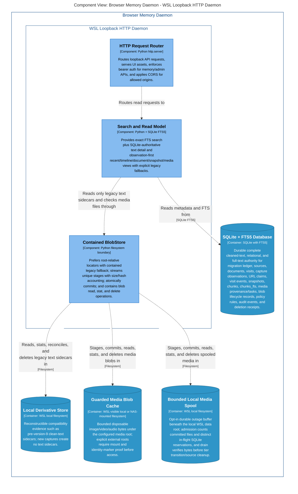
```mermaid
graph LR
  linkStyle default fill:#ffffff

  subgraph diagram ["Component View: Browser Memory Daemon - WSL Loopback HTTP Daemon"]
    style diagram fill:#ffffff,stroke:#ffffff

    subgraph 4 ["Browser Memory Daemon"]
      style 4 fill:#ffffff,stroke:#0b4884,color:#0b4884

      subgraph 14 ["WSL Loopback HTTP Daemon"]
        style 14 fill:#ffffff,stroke:#2e6295,color:#2e6295

        15["<div style='font-weight: bold'>HTTP Request Router</div><div style='font-size: 70%; margin-top: 0px'>[Component: Python http.server]</div><div style='font-size: 80%; margin-top:10px'>Routes loopback API requests,<br />serves UI assets, enforces<br />bearer auth for memory/admin<br />APIs, and applies CORS for<br />allowed origins.</div>"]
        style 15 fill:#85bbf0,stroke:#1168bd,color:#000000
        22["<div style='font-weight: bold'>Contained BlobStore</div><div style='font-size: 70%; margin-top: 0px'>[Component: Python filesystem boundary]</div><div style='font-size: 80%; margin-top:10px'>Prefers root-relative<br />locators with contained<br />legacy fallback; streams<br />unique stages with size/hash<br />accounting; atomically<br />commits; and contains blob<br />read, stat, and delete<br />operations.</div>"]
        style 22 fill:#85bbf0,stroke:#1168bd,color:#000000
        24["<div style='font-weight: bold'>Search and Read Model</div><div style='font-size: 70%; margin-top: 0px'>[Component: Python + SQLite FTS5]</div><div style='font-size: 80%; margin-top:10px'>Provides exact FTS search<br />plus SQLite-authoritative<br />text detail and<br />observation-first<br />recent/timeline/document/snapshot/media<br />views with explicit legacy<br />fallbacks.</div>"]
        style 24 fill:#85bbf0,stroke:#1168bd,color:#000000
      end

      30[("<div style='font-weight: bold'>SQLite + FTS5 Database</div><div style='font-size: 70%; margin-top: 0px'>[Container: SQLite with FTS5]</div><div style='font-size: 80%; margin-top:10px'>Durable complete<br />cleaned-text, relational, and<br />full-text authority for<br />migration ledger, sources,<br />documents, visits, capture<br />observations, URL claims,<br />visit events, snapshots,<br />chunks, chunks_fts, media<br />provenance/tasks, blob<br />lifecycle records, policy<br />rules, audit events, and<br />deletion receipts.</div>")]
      style 30 fill:#2f95c8,stroke:#20688c,color:#ffffff
      31[("<div style='font-weight: bold'>Local Derivative Store</div><div style='font-size: 70%; margin-top: 0px'>[Container: WSL local filesystem]</div><div style='font-size: 80%; margin-top:10px'>Reconstructible compatibility<br />evidence such as<br />pre-version-9 clean-text<br />sidecars; new captures create<br />no text sidecars.</div>")]
      style 31 fill:#2f95c8,stroke:#20688c,color:#ffffff
      32[("<div style='font-weight: bold'>Guarded Media Blob Cache</div><div style='font-size: 70%; margin-top: 0px'>[Container: WSL-visible local or NAS-mounted filesystem]</div><div style='font-size: 80%; margin-top:10px'>Bounded disposable<br />image/video/audio bytes under<br />the configured media root;<br />explicit external roots<br />require mount and<br />identity-marker proof before<br />access.</div>")]
      style 32 fill:#2f95c8,stroke:#20688c,color:#ffffff
      33[("<div style='font-weight: bold'>Bounded Local Media Spool</div><div style='font-size: 70%; margin-top: 0px'>[Container: WSL local filesystem]</div><div style='font-size: 80%; margin-top:10px'>Opt-in durable outage buffer<br />beneath the local WSL data<br />root; admission counts<br />committed files and distinct<br />in-flight SQLite<br />reservations, and drain<br />verifies bytes before tier<br />transition/source cleanup.</div>")]
      style 33 fill:#2f95c8,stroke:#20688c,color:#ffffff
    end

    15-. "<div>Routes read requests to</div><div style='font-size: 70%'></div>" .->24
    24-. "<div>Reads metadata and FTS from</div><div style='font-size: 70%'>[SQLite FTS5]</div>" .->30
    24-. "<div>Reads only legacy text<br />sidecars and checks media<br />files through</div><div style='font-size: 70%'></div>" .->22
    22-. "<div>Reads, stats, reconciles, and<br />deletes legacy text sidecars<br />in</div><div style='font-size: 70%'>[Filesystem]</div>" .->31
    22-. "<div>Stages, commits, reads,<br />stats, and deletes media<br />blobs in</div><div style='font-size: 70%'>[Filesystem]</div>" .->32
    22-. "<div>Stages, commits, reads,<br />stats, and deletes spooled<br />media in</div><div style='font-size: 70%'>[Filesystem]</div>" .->33

  end
```

### Derived artifacts

| Artifact | Link |
|---|---|
| Mermaid source | [`structurizr-DaemonReadComponents.mmd`](diagrams/structurizr-DaemonReadComponents.mmd) |
| Mermaid SVG | [`structurizr-DaemonReadComponents.svg`](diagrams/structurizr-DaemonReadComponents.svg) |
| Mermaid PNG | [`structurizr-DaemonReadComponents.png`](diagrams/structurizr-DaemonReadComponents.png) |
| DOT source | [`structurizr-DaemonReadComponents.dot`](diagrams/dot/structurizr-DaemonReadComponents.dot) |
| Graphviz SVG | [`structurizr-DaemonReadComponents.svg`](diagrams/dot-rendered/structurizr-DaemonReadComponents.svg) |
| Graphviz PNG | [`structurizr-DaemonReadComponents.png`](diagrams/dot-rendered/structurizr-DaemonReadComponents.png) |

---

## Daemon Storage Reconcile Components

> C4 view `DaemonStorageReconcileComponents`.

### Diagram

_Preferred Markdown display: Graphviz SVG. Mermaid source is retained below for text review._

Mermaid source

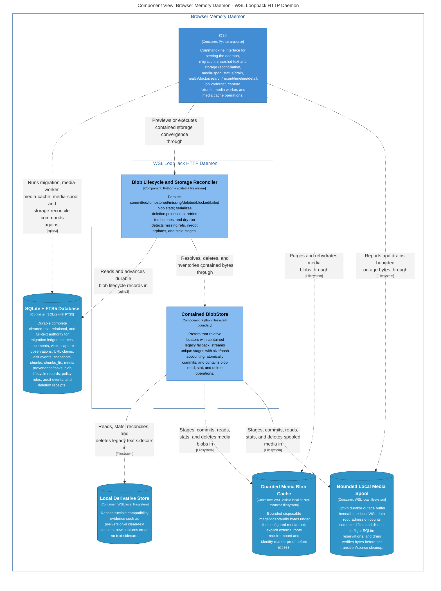
```mermaid
graph LR
  linkStyle default fill:#ffffff

  subgraph diagram ["Component View: Browser Memory Daemon - WSL Loopback HTTP Daemon"]
    style diagram fill:#ffffff,stroke:#ffffff

    subgraph 4 ["Browser Memory Daemon"]
      style 4 fill:#ffffff,stroke:#0b4884,color:#0b4884

      subgraph 14 ["WSL Loopback HTTP Daemon"]
        style 14 fill:#ffffff,stroke:#2e6295,color:#2e6295

        22["<div style='font-weight: bold'>Contained BlobStore</div><div style='font-size: 70%; margin-top: 0px'>[Component: Python filesystem boundary]</div><div style='font-size: 80%; margin-top:10px'>Prefers root-relative<br />locators with contained<br />legacy fallback; streams<br />unique stages with size/hash<br />accounting; atomically<br />commits; and contains blob<br />read, stat, and delete<br />operations.</div>"]
        style 22 fill:#85bbf0,stroke:#1168bd,color:#000000
        23["<div style='font-weight: bold'>Blob Lifecycle and Storage Reconciler</div><div style='font-size: 70%; margin-top: 0px'>[Component: Python + sqlite3 + filesystem]</div><div style='font-size: 80%; margin-top:10px'>Persists<br />committed/tombstoned/missing/deleted/blocked/failed<br />blob state; serializes<br />deletion processors; retries<br />tombstones; and dry-run<br />detects missing refs, in-root<br />orphans, and stale stages.</div>"]
        style 23 fill:#85bbf0,stroke:#1168bd,color:#000000
      end

      29["<div style='font-weight: bold'>CLI</div><div style='font-size: 70%; margin-top: 0px'>[Container: Python argparse]</div><div style='font-size: 80%; margin-top:10px'>Command-line interface for<br />serving the daemon,<br />migration, snapshot-text and<br />storage reconciliation,<br />media-spool status/drain,<br />health/doctor/search/recent/timeline/detail,<br />policy/forget, capture<br />fixtures, media worker, and<br />media cache operations.</div>"]
      style 29 fill:#438dd5,stroke:#2e6295,color:#ffffff
      30[("<div style='font-weight: bold'>SQLite + FTS5 Database</div><div style='font-size: 70%; margin-top: 0px'>[Container: SQLite with FTS5]</div><div style='font-size: 80%; margin-top:10px'>Durable complete<br />cleaned-text, relational, and<br />full-text authority for<br />migration ledger, sources,<br />documents, visits, capture<br />observations, URL claims,<br />visit events, snapshots,<br />chunks, chunks_fts, media<br />provenance/tasks, blob<br />lifecycle records, policy<br />rules, audit events, and<br />deletion receipts.</div>")]
      style 30 fill:#2f95c8,stroke:#20688c,color:#ffffff
      31[("<div style='font-weight: bold'>Local Derivative Store</div><div style='font-size: 70%; margin-top: 0px'>[Container: WSL local filesystem]</div><div style='font-size: 80%; margin-top:10px'>Reconstructible compatibility<br />evidence such as<br />pre-version-9 clean-text<br />sidecars; new captures create<br />no text sidecars.</div>")]
      style 31 fill:#2f95c8,stroke:#20688c,color:#ffffff
      32[("<div style='font-weight: bold'>Guarded Media Blob Cache</div><div style='font-size: 70%; margin-top: 0px'>[Container: WSL-visible local or NAS-mounted filesystem]</div><div style='font-size: 80%; margin-top:10px'>Bounded disposable<br />image/video/audio bytes under<br />the configured media root;<br />explicit external roots<br />require mount and<br />identity-marker proof before<br />access.</div>")]
      style 32 fill:#2f95c8,stroke:#20688c,color:#ffffff
      33[("<div style='font-weight: bold'>Bounded Local Media Spool</div><div style='font-size: 70%; margin-top: 0px'>[Container: WSL local filesystem]</div><div style='font-size: 80%; margin-top:10px'>Opt-in durable outage buffer<br />beneath the local WSL data<br />root; admission counts<br />committed files and distinct<br />in-flight SQLite<br />reservations, and drain<br />verifies bytes before tier<br />transition/source cleanup.</div>")]
      style 33 fill:#2f95c8,stroke:#20688c,color:#ffffff
    end

    29-. "<div>Runs migration, media-worker,<br />media-cache, media-spool, and<br />storage-reconcile commands<br />against</div><div style='font-size: 70%'>[sqlite3]</div>" .->30
    29-. "<div>Previews or executes<br />contained storage convergence<br />through</div><div style='font-size: 70%'></div>" .->23
    29-. "<div>Purges and rehydrates media<br />blobs through</div><div style='font-size: 70%'>[Filesystem]</div>" .->32
    29-. "<div>Reports and drains bounded<br />outage bytes through</div><div style='font-size: 70%'>[Filesystem]</div>" .->33
    23-. "<div>Reads and advances durable<br />blob lifecycle records in</div><div style='font-size: 70%'>[sqlite3]</div>" .->30
    23-. "<div>Resolves, deletes, and<br />inventories contained bytes<br />through</div><div style='font-size: 70%'></div>" .->22
    22-. "<div>Reads, stats, reconciles, and<br />deletes legacy text sidecars<br />in</div><div style='font-size: 70%'>[Filesystem]</div>" .->31
    22-. "<div>Stages, commits, reads,<br />stats, and deletes media<br />blobs in</div><div style='font-size: 70%'>[Filesystem]</div>" .->32
    22-. "<div>Stages, commits, reads,<br />stats, and deletes spooled<br />media in</div><div style='font-size: 70%'>[Filesystem]</div>" .->33

  end
```

### Derived artifacts

| Artifact | Link |
|---|---|
| Mermaid source | [`structurizr-DaemonStorageReconcileComponents.mmd`](diagrams/structurizr-DaemonStorageReconcileComponents.mmd) |
| Mermaid SVG | [`structurizr-DaemonStorageReconcileComponents.svg`](diagrams/structurizr-DaemonStorageReconcileComponents.svg) |
| Mermaid PNG | [`structurizr-DaemonStorageReconcileComponents.png`](diagrams/structurizr-DaemonStorageReconcileComponents.png) |
| DOT source | [`structurizr-DaemonStorageReconcileComponents.dot`](diagrams/dot/structurizr-DaemonStorageReconcileComponents.dot) |
| Graphviz SVG | [`structurizr-DaemonStorageReconcileComponents.svg`](diagrams/dot-rendered/structurizr-DaemonStorageReconcileComponents.svg) |
| Graphviz PNG | [`structurizr-DaemonStorageReconcileComponents.png`](diagrams/dot-rendered/structurizr-DaemonStorageReconcileComponents.png) |

---

## Daily Driver Deployment

> C4 view `DailyDriverDeployment`.

### Diagram

_Preferred Markdown display: Graphviz SVG. Mermaid source is retained below for text review._

Mermaid source

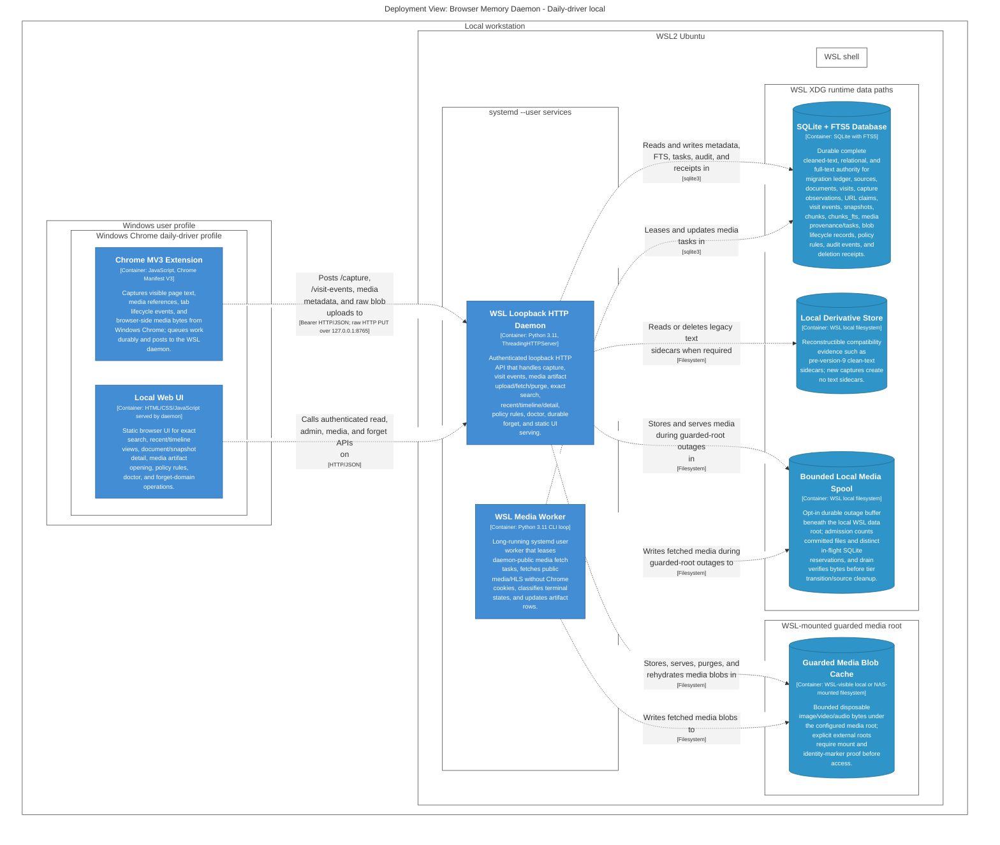
```mermaid
graph TB
  linkStyle default fill:#ffffff

  subgraph diagram ["Deployment View: Browser Memory Daemon - Daily-driver local"]
    style diagram fill:#ffffff,stroke:#ffffff

    subgraph 100 ["Local workstation"]
      style 100 fill:#ffffff,stroke:#444444,color:#444444

      subgraph 101 ["Windows user profile"]
        style 101 fill:#ffffff,stroke:#444444,color:#444444

        subgraph 102 ["Windows Chrome daily-driver profile"]
          style 102 fill:#ffffff,stroke:#444444,color:#444444

          103["<div style='font-weight: bold'>Chrome MV3 Extension</div><div style='font-size: 70%; margin-top: 0px'>[Container: JavaScript, Chrome Manifest V3]</div><div style='font-size: 80%; margin-top:10px'>Captures visible page text,<br />media references, tab<br />lifecycle events, and<br />browser-side media bytes from<br />Windows Chrome; queues work<br />durably and posts to the WSL<br />daemon.</div>"]
          style 103 fill:#438dd5,stroke:#2e6295,color:#ffffff
          106["<div style='font-weight: bold'>Local Web UI</div><div style='font-size: 70%; margin-top: 0px'>[Container: HTML/CSS/JavaScript served by daemon]</div><div style='font-size: 80%; margin-top:10px'>Static browser UI for exact<br />search, recent/timeline<br />views, document/snapshot<br />detail, media artifact<br />opening, policy rules,<br />doctor, and forget-domain<br />operations.</div>"]
          style 106 fill:#438dd5,stroke:#2e6295,color:#ffffff
        end

      end

      subgraph 108 ["WSL2 Ubuntu"]
        style 108 fill:#ffffff,stroke:#444444,color:#444444

        subgraph 109 ["systemd --user services"]
          style 109 fill:#ffffff,stroke:#444444,color:#444444

          110["<div style='font-weight: bold'>WSL Loopback HTTP Daemon</div><div style='font-size: 70%; margin-top: 0px'>[Container: Python 3.11, ThreadingHTTPServer]</div><div style='font-size: 80%; margin-top:10px'>Authenticated loopback HTTP<br />API that handles capture,<br />visit events, media artifact<br />upload/fetch/purge, exact<br />search,<br />recent/timeline/detail,<br />policy rules, doctor, durable<br />forget, and static UI<br />serving.</div>"]
          style 110 fill:#438dd5,stroke:#2e6295,color:#ffffff
          113["<div style='font-weight: bold'>WSL Media Worker</div><div style='font-size: 70%; margin-top: 0px'>[Container: Python 3.11 CLI loop]</div><div style='font-size: 80%; margin-top:10px'>Long-running systemd user<br />worker that leases<br />daemon-public media fetch<br />tasks, fetches public<br />media/HLS without Chrome<br />cookies, classifies terminal<br />states, and updates artifact<br />rows.</div>"]
          style 113 fill:#438dd5,stroke:#2e6295,color:#ffffff
        end

        subgraph 114 ["WSL shell"]
          style 114 fill:#ffffff,stroke:#444444,color:#444444

        end

        subgraph 117 ["WSL XDG runtime data paths"]
          style 117 fill:#ffffff,stroke:#444444,color:#444444

          118[("<div style='font-weight: bold'>SQLite + FTS5 Database</div><div style='font-size: 70%; margin-top: 0px'>[Container: SQLite with FTS5]</div><div style='font-size: 80%; margin-top:10px'>Durable complete<br />cleaned-text, relational, and<br />full-text authority for<br />migration ledger, sources,<br />documents, visits, capture<br />observations, URL claims,<br />visit events, snapshots,<br />chunks, chunks_fts, media<br />provenance/tasks, blob<br />lifecycle records, policy<br />rules, audit events, and<br />deletion receipts.</div>")]
          style 118 fill:#2f95c8,stroke:#20688c,color:#ffffff
          122[("<div style='font-weight: bold'>Local Derivative Store</div><div style='font-size: 70%; margin-top: 0px'>[Container: WSL local filesystem]</div><div style='font-size: 80%; margin-top:10px'>Reconstructible compatibility<br />evidence such as<br />pre-version-9 clean-text<br />sidecars; new captures create<br />no text sidecars.</div>")]
          style 122 fill:#2f95c8,stroke:#20688c,color:#ffffff
          124[("<div style='font-weight: bold'>Bounded Local Media Spool</div><div style='font-size: 70%; margin-top: 0px'>[Container: WSL local filesystem]</div><div style='font-size: 80%; margin-top:10px'>Opt-in durable outage buffer<br />beneath the local WSL data<br />root; admission counts<br />committed files and distinct<br />in-flight SQLite<br />reservations, and drain<br />verifies bytes before tier<br />transition/source cleanup.</div>")]
          style 124 fill:#2f95c8,stroke:#20688c,color:#ffffff
        end

        subgraph 129 ["WSL-mounted guarded media root"]
          style 129 fill:#ffffff,stroke:#444444,color:#444444

          130[("<div style='font-weight: bold'>Guarded Media Blob Cache</div><div style='font-size: 70%; margin-top: 0px'>[Container: WSL-visible local or NAS-mounted filesystem]</div><div style='font-size: 80%; margin-top:10px'>Bounded disposable<br />image/video/audio bytes under<br />the configured media root;<br />explicit external roots<br />require mount and<br />identity-marker proof before<br />access.</div>")]
          style 130 fill:#2f95c8,stroke:#20688c,color:#ffffff
        end

      end

    end

    103-. "<div>Posts /capture,<br />/visit-events, media<br />metadata, and raw blob<br />uploads to</div><div style='font-size: 70%'>[Bearer HTTP/JSON; raw HTTP PUT over 127.0.0.1:8765]</div>" .->110
    106-. "<div>Calls authenticated read,<br />admin, media, and forget APIs<br />on</div><div style='font-size: 70%'>[HTTP/JSON]</div>" .->110
    110-. "<div>Reads and writes metadata,<br />FTS, tasks, audit, and<br />receipts in</div><div style='font-size: 70%'>[sqlite3]</div>" .->118
    113-. "<div>Leases and updates media<br />tasks in</div><div style='font-size: 70%'>[sqlite3]</div>" .->118
    110-. "<div>Reads or deletes legacy text<br />sidecars when required</div><div style='font-size: 70%'>[Filesystem]</div>" .->122
    110-. "<div>Stores and serves media<br />during guarded-root outages<br />in</div><div style='font-size: 70%'>[Filesystem]</div>" .->124
    113-. "<div>Writes fetched media during<br />guarded-root outages to</div><div style='font-size: 70%'>[Filesystem]</div>" .->124
    110-. "<div>Stores, serves, purges, and<br />rehydrates media blobs in</div><div style='font-size: 70%'>[Filesystem]</div>" .->130
    113-. "<div>Writes fetched media blobs to</div><div style='font-size: 70%'>[Filesystem]</div>" .->130

  end
```

### Derived artifacts

| Artifact | Link |
|---|---|
| Mermaid source | [`structurizr-DailyDriverDeployment.mmd`](diagrams/structurizr-DailyDriverDeployment.mmd) |
| Mermaid SVG | [`structurizr-DailyDriverDeployment.svg`](diagrams/structurizr-DailyDriverDeployment.svg) |
| Mermaid PNG | [`structurizr-DailyDriverDeployment.png`](diagrams/structurizr-DailyDriverDeployment.png) |
| DOT source | [`structurizr-DailyDriverDeployment.dot`](diagrams/dot/structurizr-DailyDriverDeployment.dot) |
| Graphviz SVG | [`structurizr-DailyDriverDeployment.svg`](diagrams/dot-rendered/structurizr-DailyDriverDeployment.svg) |
| Graphviz PNG | [`structurizr-DailyDriverDeployment.png`](diagrams/dot-rendered/structurizr-DailyDriverDeployment.png) |

---

## Extension Capture Components

> C4 view `ExtensionCaptureComponents`.

### Diagram

_Preferred Markdown display: Graphviz SVG. Mermaid source is retained below for text review._

Mermaid source

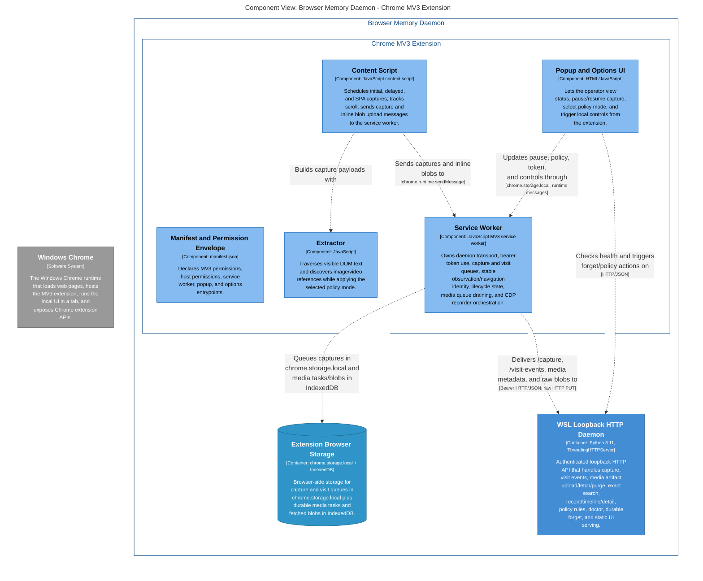
```mermaid
graph LR
  linkStyle default fill:#ffffff

  subgraph diagram ["Component View: Browser Memory Daemon - Chrome MV3 Extension"]
    style diagram fill:#ffffff,stroke:#ffffff

    2["<div style='font-weight: bold'>Windows Chrome</div><div style='font-size: 70%; margin-top: 0px'>[Software System]</div><div style='font-size: 80%; margin-top:10px'>The Windows Chrome runtime<br />that loads web pages, hosts<br />the MV3 extension, runs the<br />local UI in a tab, and<br />exposes Chrome extension<br />APIs.</div>"]
    style 2 fill:#999999,stroke:#6b6b6b,color:#ffffff

    subgraph 4 ["Browser Memory Daemon"]
      style 4 fill:#ffffff,stroke:#0b4884,color:#0b4884

      subgraph 5 ["Chrome MV3 Extension"]
        style 5 fill:#ffffff,stroke:#2e6295,color:#2e6295

        12["<div style='font-weight: bold'>Popup and Options UI</div><div style='font-size: 70%; margin-top: 0px'>[Component: HTML/JavaScript]</div><div style='font-size: 80%; margin-top:10px'>Lets the operator view<br />status, pause/resume capture,<br />select policy mode, and<br />trigger local controls from<br />the extension.</div>"]
        style 12 fill:#85bbf0,stroke:#1168bd,color:#000000
        6["<div style='font-weight: bold'>Manifest and Permission Envelope</div><div style='font-size: 70%; margin-top: 0px'>[Component: manifest.json]</div><div style='font-size: 80%; margin-top:10px'>Declares MV3 permissions,<br />host permissions, service<br />worker, popup, and options<br />entrypoints.</div>"]
        style 6 fill:#85bbf0,stroke:#1168bd,color:#000000
        7["<div style='font-weight: bold'>Extractor</div><div style='font-size: 70%; margin-top: 0px'>[Component: JavaScript]</div><div style='font-size: 80%; margin-top:10px'>Traverses visible DOM text<br />and discovers image/video<br />references while applying the<br />selected policy mode.</div>"]
        style 7 fill:#85bbf0,stroke:#1168bd,color:#000000
        8["<div style='font-weight: bold'>Content Script</div><div style='font-size: 70%; margin-top: 0px'>[Component: JavaScript content script]</div><div style='font-size: 80%; margin-top:10px'>Schedules initial, delayed,<br />and SPA captures; tracks<br />scroll; sends capture and<br />inline blob upload messages<br />to the service worker.</div>"]
        style 8 fill:#85bbf0,stroke:#1168bd,color:#000000
        9["<div style='font-weight: bold'>Service Worker</div><div style='font-size: 70%; margin-top: 0px'>[Component: JavaScript MV3 service worker]</div><div style='font-size: 80%; margin-top:10px'>Owns daemon transport, bearer<br />token use, capture and visit<br />queues, stable<br />observation/navigation<br />identity, lifecycle state,<br />media queue draining, and CDP<br />recorder orchestration.</div>"]
        style 9 fill:#85bbf0,stroke:#1168bd,color:#000000
      end

      13[("<div style='font-weight: bold'>Extension Browser Storage</div><div style='font-size: 70%; margin-top: 0px'>[Container: chrome.storage.local + IndexedDB]</div><div style='font-size: 80%; margin-top:10px'>Browser-side storage for<br />capture and visit queues in<br />chrome.storage.local plus<br />durable media tasks and<br />fetched blobs in IndexedDB.</div>")]
      style 13 fill:#2f95c8,stroke:#20688c,color:#ffffff
      14["<div style='font-weight: bold'>WSL Loopback HTTP Daemon</div><div style='font-size: 70%; margin-top: 0px'>[Container: Python 3.11, ThreadingHTTPServer]</div><div style='font-size: 80%; margin-top:10px'>Authenticated loopback HTTP<br />API that handles capture,<br />visit events, media artifact<br />upload/fetch/purge, exact<br />search,<br />recent/timeline/detail,<br />policy rules, doctor, durable<br />forget, and static UI<br />serving.</div>"]
      style 14 fill:#438dd5,stroke:#2e6295,color:#ffffff
    end

    8-. "<div>Builds capture payloads with</div><div style='font-size: 70%'></div>" .->7
    8-. "<div>Sends captures and inline<br />blobs to</div><div style='font-size: 70%'>[chrome.runtime.sendMessage]</div>" .->9
    9-. "<div>Queues captures in<br />chrome.storage.local and<br />media tasks/blobs in<br />IndexedDB</div><div style='font-size: 70%'></div>" .->13
    9-. "<div>Delivers /capture,<br />/visit-events, media<br />metadata, and raw blobs to</div><div style='font-size: 70%'>[Bearer HTTP/JSON; raw HTTP PUT]</div>" .->14
    12-. "<div>Updates pause, policy, token,<br />and controls through</div><div style='font-size: 70%'>[chrome.storage.local, runtime messages]</div>" .->9
    12-. "<div>Checks health and triggers<br />forget/policy actions on</div><div style='font-size: 70%'>[HTTP/JSON]</div>" .->14

  end
```

### Derived artifacts

| Artifact | Link |
|---|---|
| Mermaid source | [`structurizr-ExtensionCaptureComponents.mmd`](diagrams/structurizr-ExtensionCaptureComponents.mmd) |
| Mermaid SVG | [`structurizr-ExtensionCaptureComponents.svg`](diagrams/structurizr-ExtensionCaptureComponents.svg) |
| Mermaid PNG | [`structurizr-ExtensionCaptureComponents.png`](diagrams/structurizr-ExtensionCaptureComponents.png) |
| DOT source | [`structurizr-ExtensionCaptureComponents.dot`](diagrams/dot/structurizr-ExtensionCaptureComponents.dot) |
| Graphviz SVG | [`structurizr-ExtensionCaptureComponents.svg`](diagrams/dot-rendered/structurizr-ExtensionCaptureComponents.svg) |
| Graphviz PNG | [`structurizr-ExtensionCaptureComponents.png`](diagrams/dot-rendered/structurizr-ExtensionCaptureComponents.png) |

---

## Extension Media Components

> C4 view `ExtensionMediaComponents`.

### Diagram

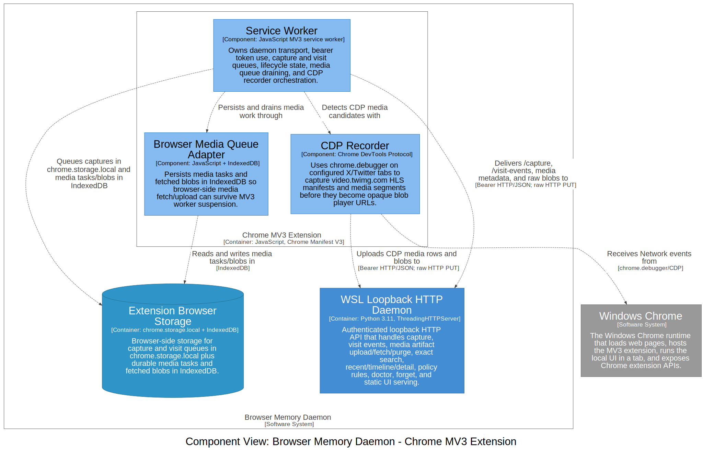

_Preferred Markdown display: Graphviz SVG. Mermaid source is retained below for text review._

Mermaid source

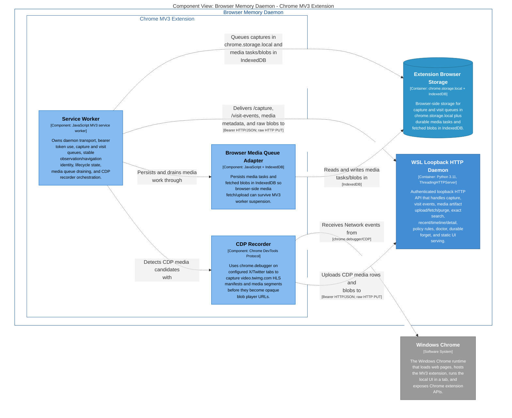
```mermaid
graph TB
  linkStyle default fill:#ffffff

  subgraph diagram ["Component View: Browser Memory Daemon - Chrome MV3 Extension"]
    style diagram fill:#ffffff,stroke:#ffffff

    2["<div style='font-weight: bold'>Windows Chrome</div><div style='font-size: 70%; margin-top: 0px'>[Software System]</div><div style='font-size: 80%; margin-top:10px'>The Windows Chrome runtime<br />that loads web pages, hosts<br />the MV3 extension, runs the<br />local UI in a tab, and<br />exposes Chrome extension<br />APIs.</div>"]
    style 2 fill:#999999,stroke:#6b6b6b,color:#ffffff

    subgraph 4 ["Browser Memory Daemon"]
      style 4 fill:#ffffff,stroke:#0b4884,color:#0b4884

      subgraph 5 ["Chrome MV3 Extension"]
        style 5 fill:#ffffff,stroke:#2e6295,color:#2e6295

        10["<div style='font-weight: bold'>Browser Media Queue Adapter</div><div style='font-size: 70%; margin-top: 0px'>[Component: JavaScript + IndexedDB]</div><div style='font-size: 80%; margin-top:10px'>Persists media tasks and<br />fetched blobs in IndexedDB so<br />browser-side media<br />fetch/upload can survive MV3<br />worker suspension.</div>"]
        style 10 fill:#85bbf0,stroke:#1168bd,color:#000000
        11["<div style='font-weight: bold'>CDP Recorder</div><div style='font-size: 70%; margin-top: 0px'>[Component: Chrome DevTools Protocol]</div><div style='font-size: 80%; margin-top:10px'>Uses chrome.debugger on<br />configured X/Twitter tabs to<br />capture video.twimg.com HLS<br />manifests and media segments<br />before they become opaque<br />blob player URLs.</div>"]
        style 11 fill:#85bbf0,stroke:#1168bd,color:#000000
        9["<div style='font-weight: bold'>Service Worker</div><div style='font-size: 70%; margin-top: 0px'>[Component: JavaScript MV3 service worker]</div><div style='font-size: 80%; margin-top:10px'>Owns daemon transport, bearer<br />token use, capture and visit<br />queues, stable<br />observation/navigation<br />identity, lifecycle state,<br />media queue draining, and CDP<br />recorder orchestration.</div>"]
        style 9 fill:#85bbf0,stroke:#1168bd,color:#000000
      end

      13[("<div style='font-weight: bold'>Extension Browser Storage</div><div style='font-size: 70%; margin-top: 0px'>[Container: chrome.storage.local + IndexedDB]</div><div style='font-size: 80%; margin-top:10px'>Browser-side storage for<br />capture and visit queues in<br />chrome.storage.local plus<br />durable media tasks and<br />fetched blobs in IndexedDB.</div>")]
      style 13 fill:#2f95c8,stroke:#20688c,color:#ffffff
      14["<div style='font-weight: bold'>WSL Loopback HTTP Daemon</div><div style='font-size: 70%; margin-top: 0px'>[Container: Python 3.11, ThreadingHTTPServer]</div><div style='font-size: 80%; margin-top:10px'>Authenticated loopback HTTP<br />API that handles capture,<br />visit events, media artifact<br />upload/fetch/purge, exact<br />search,<br />recent/timeline/detail,<br />policy rules, doctor, durable<br />forget, and static UI<br />serving.</div>"]
      style 14 fill:#438dd5,stroke:#2e6295,color:#ffffff
    end

    9-. "<div>Queues captures in<br />chrome.storage.local and<br />media tasks/blobs in<br />IndexedDB</div><div style='font-size: 70%'></div>" .->13
    9-. "<div>Delivers /capture,<br />/visit-events, media<br />metadata, and raw blobs to</div><div style='font-size: 70%'>[Bearer HTTP/JSON; raw HTTP PUT]</div>" .->14
    9-. "<div>Persists and drains media<br />work through</div><div style='font-size: 70%'></div>" .->10
    10-. "<div>Reads and writes media<br />tasks/blobs in</div><div style='font-size: 70%'>[IndexedDB]</div>" .->13
    9-. "<div>Detects CDP media candidates<br />with</div><div style='font-size: 70%'></div>" .->11
    11-. "<div>Receives Network events from</div><div style='font-size: 70%'>[chrome.debugger/CDP]</div>" .->2
    11-. "<div>Uploads CDP media rows and<br />blobs to</div><div style='font-size: 70%'>[Bearer HTTP/JSON; raw HTTP PUT]</div>" .->14

  end
```

### Derived artifacts

| Artifact | Link |
|---|---|
| Mermaid source | [`structurizr-ExtensionMediaComponents.mmd`](diagrams/structurizr-ExtensionMediaComponents.mmd) |
| Mermaid SVG | [`structurizr-ExtensionMediaComponents.svg`](diagrams/structurizr-ExtensionMediaComponents.svg) |
| Mermaid PNG | [`structurizr-ExtensionMediaComponents.png`](diagrams/structurizr-ExtensionMediaComponents.png) |
| DOT source | [`structurizr-ExtensionMediaComponents.dot`](diagrams/dot/structurizr-ExtensionMediaComponents.dot) |
| Graphviz SVG | [`structurizr-ExtensionMediaComponents.svg`](diagrams/dot-rendered/structurizr-ExtensionMediaComponents.svg) |
| Graphviz PNG | [`structurizr-ExtensionMediaComponents.png`](diagrams/dot-rendered/structurizr-ExtensionMediaComponents.png) |

---

## Fast Capture Flow

> C4 view `FastCaptureFlow`.

### Diagram

_Preferred Markdown display: Graphviz SVG. Mermaid source is retained below for text review._

Mermaid source

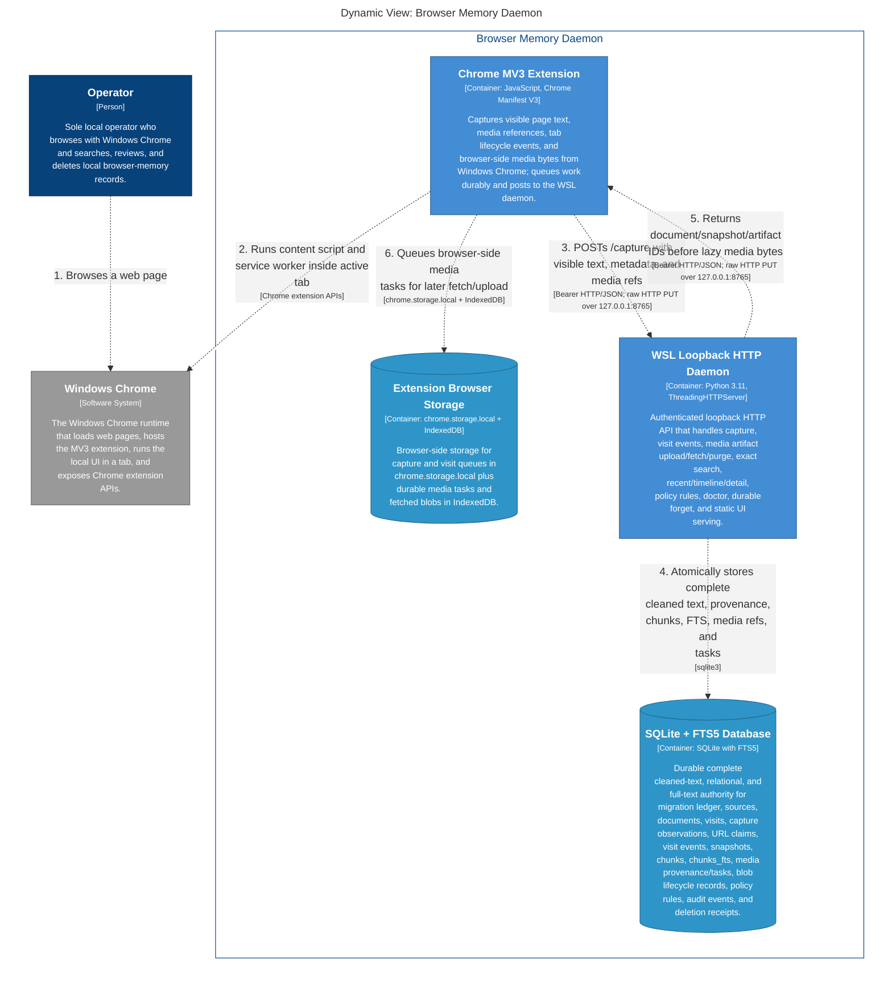
```mermaid
graph LR
  linkStyle default fill:#ffffff

  subgraph diagram ["Dynamic View: Browser Memory Daemon"]
    style diagram fill:#ffffff,stroke:#ffffff

    subgraph 4 ["Browser Memory Daemon"]
      style 4 fill:#ffffff,stroke:#0b4884,color:#0b4884

      13[("<div style='font-weight: bold'>Extension Browser Storage</div><div style='font-size: 70%; margin-top: 0px'>[Container: chrome.storage.local + IndexedDB]</div><div style='font-size: 80%; margin-top:10px'>Browser-side storage for<br />capture and visit queues in<br />chrome.storage.local plus<br />durable media tasks and<br />fetched blobs in IndexedDB.</div>")]
      style 13 fill:#2f95c8,stroke:#20688c,color:#ffffff
      14["<div style='font-weight: bold'>WSL Loopback HTTP Daemon</div><div style='font-size: 70%; margin-top: 0px'>[Container: Python 3.11, ThreadingHTTPServer]</div><div style='font-size: 80%; margin-top:10px'>Authenticated loopback HTTP<br />API that handles capture,<br />visit events, media artifact<br />upload/fetch/purge, exact<br />search,<br />recent/timeline/detail,<br />policy rules, doctor, durable<br />forget, and static UI<br />serving.</div>"]
      style 14 fill:#438dd5,stroke:#2e6295,color:#ffffff
      30[("<div style='font-weight: bold'>SQLite + FTS5 Database</div><div style='font-size: 70%; margin-top: 0px'>[Container: SQLite with FTS5]</div><div style='font-size: 80%; margin-top:10px'>Durable complete<br />cleaned-text, relational, and<br />full-text authority for<br />migration ledger, sources,<br />documents, visits, capture<br />observations, URL claims,<br />visit events, snapshots,<br />chunks, chunks_fts, media<br />provenance/tasks, blob<br />lifecycle records, policy<br />rules, audit events, and<br />deletion receipts.</div>")]
      style 30 fill:#2f95c8,stroke:#20688c,color:#ffffff
      5["<div style='font-weight: bold'>Chrome MV3 Extension</div><div style='font-size: 70%; margin-top: 0px'>[Container: JavaScript, Chrome Manifest V3]</div><div style='font-size: 80%; margin-top:10px'>Captures visible page text,<br />media references, tab<br />lifecycle events, and<br />browser-side media bytes from<br />Windows Chrome; queues work<br />durably and posts to the WSL<br />daemon.</div>"]
      style 5 fill:#438dd5,stroke:#2e6295,color:#ffffff
    end

    1["<div style='font-weight: bold'>Operator</div><div style='font-size: 70%; margin-top: 0px'>[Person]</div><div style='font-size: 80%; margin-top:10px'>Sole local operator who<br />browses with Windows Chrome<br />and searches, reviews, and<br />deletes local browser-memory<br />records.</div>"]
    style 1 fill:#08427b,stroke:#052e56,color:#ffffff
    2["<div style='font-weight: bold'>Windows Chrome</div><div style='font-size: 70%; margin-top: 0px'>[Software System]</div><div style='font-size: 80%; margin-top:10px'>The Windows Chrome runtime<br />that loads web pages, hosts<br />the MV3 extension, runs the<br />local UI in a tab, and<br />exposes Chrome extension<br />APIs.</div>"]
    style 2 fill:#999999,stroke:#6b6b6b,color:#ffffff

    1-. "<div>1. Browses a web page</div><div style='font-size: 70%'></div>" .->2
    5-. "<div>2. Runs content script and<br />service worker inside active<br />tab</div><div style='font-size: 70%'>[Chrome extension APIs]</div>" .->2
    5-. "<div>3. POSTs /capture with<br />visible text, metadata, and<br />media refs</div><div style='font-size: 70%'>[Bearer HTTP/JSON; raw HTTP PUT over 127.0.0.1:8765]</div>" .->14
    14-. "<div>4. Atomically stores complete<br />cleaned text, provenance,<br />chunks, FTS, media refs, and<br />tasks</div><div style='font-size: 70%'>[sqlite3]</div>" .->30
    14-. "<div>5. Returns<br />document/snapshot/artifact<br />IDs before lazy media bytes</div><div style='font-size: 70%'>[Bearer HTTP/JSON; raw HTTP PUT over 127.0.0.1:8765]</div>" .->5
    5-. "<div>6. Queues browser-side media<br />tasks for later fetch/upload</div><div style='font-size: 70%'>[chrome.storage.local + IndexedDB]</div>" .->13

  end
```

### Derived artifacts

| Artifact | Link |
|---|---|
| Mermaid source | [`structurizr-FastCaptureFlow.mmd`](diagrams/structurizr-FastCaptureFlow.mmd) |
| Mermaid SVG | [`structurizr-FastCaptureFlow.svg`](diagrams/structurizr-FastCaptureFlow.svg) |
| Mermaid PNG | [`structurizr-FastCaptureFlow.png`](diagrams/structurizr-FastCaptureFlow.png) |
| DOT source | [`structurizr-FastCaptureFlow.dot`](diagrams/dot/structurizr-FastCaptureFlow.dot) |
| Graphviz SVG | [`structurizr-FastCaptureFlow.svg`](diagrams/dot-rendered/structurizr-FastCaptureFlow.svg) |
| Graphviz PNG | [`structurizr-FastCaptureFlow.png`](diagrams/dot-rendered/structurizr-FastCaptureFlow.png) |

---

## Ops Containers

> C4 view `OpsContainers`.

### Diagram

_Preferred Markdown display: Graphviz SVG. Mermaid source is retained below for text review._

Mermaid source

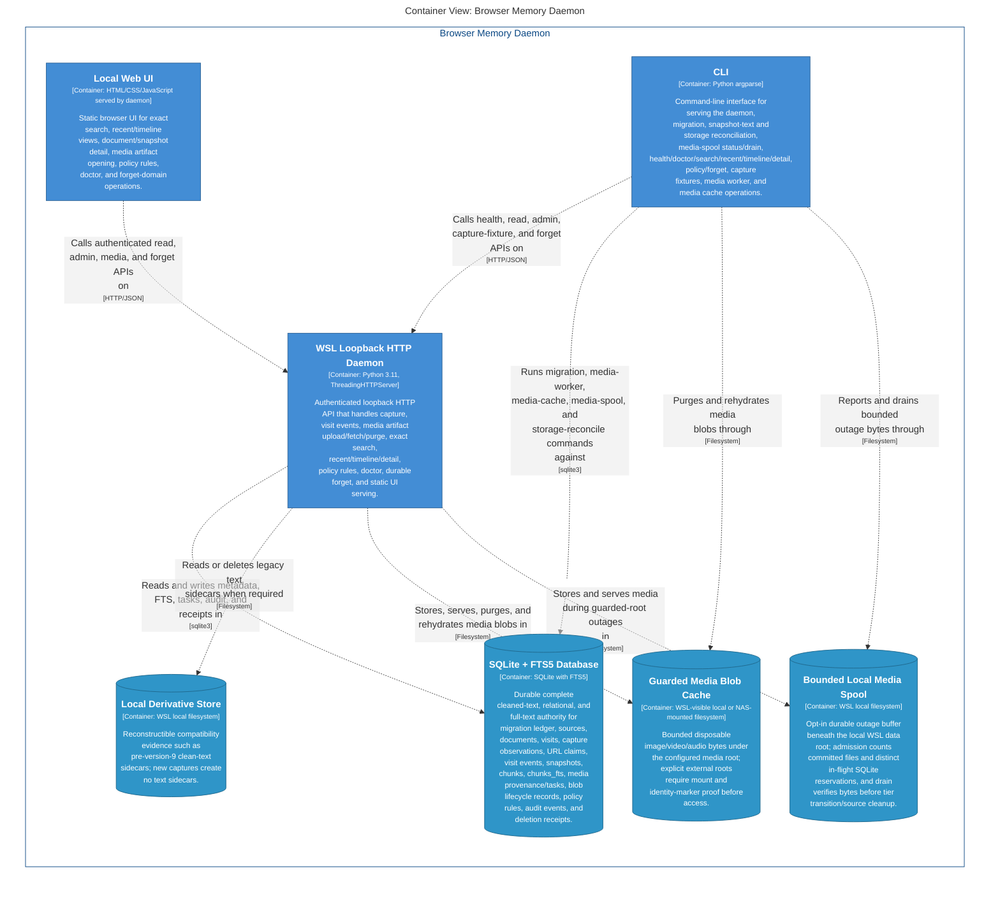
```mermaid
graph LR
  linkStyle default fill:#ffffff

  subgraph diagram ["Container View: Browser Memory Daemon"]
    style diagram fill:#ffffff,stroke:#ffffff

    subgraph 4 ["Browser Memory Daemon"]
      style 4 fill:#ffffff,stroke:#0b4884,color:#0b4884

      14["<div style='font-weight: bold'>WSL Loopback HTTP Daemon</div><div style='font-size: 70%; margin-top: 0px'>[Container: Python 3.11, ThreadingHTTPServer]</div><div style='font-size: 80%; margin-top:10px'>Authenticated loopback HTTP<br />API that handles capture,<br />visit events, media artifact<br />upload/fetch/purge, exact<br />search,<br />recent/timeline/detail,<br />policy rules, doctor, durable<br />forget, and static UI<br />serving.</div>"]
      style 14 fill:#438dd5,stroke:#2e6295,color:#ffffff
      28["<div style='font-weight: bold'>Local Web UI</div><div style='font-size: 70%; margin-top: 0px'>[Container: HTML/CSS/JavaScript served by daemon]</div><div style='font-size: 80%; margin-top:10px'>Static browser UI for exact<br />search, recent/timeline<br />views, document/snapshot<br />detail, media artifact<br />opening, policy rules,<br />doctor, and forget-domain<br />operations.</div>"]
      style 28 fill:#438dd5,stroke:#2e6295,color:#ffffff
      29["<div style='font-weight: bold'>CLI</div><div style='font-size: 70%; margin-top: 0px'>[Container: Python argparse]</div><div style='font-size: 80%; margin-top:10px'>Command-line interface for<br />serving the daemon,<br />migration, snapshot-text and<br />storage reconciliation,<br />media-spool status/drain,<br />health/doctor/search/recent/timeline/detail,<br />policy/forget, capture<br />fixtures, media worker, and<br />media cache operations.</div>"]
      style 29 fill:#438dd5,stroke:#2e6295,color:#ffffff
      30[("<div style='font-weight: bold'>SQLite + FTS5 Database</div><div style='font-size: 70%; margin-top: 0px'>[Container: SQLite with FTS5]</div><div style='font-size: 80%; margin-top:10px'>Durable complete<br />cleaned-text, relational, and<br />full-text authority for<br />migration ledger, sources,<br />documents, visits, capture<br />observations, URL claims,<br />visit events, snapshots,<br />chunks, chunks_fts, media<br />provenance/tasks, blob<br />lifecycle records, policy<br />rules, audit events, and<br />deletion receipts.</div>")]
      style 30 fill:#2f95c8,stroke:#20688c,color:#ffffff
      31[("<div style='font-weight: bold'>Local Derivative Store</div><div style='font-size: 70%; margin-top: 0px'>[Container: WSL local filesystem]</div><div style='font-size: 80%; margin-top:10px'>Reconstructible compatibility<br />evidence such as<br />pre-version-9 clean-text<br />sidecars; new captures create<br />no text sidecars.</div>")]
      style 31 fill:#2f95c8,stroke:#20688c,color:#ffffff
      32[("<div style='font-weight: bold'>Guarded Media Blob Cache</div><div style='font-size: 70%; margin-top: 0px'>[Container: WSL-visible local or NAS-mounted filesystem]</div><div style='font-size: 80%; margin-top:10px'>Bounded disposable<br />image/video/audio bytes under<br />the configured media root;<br />explicit external roots<br />require mount and<br />identity-marker proof before<br />access.</div>")]
      style 32 fill:#2f95c8,stroke:#20688c,color:#ffffff
      33[("<div style='font-weight: bold'>Bounded Local Media Spool</div><div style='font-size: 70%; margin-top: 0px'>[Container: WSL local filesystem]</div><div style='font-size: 80%; margin-top:10px'>Opt-in durable outage buffer<br />beneath the local WSL data<br />root; admission counts<br />committed files and distinct<br />in-flight SQLite<br />reservations, and drain<br />verifies bytes before tier<br />transition/source cleanup.</div>")]
      style 33 fill:#2f95c8,stroke:#20688c,color:#ffffff
    end

    28-. "<div>Calls authenticated read,<br />admin, media, and forget APIs<br />on</div><div style='font-size: 70%'>[HTTP/JSON]</div>" .->14
    29-. "<div>Calls health, read, admin,<br />capture-fixture, and forget<br />APIs on</div><div style='font-size: 70%'>[HTTP/JSON]</div>" .->14
    29-. "<div>Runs migration, media-worker,<br />media-cache, media-spool, and<br />storage-reconcile commands<br />against</div><div style='font-size: 70%'>[sqlite3]</div>" .->30
    29-. "<div>Purges and rehydrates media<br />blobs through</div><div style='font-size: 70%'>[Filesystem]</div>" .->32
    29-. "<div>Reports and drains bounded<br />outage bytes through</div><div style='font-size: 70%'>[Filesystem]</div>" .->33
    14-. "<div>Reads and writes metadata,<br />FTS, tasks, audit, and<br />receipts in</div><div style='font-size: 70%'>[sqlite3]</div>" .->30
    14-. "<div>Reads or deletes legacy text<br />sidecars when required</div><div style='font-size: 70%'>[Filesystem]</div>" .->31
    14-. "<div>Stores, serves, purges, and<br />rehydrates media blobs in</div><div style='font-size: 70%'>[Filesystem]</div>" .->32
    14-. "<div>Stores and serves media<br />during guarded-root outages<br />in</div><div style='font-size: 70%'>[Filesystem]</div>" .->33

  end
```

### Derived artifacts

| Artifact | Link |
|---|---|
| Mermaid source | [`structurizr-OpsContainers.mmd`](diagrams/structurizr-OpsContainers.mmd) |
| Mermaid SVG | [`structurizr-OpsContainers.svg`](diagrams/structurizr-OpsContainers.svg) |
| Mermaid PNG | [`structurizr-OpsContainers.png`](diagrams/structurizr-OpsContainers.png) |
| DOT source | [`structurizr-OpsContainers.dot`](diagrams/dot/structurizr-OpsContainers.dot) |
| Graphviz SVG | [`structurizr-OpsContainers.svg`](diagrams/dot-rendered/structurizr-OpsContainers.svg) |
| Graphviz PNG | [`structurizr-OpsContainers.png`](diagrams/dot-rendered/structurizr-OpsContainers.png) |

---

## System Context

> C4 view `SystemContext`.

### Diagram

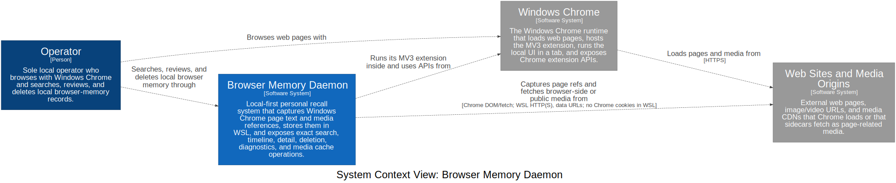

_Preferred Markdown display: Graphviz SVG. Mermaid source is retained below for text review._

Mermaid source

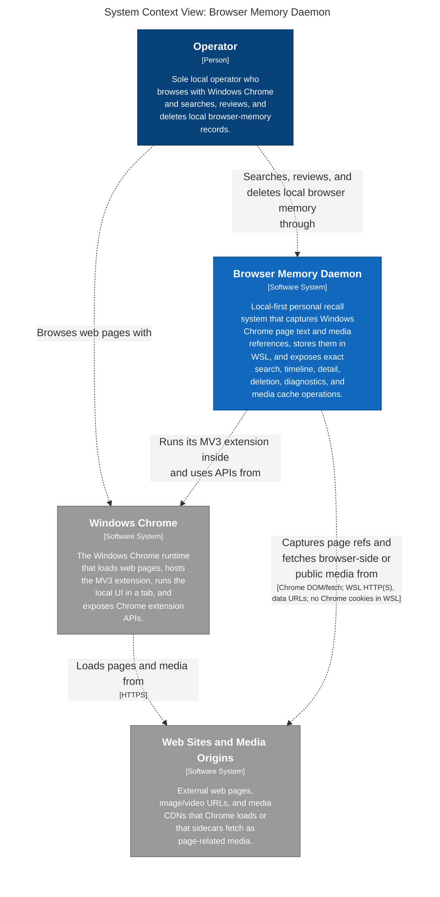
```mermaid
graph LR
  linkStyle default fill:#ffffff

  subgraph diagram ["System Context View: Browser Memory Daemon"]
    style diagram fill:#ffffff,stroke:#ffffff

    1["<div style='font-weight: bold'>Operator</div><div style='font-size: 70%; margin-top: 0px'>[Person]</div><div style='font-size: 80%; margin-top:10px'>Sole local operator who<br />browses with Windows Chrome<br />and searches, reviews, and<br />deletes local browser-memory<br />records.</div>"]
    style 1 fill:#08427b,stroke:#052e56,color:#ffffff
    2["<div style='font-weight: bold'>Windows Chrome</div><div style='font-size: 70%; margin-top: 0px'>[Software System]</div><div style='font-size: 80%; margin-top:10px'>The Windows Chrome runtime<br />that loads web pages, hosts<br />the MV3 extension, runs the<br />local UI in a tab, and<br />exposes Chrome extension<br />APIs.</div>"]
    style 2 fill:#999999,stroke:#6b6b6b,color:#ffffff
    3["<div style='font-weight: bold'>Web Sites and Media Origins</div><div style='font-size: 70%; margin-top: 0px'>[Software System]</div><div style='font-size: 80%; margin-top:10px'>External web pages,<br />image/video URLs, and media<br />CDNs that Chrome loads or<br />that sidecars fetch as<br />page-related media.</div>"]
    style 3 fill:#999999,stroke:#6b6b6b,color:#ffffff
    4["<div style='font-weight: bold'>Browser Memory Daemon</div><div style='font-size: 70%; margin-top: 0px'>[Software System]</div><div style='font-size: 80%; margin-top:10px'>Local-first personal recall<br />system that captures Windows<br />Chrome page text and media<br />references, stores them in<br />WSL, and exposes exact<br />search, timeline, detail,<br />deletion, diagnostics, and<br />media cache operations.</div>"]
    style 4 fill:#1168bd,stroke:#0b4884,color:#ffffff

    1-. "<div>Browses web pages with</div><div style='font-size: 70%'></div>" .->2
    1-. "<div>Searches, reviews, and<br />deletes local browser memory<br />through</div><div style='font-size: 70%'></div>" .->4
    2-. "<div>Loads pages and media from</div><div style='font-size: 70%'>[HTTPS]</div>" .->3
    4-. "<div>Runs its MV3 extension inside<br />and uses APIs from</div><div style='font-size: 70%'></div>" .->2
    4-. "<div>Captures page refs and<br />fetches browser-side or<br />public media from</div><div style='font-size: 70%'>[Chrome DOM/fetch; WSL HTTP(S), data URLs; no Chrome cookies in WSL]</div>" .->3

  end
```

### Derived artifacts

| Artifact | Link |
|---|---|
| Mermaid source | [`structurizr-SystemContext.mmd`](diagrams/structurizr-SystemContext.mmd) |
| Mermaid SVG | [`structurizr-SystemContext.svg`](diagrams/structurizr-SystemContext.svg) |
| Mermaid PNG | [`structurizr-SystemContext.png`](diagrams/structurizr-SystemContext.png) |
| DOT source | [`structurizr-SystemContext.dot`](diagrams/dot/structurizr-SystemContext.dot) |
| Graphviz SVG | [`structurizr-SystemContext.svg`](diagrams/dot-rendered/structurizr-SystemContext.svg) |
| Graphviz PNG | [`structurizr-SystemContext.png`](diagrams/dot-rendered/structurizr-SystemContext.png) |
