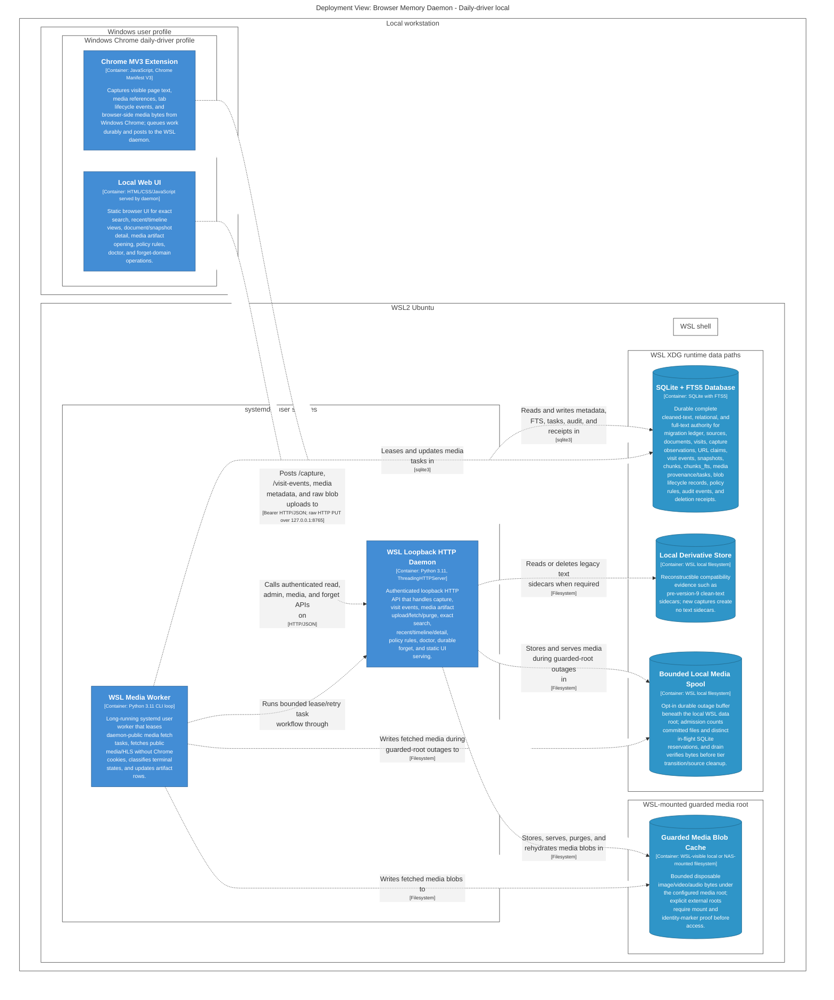

# Daily Driver Deployment

> Generated Markdown wrapper for C4 view `DailyDriverDeployment`. Canonical model: [`workspace.dsl`](../../workspace.dsl).

<!-- Generated from Structurizr exports; refresh from docs/architecture/workspace.dsl. -->

## Diagram

_Preferred Markdown display: Graphviz SVG. Mermaid source is retained below for text review._

Mermaid source

## Derived artifacts

| Artifact | Link |
|---|---|
| Mermaid source | [`structurizr-DailyDriverDeployment.mmd`](../structurizr-DailyDriverDeployment.mmd) |
| Mermaid SVG | [`structurizr-DailyDriverDeployment.svg`](../structurizr-DailyDriverDeployment.svg) |
| Mermaid PNG | [`structurizr-DailyDriverDeployment.png`](../structurizr-DailyDriverDeployment.png) |
| DOT source | [`structurizr-DailyDriverDeployment.dot`](../dot/structurizr-DailyDriverDeployment.dot) |
| Graphviz SVG | [`structurizr-DailyDriverDeployment.svg`](../dot-rendered/structurizr-DailyDriverDeployment.svg) |
| Graphviz PNG | [`structurizr-DailyDriverDeployment.png`](../dot-rendered/structurizr-DailyDriverDeployment.png) |
