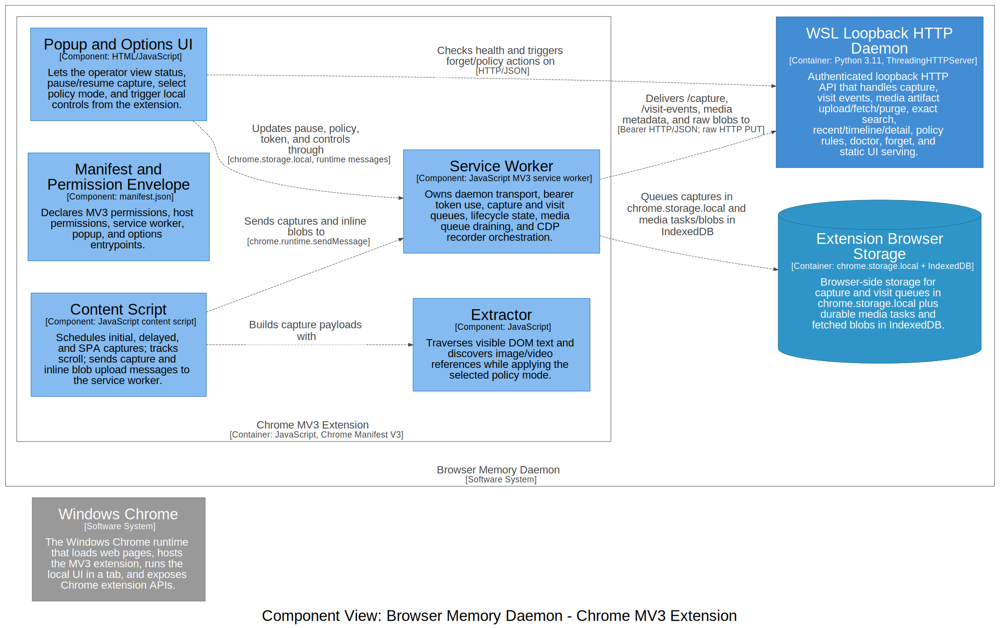

# Extension Capture Components

> Generated Markdown wrapper for C4 view `ExtensionCaptureComponents`. Canonical model: [`workspace.dsl`](../../workspace.dsl).

<!-- Generated from Structurizr exports; refresh from docs/architecture/workspace.dsl. -->

## Diagram

_Preferred Markdown display: Graphviz SVG. Mermaid source is retained below for text review._

```mermaid
graph TB
  linkStyle default fill:#ffffff

  subgraph diagram ["Component View: Browser Memory Daemon - Chrome MV3 Extension"]
    style diagram fill:#ffffff,stroke:#ffffff

    2["<div style='font-weight: bold'>Windows Chrome</div><div style='font-size: 70%; margin-top: 0px'>[Software System]</div><div style='font-size: 80%; margin-top:10px'>The Windows Chrome runtime<br />that loads web pages, hosts<br />the MV3 extension, runs the<br />local UI in a tab, and<br />exposes Chrome extension<br />APIs.</div>"]
    style 2 fill:#999999,stroke:#6b6b6b,color:#ffffff

    subgraph 4 ["Browser Memory Daemon"]
      style 4 fill:#ffffff,stroke:#0b4884,color:#0b4884

      subgraph 5 ["Chrome MV3 Extension"]
        style 5 fill:#ffffff,stroke:#2e6295,color:#2e6295

        10["<div style='font-weight: bold'>Extension Config Store</div><div style='font-size: 70%; margin-top: 0px'>[Component: JavaScript + chrome.storage.local]</div><div style='font-size: 80%; margin-top:10px'>Owns typed configuration<br />defaults/migration plus<br />durable visit and minimal CDP<br />capture-context maps.</div>"]
        style 10 fill:#85bbf0,stroke:#1168bd,color:#000000
        11["<div style='font-weight: bold'>Visit Tracker</div><div style='font-size: 70%; margin-top: 0px'>[Component: JavaScript]</div><div style='font-size: 80%; margin-top:10px'>Owns tab/navigation identity,<br />active-segment lifecycle<br />state, deterministic<br />lifecycle event identity, and<br />capture decoration.</div>"]
        style 11 fill:#85bbf0,stroke:#1168bd,color:#000000
        12["<div style='font-weight: bold'>Injection Controller</div><div style='font-size: 70%; margin-top: 0px'>[Component: JavaScript + chrome.scripting]</div><div style='font-size: 80%; margin-top:10px'>Reconstructs active-tab<br />injection after worker<br />restart and idempotently<br />injects the complete ordered<br />content-script set.</div>"]
        style 12 fill:#85bbf0,stroke:#1168bd,color:#000000
        13["<div style='font-weight: bold'>Capture and Lifecycle Bridge</div><div style='font-size: 70%; margin-top: 0px'>[Component: JavaScript]</div><div style='font-size: 80%; margin-top:10px'>Owns daemon delivery,<br />transactional outbox<br />import/admission/drain/checkpoint/retry,<br />legacy fallback, media<br />compensation, and queue<br />status.</div>"]
        style 13 fill:#85bbf0,stroke:#1168bd,color:#000000
        14["<div style='font-weight: bold'>Credentialed Media Bridge</div><div style='font-size: 70%; margin-top: 0px'>[Component: JavaScript]</div><div style='font-size: 80%; margin-top:10px'>Owns browser credentialed<br />fetch, inline/CDP blob<br />upload, specialized media<br />queue drain/retry, and<br />terminal cleanup.</div>"]
        style 14 fill:#85bbf0,stroke:#1168bd,color:#000000
        15["<div style='font-weight: bold'>Extension Telemetry</div><div style='font-size: 70%; margin-top: 0px'>[Component: JavaScript + chrome.storage.local]</div><div style='font-size: 80%; margin-top:10px'>Persists aggregate<br />bridge/queue/CDP status after<br />recursively removing captured<br />fields and redacting<br />URL-shaped errors.</div>"]
        style 15 fill:#85bbf0,stroke:#1168bd,color:#000000
        16["<div style='font-weight: bold'>Capture and Lifecycle Outbox</div><div style='font-size: 70%; margin-top: 0px'>[Component: JavaScript + IndexedDB]</div><div style='font-size: 80%; margin-top:10px'>Persists capture and<br />lifecycle messages as<br />independently sequenced<br />IndexedDB rows with atomic<br />enqueue/claim/checkpoint/ack/retry,<br />stale-claim recovery, legacy<br />queue import, item admission<br />limits, and serialized-byte<br />accounting.</div>"]
        style 16 fill:#85bbf0,stroke:#1168bd,color:#000000
        19["<div style='font-weight: bold'>CDP Session Controller</div><div style='font-size: 70%; margin-top: 0px'>[Component: JavaScript + chrome.debugger]</div><div style='font-size: 80%; margin-top:10px'>Restores minimal capture<br />provenance, reconciles<br />debugger attachments,<br />correlates Network events,<br />retrieves bounded bodies, and<br />dispatches media across MV3<br />worker restarts.</div>"]
        style 19 fill:#85bbf0,stroke:#1168bd,color:#000000
        20["<div style='font-weight: bold'>Popup and Options UI</div><div style='font-size: 70%; margin-top: 0px'>[Component: HTML/JavaScript]</div><div style='font-size: 80%; margin-top:10px'>Lets the operator view<br />status, pause/resume capture,<br />select policy mode, and<br />trigger local controls from<br />the extension.</div>"]
        style 20 fill:#85bbf0,stroke:#1168bd,color:#000000
        6["<div style='font-weight: bold'>Manifest and Permission Envelope</div><div style='font-size: 70%; margin-top: 0px'>[Component: manifest.json]</div><div style='font-size: 80%; margin-top:10px'>Declares MV3 permissions,<br />host permissions, service<br />worker, popup, and options<br />entrypoints.</div>"]
        style 6 fill:#85bbf0,stroke:#1168bd,color:#000000
        7["<div style='font-weight: bold'>Extractor</div><div style='font-size: 70%; margin-top: 0px'>[Component: JavaScript]</div><div style='font-size: 80%; margin-top:10px'>Traverses rendered light-DOM<br />text with computed-style and<br />ancestor visibility checks,<br />discovers image/video<br />references, and applies the<br />selected policy mode.</div>"]
        style 7 fill:#85bbf0,stroke:#1168bd,color:#000000
        8["<div style='font-weight: bold'>Content Script</div><div style='font-size: 70%; margin-top: 0px'>[Component: JavaScript content script]</div><div style='font-size: 80%; margin-top:10px'>Schedules initial, delayed,<br />reinjected, and SPA captures;<br />computes full deterministic<br />SHA-256 capture digests;<br />tracks scroll; and sends<br />capture and inline blob<br />upload messages to the<br />service worker.</div>"]
        style 8 fill:#85bbf0,stroke:#1168bd,color:#000000
        9["<div style='font-weight: bold'>Service Worker</div><div style='font-size: 70%; margin-top: 0px'>[Component: JavaScript MV3 service worker]</div><div style='font-size: 80%; margin-top:10px'>Composes extension modules<br />and registers MV3 message,<br />tab, window, debugger, alarm,<br />startup, and installation<br />listeners.</div>"]
        style 9 fill:#85bbf0,stroke:#1168bd,color:#000000
      end

      21[("<div style='font-weight: bold'>Extension Browser Storage</div><div style='font-size: 70%; margin-top: 0px'>[Container: chrome.storage.local + IndexedDB]</div><div style='font-size: 80%; margin-top:10px'>Browser-side IndexedDB<br />storage for transactional<br />capture/lifecycle outbox rows<br />plus specialized durable<br />media tasks/blobs;<br />chrome.storage.local retains<br />typed configuration,<br />lifecycle tab state, minimal<br />CDP capture context,<br />aggregate telemetry, and<br />one-version queue fallback<br />only.</div>")]
      style 21 fill:#2f95c8,stroke:#20688c,color:#ffffff
      22["<div style='font-weight: bold'>WSL Loopback HTTP Daemon</div><div style='font-size: 70%; margin-top: 0px'>[Container: Python 3.11, ThreadingHTTPServer]</div><div style='font-size: 80%; margin-top:10px'>Authenticated loopback HTTP<br />API that handles capture,<br />visit events, media artifact<br />upload/fetch/purge, exact<br />search,<br />recent/timeline/detail,<br />policy rules, doctor, durable<br />forget, and static UI<br />serving.</div>"]
      style 22 fill:#438dd5,stroke:#2e6295,color:#ffffff
    end

    14-. "<div>Delivers media metadata and<br />raw blobs to</div><div style='font-size: 70%'>[Bearer HTTP/JSON; raw HTTP PUT]</div>" .->22
    14-. "<div>Records aggregate media<br />status through</div><div style='font-size: 70%'></div>" .->15
    15-. "<div>Persists sanitized aggregate<br />status in</div><div style='font-size: 70%'>[chrome.storage.local]</div>" .->21
    9-. "<div>Delegates debugger<br />attachment, event<br />correlation, and restart<br />reconciliation to</div><div style='font-size: 70%'></div>" .->19
    19-. "<div>Persists minimal per-tab<br />capture context through</div><div style='font-size: 70%'></div>" .->10
    19-. "<div>Dispatches bounded CDP media<br />rows and bodies through</div><div style='font-size: 70%'></div>" .->14
    19-. "<div>Records sanitized debugger<br />status through</div><div style='font-size: 70%'></div>" .->15
    20-. "<div>Updates pause, policy, token,<br />and controls through</div><div style='font-size: 70%'>[chrome.storage.local, runtime messages]</div>" .->9
    20-. "<div>Checks health and triggers<br />forget/policy actions on</div><div style='font-size: 70%'>[HTTP/JSON]</div>" .->22
    8-. "<div>Builds capture payloads with</div><div style='font-size: 70%'></div>" .->7
    8-. "<div>Sends captures and inline<br />blobs to</div><div style='font-size: 70%'>[chrome.runtime.sendMessage]</div>" .->9
    9-. "<div>Reads typed settings and<br />durable restart state through</div><div style='font-size: 70%'></div>" .->10
    9-. "<div>Delegates navigation identity<br />and lifecycle accounting to</div><div style='font-size: 70%'></div>" .->11
    9-. "<div>Delegates idempotent<br />active-tab reconstruction to</div><div style='font-size: 70%'></div>" .->12
    10-. "<div>Reads and writes typed<br />settings and restart state in</div><div style='font-size: 70%'>[chrome.storage.local]</div>" .->21
    11-. "<div>Persists tab/navigation<br />lifecycle state through</div><div style='font-size: 70%'></div>" .->10
    12-. "<div>Injects the ordered<br />extractor/digest/content-script<br />set into</div><div style='font-size: 70%'>[chrome.scripting]</div>" .->2
    9-. "<div>Delegates capture/lifecycle<br />delivery and durable drains<br />to</div><div style='font-size: 70%'></div>" .->13
    9-. "<div>Delegates credentialed media<br />delivery and durable drains<br />to</div><div style='font-size: 70%'></div>" .->14
    9-. "<div>Creates the redaction-safe<br />telemetry boundary through</div><div style='font-size: 70%'></div>" .->15
    13-. "<div>Enqueues, drains,<br />checkpoints, retries, and<br />recovers capture/lifecycle<br />work through</div><div style='font-size: 70%'></div>" .->16
    13-. "<div>Imports and preserves the<br />one-version queue fallback in</div><div style='font-size: 70%'>[chrome.storage.local]</div>" .->21
    13-. "<div>Dispatches post-capture media<br />compensation through</div><div style='font-size: 70%'></div>" .->14
    13-. "<div>Delivers /capture and<br />/visit-events to</div><div style='font-size: 70%'>[Bearer HTTP/JSON]</div>" .->22
    13-. "<div>Records aggregate outbox<br />status through</div><div style='font-size: 70%'></div>" .->15
    16-. "<div>Reads and writes sequenced<br />capture/lifecycle rows and<br />migration metadata in</div><div style='font-size: 70%'>[IndexedDB]</div>" .->21

  end
```

Mermaid source

## Derived artifacts

| Artifact | Link |
|---|---|
| Mermaid source | [`structurizr-ExtensionCaptureComponents.mmd`](../structurizr-ExtensionCaptureComponents.mmd) |
| Mermaid SVG | [`structurizr-ExtensionCaptureComponents.svg`](../structurizr-ExtensionCaptureComponents.svg) |
| Mermaid PNG | [`structurizr-ExtensionCaptureComponents.png`](../structurizr-ExtensionCaptureComponents.png) |
| DOT source | [`structurizr-ExtensionCaptureComponents.dot`](../dot/structurizr-ExtensionCaptureComponents.dot) |
| Graphviz SVG | [`structurizr-ExtensionCaptureComponents.svg`](../dot-rendered/structurizr-ExtensionCaptureComponents.svg) |
| Graphviz PNG | [`structurizr-ExtensionCaptureComponents.png`](../dot-rendered/structurizr-ExtensionCaptureComponents.png) |
