# Extension Media Components

> Generated Markdown wrapper for C4 view `ExtensionMediaComponents`. Canonical model: [`workspace.dsl`](../../workspace.dsl).

<!-- Generated from Structurizr exports; refresh from docs/architecture/workspace.dsl. -->

## Diagram

_Preferred Markdown display: Graphviz SVG. Mermaid source is retained below for text review._

```mermaid
graph TB
  linkStyle default fill:#ffffff

  subgraph diagram ["Browser Memory Daemon - Chrome MV3 Extension - Components"]
    style diagram fill:#ffffff,stroke:#ffffff

    2["<div style='font-weight: bold'>Windows Chrome</div><div style='font-size: 70%; margin-top: 0px'>[Software System]</div><div style='font-size: 80%; margin-top:10px'>The Windows Chrome runtime<br />that loads web pages, hosts<br />the MV3 extension, runs the<br />local UI in a tab, and<br />exposes Chrome extension<br />APIs.</div>"]
    style 2 fill:#999999,stroke:#6b6b6b,color:#ffffff
    22[("<div style='font-weight: bold'>Extension Browser Storage</div><div style='font-size: 70%; margin-top: 0px'>[Container: chrome.storage.local + IndexedDB]</div><div style='font-size: 80%; margin-top:10px'>Browser-side IndexedDB<br />storage for transactional<br />capture/lifecycle outbox rows<br />plus specialized durable<br />media tasks/blobs;<br />chrome.storage.local retains<br />typed configuration,<br />lifecycle tab state, minimal<br />CDP capture context,<br />aggregate telemetry, and<br />one-version queue fallback<br />only.</div>")]
    style 22 fill:#2f95c8,stroke:#20688c,color:#ffffff
    23["<div style='font-weight: bold'>WSL Loopback HTTP Daemon</div><div style='font-size: 70%; margin-top: 0px'>[Container: Python 3.11, ThreadingHTTPServer]</div><div style='font-size: 80%; margin-top:10px'>Authenticated loopback API<br />for capture, read/admin/media<br />operations, and query-only<br />bmd.x-observations v1 export.</div>"]
    style 23 fill:#438dd5,stroke:#2e6295,color:#ffffff

    subgraph 6 ["Chrome MV3 Extension"]
      style 6 fill:#ffffff,stroke:#2e6295,color:#2e6295

      10["<div style='font-weight: bold'>Service Worker</div><div style='font-size: 70%; margin-top: 0px'>[Component: JavaScript MV3 service worker]</div><div style='font-size: 80%; margin-top:10px'>Composes extension modules<br />and registers MV3 message,<br />tab, window, debugger, alarm,<br />startup, and installation<br />listeners.</div>"]
      style 10 fill:#85bbf0,stroke:#1168bd,color:#000000
      11["<div style='font-weight: bold'>Extension Config Store</div><div style='font-size: 70%; margin-top: 0px'>[Component: JavaScript + chrome.storage.local]</div><div style='font-size: 80%; margin-top:10px'>Owns typed configuration<br />defaults/migration plus<br />durable visit and minimal CDP<br />capture-context maps.</div>"]
      style 11 fill:#85bbf0,stroke:#1168bd,color:#000000
      14["<div style='font-weight: bold'>Capture and Lifecycle Bridge</div><div style='font-size: 70%; margin-top: 0px'>[Component: JavaScript]</div><div style='font-size: 80%; margin-top:10px'>Owns daemon delivery,<br />transactional outbox<br />import/admission/drain/checkpoint/retry,<br />legacy fallback, media<br />compensation, and queue<br />status.</div>"]
      style 14 fill:#85bbf0,stroke:#1168bd,color:#000000
      15["<div style='font-weight: bold'>Credentialed Media Bridge</div><div style='font-size: 70%; margin-top: 0px'>[Component: JavaScript]</div><div style='font-size: 80%; margin-top:10px'>Owns browser credentialed<br />fetch, inline/CDP blob<br />upload, specialized media<br />queue drain/retry, and<br />terminal cleanup.</div>"]
      style 15 fill:#85bbf0,stroke:#1168bd,color:#000000
      16["<div style='font-weight: bold'>Extension Telemetry</div><div style='font-size: 70%; margin-top: 0px'>[Component: JavaScript + chrome.storage.local]</div><div style='font-size: 80%; margin-top:10px'>Persists aggregate<br />bridge/queue/CDP status after<br />recursively removing captured<br />fields and redacting<br />URL-shaped errors.</div>"]
      style 16 fill:#85bbf0,stroke:#1168bd,color:#000000
      18["<div style='font-weight: bold'>Browser Media Queue Adapter</div><div style='font-size: 70%; margin-top: 0px'>[Component: JavaScript + IndexedDB]</div><div style='font-size: 80%; margin-top:10px'>Persists media tasks and<br />fetched blobs in versioned<br />IndexedDB with atomic<br />batch/blob transitions,<br />count/byte quotas,<br />stale-processing recovery,<br />and bounded terminal<br />quarantine cleanup.</div>"]
      style 18 fill:#85bbf0,stroke:#1168bd,color:#000000
      19["<div style='font-weight: bold'>CDP Recorder</div><div style='font-size: 70%; margin-top: 0px'>[Component: Chrome DevTools Protocol]</div><div style='font-size: 80%; margin-top:10px'>Classifies configured<br />X/Twitter video.twimg.com HLS<br />manifests and media segments<br />before they become opaque<br />blob player URLs.</div>"]
      style 19 fill:#85bbf0,stroke:#1168bd,color:#000000
      20["<div style='font-weight: bold'>CDP Session Controller</div><div style='font-size: 70%; margin-top: 0px'>[Component: JavaScript + chrome.debugger]</div><div style='font-size: 80%; margin-top:10px'>Restores minimal capture<br />provenance, reconciles<br />debugger attachments,<br />correlates Network events,<br />retrieves bounded bodies, and<br />dispatches media across MV3<br />worker restarts.</div>"]
      style 20 fill:#85bbf0,stroke:#1168bd,color:#000000
    end

    10-. "<div>Reads typed settings and<br />durable restart state through</div><div style='font-size: 70%'></div>" .->11
    11-. "<div>Reads and writes typed<br />settings and restart state in</div><div style='font-size: 70%'>[chrome.storage.local]</div>" .->22
    10-. "<div>Delegates capture/lifecycle<br />delivery and durable drains<br />to</div><div style='font-size: 70%'></div>" .->14
    10-. "<div>Delegates credentialed media<br />delivery and durable drains<br />to</div><div style='font-size: 70%'></div>" .->15
    10-. "<div>Creates the redaction-safe<br />telemetry boundary through</div><div style='font-size: 70%'></div>" .->16
    14-. "<div>Imports and preserves the<br />one-version queue fallback in</div><div style='font-size: 70%'>[chrome.storage.local]</div>" .->22
    14-. "<div>Dispatches post-capture media<br />compensation through</div><div style='font-size: 70%'></div>" .->15
    14-. "<div>Delivers /capture and<br />/visit-events to</div><div style='font-size: 70%'>[Bearer HTTP/JSON]</div>" .->23
    14-. "<div>Records aggregate outbox<br />status through</div><div style='font-size: 70%'></div>" .->16
    15-. "<div>Persists and drains media<br />work through</div><div style='font-size: 70%'></div>" .->18
    15-. "<div>Delivers media metadata and<br />raw blobs to</div><div style='font-size: 70%'>[Bearer HTTP/JSON; raw HTTP PUT]</div>" .->23
    15-. "<div>Records aggregate media<br />status through</div><div style='font-size: 70%'></div>" .->16
    18-. "<div>Reads and writes media<br />tasks/blobs in</div><div style='font-size: 70%'>[IndexedDB]</div>" .->22
    16-. "<div>Persists sanitized aggregate<br />status in</div><div style='font-size: 70%'>[chrome.storage.local]</div>" .->22
    10-. "<div>Delegates debugger<br />attachment, event<br />correlation, and restart<br />reconciliation to</div><div style='font-size: 70%'></div>" .->20
    20-. "<div>Persists minimal per-tab<br />capture context through</div><div style='font-size: 70%'></div>" .->11
    20-. "<div>Uses configured<br />media-response classification<br />from</div><div style='font-size: 70%'></div>" .->19
    20-. "<div>Dispatches bounded CDP media<br />rows and bodies through</div><div style='font-size: 70%'></div>" .->15
    20-. "<div>Records sanitized debugger<br />status through</div><div style='font-size: 70%'></div>" .->16
    19-. "<div>Classifies Network events<br />received through</div><div style='font-size: 70%'>[chrome.debugger/CDP]</div>" .->2
  end
```

Mermaid source

## Derived artifacts

| Artifact | Link |
|---|---|
| Mermaid source | [`structurizr-ExtensionMediaComponents.mmd`](../structurizr-ExtensionMediaComponents.mmd) |
| Mermaid SVG | [`structurizr-ExtensionMediaComponents.svg`](../structurizr-ExtensionMediaComponents.svg) |
| Mermaid PNG | [`structurizr-ExtensionMediaComponents.png`](../structurizr-ExtensionMediaComponents.png) |
| DOT source | [`structurizr-ExtensionMediaComponents.dot`](../dot/structurizr-ExtensionMediaComponents.dot) |
| Graphviz SVG | [`structurizr-ExtensionMediaComponents.svg`](../dot-rendered/structurizr-ExtensionMediaComponents.svg) |
| Graphviz PNG | [`structurizr-ExtensionMediaComponents.png`](../dot-rendered/structurizr-ExtensionMediaComponents.png) |
