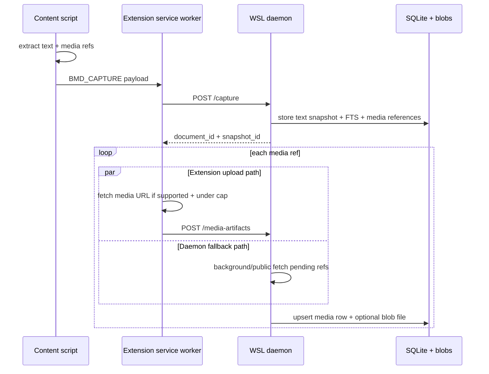

# Media Artifacts — Image/Video Reference Storage

> **Audience:** Operator and future maintainers  
> **Scope:** Store page images/videos as related artifacts next to text/FTS snapshots.  
> **Status:** ✅ Implemented for metadata references plus best-effort binary storage.

---

## Goal

The browser-memory daemon now stores media that appeared on a captured page as **related artifacts** for reference.

This is intentionally **not OCR** and **not media indexing**:

```text
page text → chunks + FTS
page media → media_artifacts table + optional blob file
```

A search hit still comes from FTS text. The hit can then show that the same snapshot had related images/videos and let the operator open stored media from the local UI/API.

---

## What gets captured

The Chrome content script extracts media references from:

| DOM source | Stored artifact type | Notes |
|---|---|---|
| `` | `image:content` | Uses `currentSrc`/`src`, alt/title, dimensions. |
| `<picture><source srcset>` | `image:content` | Uses the first srcset candidate. |
| `<video poster>` | `image:poster` | Poster image stored as an image artifact. |
| `<video src>` / `<video><source src>` | `video:content` | Direct video source is stored if fetchable and under cap. |

Quality skips retained:

- hidden media elements are skipped;
- 1×1 tracking-pixel-like images are skipped;
- at most 50 media refs per page capture are considered;
- huge inline data URLs are not embedded in the capture payload.

---

## Storage model

New table:

```text
media_artifacts
```

Each row links to the normal recall graph:

```text
document → snapshot → media_artifacts
         ↘ visit ↗
```

Key fields:

| Field | Purpose |
|---|---|
| `document_id` | Parent document. |
| `snapshot_id` | Exact text snapshot the media appeared with. |
| `visit_id` | Visit that generated/uploaded the artifact when known. |
| `media_type` | `image` or `video`. |
| `role` | `content`, `poster`, or `source`. |
| `source_url` | Original media URL, redacted outside `all` mode. |
| `mime_type` | Response or DOM MIME type. |
| `width`, `height`, `duration_seconds` | DOM metadata. |
| `capture_status` | `referenced`, `stored`, `metadata-only`, `skipped`, or `failed`. |
| `file_path` | Local blob path when binary was stored. |

Binary files live under:

```text
~/.local/share/browser-memory-daemon/blobs/media/
```

---

## Capture flow



Important: page text storage does not wait on media binary upload. If the extension service worker is suspended or cannot fetch a public CDN asset, the daemon-side fallback can fetch pending `referenced` artifacts from WSL. If media fetch fails, the reference row still exists as metadata.

---

## API

### Store media artifact

```http
POST /media-artifacts
Authorization: Bearer <token>
Content-Type: application/json
```

Payload shape:

```json
{
  "document_id": "doc_...",
  "snapshot_id": "snap_...",
  "visit_id": "visit_...",
  "page_url": "https://example.com/article",
  "media_type": "image",
  "role": "content",
  "source_url": "https://example.com/hero.png",
  "mime_type": "image/png",
  "width": 640,
  "height": 360,
  "content_base64": "..."
}
```

If `content_base64` is omitted, the row is metadata-only.

### Fetch pending referenced artifacts

```http
POST /media-artifacts/fetch-pending
Authorization: Bearer ***
Content-Type: application/json
```

Payload shape:

```json
{
  "domain": "x.com",
  "snapshot_id": "snap_...",
  "document_id": "doc_...",
  "limit": 100
}
```

All filters are optional. The daemon fetches pending `referenced` / `metadata-only` artifacts with public `http:`, `https:`, or `data:` source URLs, stores successful binaries under `blobs/media/`, and leaves unsupported/oversized/non-media responses as `skipped` or `failed` metadata rows.

### Retrieve media artifact

```http
GET /media-artifacts/<artifact_id>
Authorization: Bearer <token>
```

Returns the stored binary with its MIME type if available. If the artifact is metadata-only, the endpoint returns `404` with artifact metadata.

---

## Limits and caveats

| Limit | Value / behavior |
|---|---|
| Media refs per capture | 50 |
| Max binary artifact | 25 MB |
| Max media JSON upload | 40 MB |
| Auto daemon fetches after one capture | 12 pending artifacts |
| Manual fetch-pending call limit | 100 artifacts |
| Supported binary fetch schemes | `http:`, `https:`, `data:` |
| Unsupported binary fetch schemes | `blob:`, browser-internal, opaque streaming manifests |

Video caveat:

- Direct small video files can be stored.
- Streaming video pages often expose HLS/DASH manifests, DRM blobs, or transient `blob:` URLs. Those will usually become metadata-only unless a later specialized capture path is added.

---

## Verification

Implemented gates:

```bash
python3 -m pytest -q
cd extension && npm test && npm run build
./scripts/run-e2e.sh
BMD_REAL_CHROME_POLICY_MODE=strict ./scripts/run-real-chrome-e2e.sh
./scripts/secret-scan.sh
git diff --check -- .
```

Real Chrome e2e verifies:

- synthetic page text appears in FTS;
- synthetic image artifact is extracted from DOM;
- service worker fetches the image;
- daemon stores `media_artifacts` row;
- daemon writes media blob under `blobs/media/`;
- daemon-side fallback stores referenced media when `/media-artifacts/fetch-pending` runs;
- search result includes `media_artifact_count=1`;
- strict policy still blocks sensitive/local fixture pages.
