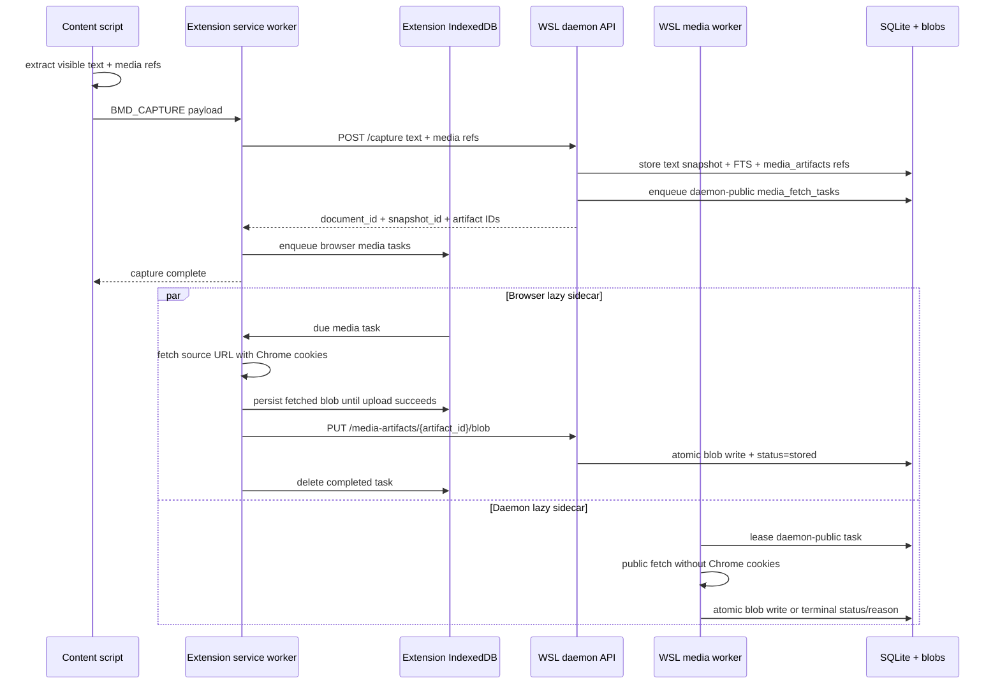

# Media Artifacts — Durable Image/Video Sidecars

> **Audience:** Operator and future maintainers  
> **Scope:** Store page images/videos as related artifacts next to text/FTS snapshots.  
> **Status:** ✅ Implemented: fast text/manifest capture, durable browser lazy media queue, raw blob upload, daemon public worker, cache purge/rehydrate controls.

---

## Goal

The browser-memory daemon stores media that appeared on a captured page as **related artifacts** for reference while keeping text recall fast and reliable.

This is intentionally **not OCR** and **not media indexing**:

```text
page text  → chunks + FTS
page media → media_artifacts rows + optional blob files
```

A search hit still comes from FTS text. The hit can then show that the same snapshot had related images/videos and expose stored local media from the UI/API.

---

## What gets captured

The Chrome content script extracts media references from:

| DOM source | Stored artifact type | Notes |
|---|---|---|
| `` | `image:content` | Uses `currentSrc`/`src`, alt/title, dimensions. |
| `<picture><source srcset>` | `image:content` | Uses the first srcset candidate. |
| `<video poster>` | `image:poster` | Poster image stored as an image artifact. |
| `<video src>` / `<video><source src>` | `video:content` | Direct video source is stored if fetchable and under caps. |

Quality skips retained:

- hidden media elements are skipped;
- 1×1 tracking-pixel-like images are skipped;
- at most 50 media refs per page capture are considered;
- huge inline data URLs are not embedded in the `/capture` payload.

---

## Storage model

```text
document → snapshot → media_artifacts
         ↘ visit ↗

media_fetch_tasks → media_artifacts
blobs/media/<artifact_id>.<ext>
```

Key fields:

| Field | Purpose |
|---|---|
| `document_id` | Parent document. |
| `snapshot_id` | Exact text snapshot the media appeared with. |
| `visit_id` | Visit that generated/uploaded the artifact when known. |
| `media_type` | `image` or `video`. |
| `role` | `content`, `poster`, or `source`. |
| `source_url` | Original media URL, redacted outside `all` mode. |
| `mime_type` | Response or DOM MIME type. |
| `width`, `height`, `duration_seconds` | DOM metadata. |
| `capture_status` | `referenced`, `metadata-only`, `queued`, `fetching`, `fetched`, `uploading`, `stored`, `retrying`, `failed`, `skipped`, `expired`, or `purged`. |
| `status_reason` | Terminal or diagnostic reason, e.g. `media-too-large`, `fetch-status-403`, `cache-purged:domain:x.com`. |
| `file_path` | Local blob path when binary is currently stored. |
| `content_sha256`, `byte_size` | Blob provenance retained even after cache purge. |

Binary files live under:

```text
~/.local/share/browser-memory-daemon/blobs/media/
```

---

## Capture flow



Important properties:

- `/capture` stores text/FTS and media reference rows without waiting on media bytes.
- Credentialed media fetch happens inside Chrome; cookies are **not** exported to WSL.
- WSL daemon media worker backfills public `http:`, `https:`, and `data:` refs.
- If media cannot be fetched, the reference row remains with an explicit status/reason.
- Browser queue tasks in `fetching` or `uploading` become due again after a stale processing window, so MV3 service-worker suspension does not strand them permanently.

---

## API

### `/capture` response includes artifact IDs

`/capture` stores media refs and returns stable artifact metadata so the browser sidecar can enqueue durable upload work:

```json
{
  "stored": true,
  "document_id": "doc_...",
  "snapshot_id": "snap_...",
  "media_ref_count": 2,
  "media_artifacts": [
    {
      "artifact_id": "media_...",
      "document_id": "doc_...",
      "snapshot_id": "snap_...",
      "media_type": "image",
      "role": "content",
      "source_url": "https://example.com/hero.png"
    }
  ]
}
```

### Raw blob upload

Primary browser lazy sidecar path:

```http
PUT /media-artifacts/<artifact_id>/blob
Authorization: Bearer ***
Content-Type: image/png
X-BMD-Document-ID: doc_...
X-BMD-Snapshot-ID: snap_...
```

The daemon size/MIME/cache gates the blob, writes through `blobs/media/.tmp`, then atomically renames to the final file.

### Compatibility JSON artifact upload

Kept for compatibility and tests:

```http
POST /media-artifacts
Authorization: Bearer ***
Content-Type: application/json
```

```json
{
  "document_id": "doc_...",
  "snapshot_id": "snap_...",
  "media_type": "image",
  "source_url": "https://example.com/hero.png",
  "mime_type": "image/png",
  "content_base64": "..."
}
```

If `content_base64` is omitted, the row is metadata-only.

### Fetch pending public refs

Manual/backfill path:

```http
POST /media-artifacts/fetch-pending
Authorization: Bearer ***
Content-Type: application/json
```

```json
{"domain": "x.com", "limit": 100}
```

### Queue status

```http
GET /media-artifacts/queue-status?limit=50
Authorization: Bearer ***
```

Returns artifact status counts, task status counts, stored bytes, configured cache gates, and recent non-stored artifacts.

### Purge media cache

```http
POST /media-artifacts/purge-cache
Authorization: Bearer ***
Content-Type: application/json
```

```json
{
  "domain": "linkedin.com",
  "dry_run": true,
  "rehydrate": false
}
```

Purge removes blob files and marks artifacts `purged`; it does **not** delete text/FTS/media refs. If `rehydrate=true`, eligible daemon-public tasks are reset to `pending` for best-effort refetch.

CLI wrappers:

```bash
PYTHONPATH=daemon/src python3 -m browser_memory_daemon media-cache purge --domain linkedin.com --dry-run
PYTHONPATH=daemon/src python3 -m browser_memory_daemon media-cache purge --domain linkedin.com --execute --rehydrate
PYTHONPATH=daemon/src python3 -m browser_memory_daemon media-worker --once --limit 100
```

### Retrieve media artifact

```http
GET /media-artifacts/<artifact_id>
Authorization: Bearer ***
```

Returns the stored binary with its MIME type if available. If the artifact has no current file, the endpoint returns `404` with artifact metadata.

---

## Limits and caveats

| Limit | Value / behavior |
|---|---|
| Media refs per capture | 50 |
| Max binary artifact | 25 MB by default |
| Max media JSON upload | 40 MB |
| Browser lazy sidecar | Extension IndexedDB queue, `chrome.alarms`, fetch with `credentials: include`, raw `PUT` upload |
| Daemon lazy sidecar | `browser-memory-media-worker.service`, public fetch only, no Chrome cookies |
| Manual fetch-pending call limit | 100 artifacts |
| Supported binary fetch schemes | `http:`, `https:`, `data:` |
| Unsupported/hard schemes | `blob:`, browser-internal, opaque streaming, DRM |

Cache gates:

| Gate | Default |
|---|---:|
| Per artifact | 25 MB |
| Per snapshot | 100 MB |
| Per domain | 2 GB |
| Global media cache | 50 GB |
| Minimum priority | 0 |

Video caveat:

- Direct small video files can be stored.
- Streaming video pages often expose HLS/DASH manifests, DRM blobs, or transient `blob:` URLs. Those usually remain metadata-only unless a later specialized capture path is added.

---

## Verification

Implemented gates:

```bash
python3 -m pytest -q
cd extension && npm test && npm run build
./scripts/run-e2e.sh
BMD_REAL_CHROME_POLICY_MODE=strict ./scripts/run-real-chrome-e2e.sh
./scripts/secret-scan.sh
git diff --check -- .
```

Real Chrome e2e verifies:

- synthetic page text appears in FTS;
- public and cookie-required image artifacts are extracted from DOM;
- browser lazy sidecar fetches with Chrome cookie envelope using a no-store fetch path;
- raw `PUT /media-artifacts/{id}/blob` stores local files;
- stale `fetching`/`uploading` tasks are re-eligible instead of stranded;
- extension capture/lifecycle/media queues drain empty;
- daemon task rows reach `succeeded`;
- strict policy still blocks sensitive/local fixture pages.
