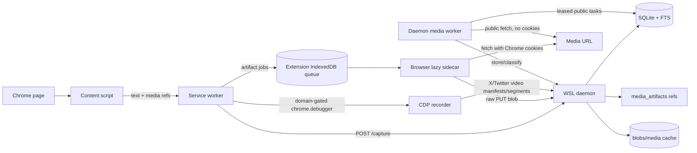

# Media Sidecar Design History

> **Status:** Historical implementation rationale, reconciled from the former `docs/plans/2026-06-09-durable-media-sidecars.md` plan.
> **Current operational source of truth:** [`media-artifacts.md`](media-artifacts.md), [`ARCHITECTURE.md`](ARCHITECTURE.md), [`api.md`](api.md), and the implementation/tests.

---

## Why this slice existed

The original media-sidecar plan solved one failure mode: text recall should be durable immediately, but media bytes should not block `/capture` or disappear when Chrome MV3 suspends the service worker.

The implemented invariant is:

```text
fast sidecar owns recall correctness
lazy sidecars own media completeness
media blobs are a disposable cache
text/FTS/media refs remain authoritative
```

---

## Implemented design



Implemented lanes:

| Lane | Purpose | Current files |
|---|---|---|
| Fast capture | Store text, FTS, visits/snapshots, and media refs immediately. | `extension/src/content_script.js`, `extension/src/service_worker.js`, `daemon/src/browser_memory_daemon/ingest.py`, `media.py` |
| Browser lazy sidecar | Fetch credentialed media inside Chrome and upload raw blobs. | `extension/src/media_queue.js`, `service_worker.js` |
| Inline/blob upload | Let content script read transient `blob:` / `data:` bytes while page context is alive. | `extension/src/content_script.js`, `service_worker.js` |
| CDP recorder | Capture X/Twitter `video.twimg.com` HLS manifests/segments before only opaque `blob:` player URLs remain. | `extension/src/cdp_recorder.js`, `service_worker.js` |
| Daemon lazy sidecar | Public unauthenticated backfill with leases, backoff, HLS assembly, and status classification. | `daemon/src/browser_memory_daemon/media_worker.py`, `media.py` |
| Cache management | Purge/rehydrate controls plus oldest-first rolling eviction for domain/global caps. | `media.py`, `cli.py`, `/media-artifacts/*` |

---

## Requirement reconciliation

| Original requirement | Current implementation status |
|---|---|
| Text/FTS must not wait on media bytes. | Implemented. `/capture` stores refs and returns artifact IDs before lazy binary work. |
| Every media candidate should produce a durable row. | Implemented subject to the per-capture ref cap; video refs are prioritized over lower-priority images. |
| Browser media work must survive service-worker suspension. | Implemented with IndexedDB tasks/blobs and stale-task requeue. |
| Credentialed media fetch must stay inside Chrome. | Implemented; WSL daemon never receives Chrome cookies. |
| Raw binary upload should avoid base64 inflation. | Implemented via `PUT /media-artifacts/{artifact_id}/blob`; JSON/base64 remains compatibility-only. |
| Daemon public backfill should use durable leases/backoff. | Implemented with `media_fetch_tasks`, leases, attempts, and worker service. |
| Every artifact needs explicit state/reason. | Implemented and normalized; `failed` is reserved for unexpected/unclassified cases. |
| Media blobs must be bounded and disposable. | Implemented with per-artifact, per-snapshot, per-domain, and global gates; domain/global gates roll by evicting oldest blobs first. |
| Purged blobs should be rehydratable when remote URLs still work. | Implemented with cache purge `--rehydrate` and media worker requeue. |
| Real Chrome e2e must prove browser/daemon/media behavior. | Implemented; includes public media, cookie-required media, blob video fixture, queue drain, and strict-mode regression. |

---

## Current default media limits

These values come from `RuntimeConfig` in `daemon/src/browser_memory_daemon/config.py`:

| Gate | Default |
|---|---:|
| Max artifact bytes | 250 MB |
| Per-snapshot media bytes | 1 GB |
| Per-domain media bytes | 10 GB |
| Global media cache bytes | 100 GB |
| Media refs per capture | 50 |
| Daemon worker manual call limit | 100 |
| Worker service interval / batch | 30 seconds / 25 items |

Domain/global gates are rolling caches. When a new blob would exceed one of those caps, the daemon evicts the oldest stored blobs in that scope first and preserves rows as:

```text
capture_status = purged
status_reason  = cache-evicted:domain-oldest
# or
status_reason  = cache-evicted:global-oldest
```

---

## Out of scope / still future

These are intentionally not part of the current implementation:

- OCR or media-derived text indexing.
- DRM/EME capture.
- General DASH/MSE capture when no readable blob, direct URL, or public HLS manifest exists.
- Always-on screenshots for every page.
- Semantic/vector search.
- MCP/Hermes tool integration.
- Encrypted backup/restore and broad retention jobs.

---

## Verification gates

The reconciled implementation is covered by:

```bash
python3 -m pytest -q
cd extension && npm test && npm run build
./scripts/run-real-chrome-e2e.sh
./scripts/run-e2e.sh
./scripts/secret-scan.sh
git diff --check -- .
```

See [`TESTS.md`](TESTS.md) and [`test-plan.md`](test-plan.md) for the current verification matrix.
