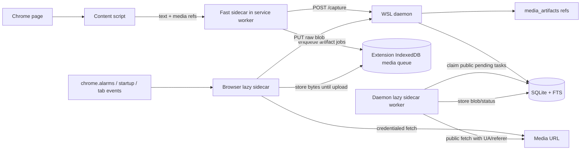

# Durable Media Sidecars Implementation Plan

> **For Hermes:** Use `subagent-driven-development` or a strict task-by-task TDD loop to implement this plan.
>
> **Goal:** Make media capture resilient without putting media bytes on the fast text/FTS path.
>
> **Architecture:** Keep `/capture` as the fast sidecar for text + media manifest rows. Add a durable browser lazy sidecar for credentialed media fetch/upload, plus a durable daemon lazy sidecar for public backfill/retry. Do not export Chrome cookies to WSL.
>
> **Tech Stack:** Chrome MV3 extension, IndexedDB, `chrome.alarms`, WSL Python HTTP daemon, SQLite, filesystem blobs, real Chrome e2e.
>
> **Status:** 📋 Plan ready; not implemented.

---

## 1. Scope decision

This slice should **not** try to capture every media byte on every site. That is not technically true for the open web.

It should make the system bulletproof in the engineering sense:

```text
text/FTS never waits on media
media candidates are durable immediately
credentialed media is fetched inside Chrome
public media is retried by WSL
every artifact has an explicit terminal status/reason
failures are observable and recoverable
hard size gates prevent storing objects above configured cutoffs
blob cache can be purged while preserving refs/metadata
purged blobs can be queued for async rehydration later when remote URLs still work
```

Out of scope for this slice:

- OCR or media-derived text indexing.
- DRM/EME media capture.
- Full HLS/DASH segment reconstruction.
- CDP/chrome.debugger exact-envelope capture.
- Always-on screenshots for every page.

Possible later slices:

- failed-media-only screenshot fallback;
- optional allowlisted CDP exact-envelope mode;
- streaming-video manifest/segment capture.

---

## 2. Current baseline

Relevant current files:

| Area | Current file(s) | Current behavior |
|---|---|---|
| Fast text capture | `extension/src/content_script.js`, `extension/src/service_worker.js` | Content script sends `BMD_CAPTURE`; service worker posts `/capture`. |
| Media extraction | `extension/src/extractor.js` | Extracts ``, `<picture><source>`, video posters/sources. |
| Fire-and-forget media upload | `extension/src/service_worker.js:117-208` | Fetches media with `credentials: 'include'`, base64-encodes, posts `/media-artifacts`; not durable across service worker suspension. |
| Daemon media storage | `daemon/src/browser_memory_daemon/media.py` | Stores refs/blobs and can public-fetch pending refs. |
| Daemon API | `daemon/src/browser_memory_daemon/app.py` | Has `/capture`, `/media-artifacts`, `/media-artifacts/fetch-pending`, `/media-artifacts/{id}`. |
| Schema | `daemon/src/browser_memory_daemon/schema.sql` | Has `media_artifacts`; no durable fetch task table yet. |
| Real browser e2e | `scripts/real-chrome-e2e.mjs` | Verifies one public synthetic image and daemon fallback. |

Current weakness:

```text
/capture returns and shifts the text queue before extension-side media upload is durably queued.
```

That means a Chrome MV3 service worker suspension can lose the browser-cookie media opportunity even though the daemon keeps metadata refs.

---

## 3. Requirements

| ID | Requirement | Priority | Verification method |
|---|---|---:|---|
| REQ-MEDIA-001 | Text/FTS capture shall complete without waiting on media binary fetch/upload. | Must | Real Chrome e2e + timing/assertions. |
| REQ-MEDIA-002 | Every extracted media candidate shall produce a durable `media_artifacts` row during `/capture`. | Must | Daemon integration test. |
| REQ-MEDIA-003 | Browser-side media work shall be durably queued before the text capture queue item is removed. | Must | Extension unit test + real Chrome e2e queue inspection. |
| REQ-MEDIA-004 | Browser-side fetch shall use the Chrome cookie/session envelope when possible and shall not export cookies to WSL. | Must | Cookie-required media e2e; code inspection. |
| REQ-MEDIA-005 | Pulled media bytes shall survive daemon upload failure and retry later, subject to quota/size caps. | Should | Extension unit test with mocked daemon failure. |
| REQ-MEDIA-006 | Media upload shall support raw binary upload without base64 inflation on the new path. | Must | HTTP e2e test for `PUT /media-artifacts/{id}/blob`. |
| REQ-MEDIA-007 | Daemon public backfill shall use durable leases/backoff, not only request-scoped threads. | Should | Daemon integration test + CLI/worker smoke. |
| REQ-MEDIA-008 | Each artifact shall expose an explicit state and reason: `referenced`, `queued`, `fetching`, `fetched`, `uploading`, `stored`, `retrying`, `failed`, `skipped`, `expired`, `purged`. | Must | Schema/API tests. |
| REQ-MEDIA-009 | Stored blobs shall be content-hash deduped or at least content-hash indexed before duplicate storage growth becomes material. | Should | Integration test with duplicate media URL/content. |
| REQ-MEDIA-010 | Doctor/UI/API shall report media queue health: pending, retrying, stored, failed/skipped, purged, bytes, and configured cache gates. | Should | Admin API/e2e tests. |
| REQ-MEDIA-011 | Real Chrome e2e shall include public image, cookie-required image, oversized media, unsupported `blob:` marker, and restart/retry behavior. | Must | `./scripts/run-real-chrome-e2e.sh`. |
| REQ-MEDIA-012 | Media storage shall enforce configurable hard gates: per-artifact bytes, per-snapshot bytes, per-domain bytes, total cache bytes, MIME allowlist, and optional priority cutoff. | Must | Daemon/extension tests with oversized fixtures. |
| REQ-MEDIA-013 | Operator shall be able to purge media blob cache by scope without deleting text/FTS/media reference rows. | Must | HTTP/CLI e2e test plus live dry-run. |
| REQ-MEDIA-014 | Purged artifacts shall be eligible for explicit async rehydration, with no guarantee if the remote URL expired or disappeared. | Should | Worker test: purged → queued → stored/failed. |

---

## 4. Target architecture



Key invariant:

```text
Fast sidecar owns recall correctness.
Lazy sidecars own media completeness.
```

---

## 5. Data model changes

### 5.1 Extend artifact status vocabulary

Keep `media_artifacts.capture_status` as the human/API summary, but allow more explicit values:

```text
referenced
queued
fetching
fetched
uploading
stored
retrying
failed
skipped
expired
purged
```

Add status normalization helper in:

```text
daemon/src/browser_memory_daemon/media.py
```

### 5.2 Add daemon task table

Modify:

```text
daemon/src/browser_memory_daemon/schema.sql
```

Add:

```sql
CREATE TABLE IF NOT EXISTS media_fetch_tasks (
  id TEXT PRIMARY KEY,
  artifact_id TEXT NOT NULL,
  worker_kind TEXT NOT NULL, -- browser, daemon-public, screenshot-fallback
  status TEXT NOT NULL DEFAULT 'pending',
  priority INTEGER NOT NULL DEFAULT 50,
  attempts INTEGER NOT NULL DEFAULT 0,
  max_attempts INTEGER NOT NULL DEFAULT 5,
  next_attempt_at TEXT,
  lease_owner TEXT,
  lease_until TEXT,
  last_error TEXT,
  created_at TEXT NOT NULL DEFAULT CURRENT_TIMESTAMP,
  updated_at TEXT NOT NULL DEFAULT CURRENT_TIMESTAMP,
  FOREIGN KEY(artifact_id) REFERENCES media_artifacts(id) ON DELETE CASCADE
);

CREATE INDEX IF NOT EXISTS idx_media_fetch_tasks_status_next
  ON media_fetch_tasks(status, next_attempt_at, priority);

CREATE INDEX IF NOT EXISTS idx_media_fetch_tasks_artifact
  ON media_fetch_tasks(artifact_id);
```

Design rule:

- `media_artifacts` answers “what existed with the snapshot?”
- `media_fetch_tasks` answers “what still needs work?”

### 5.3 Extension IndexedDB stores

Create:

```text
extension/src/media_queue.js
```

IndexedDB database:

```text
browser-memory-media-v1
```

Stores:

| Store | Key | Purpose |
|---|---|---|
| `tasks` | `artifact_id` | Durable media fetch/upload task metadata. |
| `blobs` | `artifact_id` | Optional fetched bytes pending upload. |

Task shape:

```js
{
  artifact_id,
  document_id,
  snapshot_id,
  visit_id,
  page_url,
  source_url,
  media_type,
  role,
  mime_type,
  width,
  height,
  priority,
  status,          // pending-fetch, fetched, pending-upload, retrying, stored, skipped, failed
  attempts,
  next_attempt_at,
  last_error,
  created_at,
  updated_at
}
```

Do **not** store cookies or request headers in IndexedDB.

### 5.4 Size gates and purge/rehydration model

Add config fields in:

```text
daemon/src/browser_memory_daemon/config.py
```

Planned knobs:

```python
max_media_artifact_bytes: int = 25_000_000
max_media_bytes_per_snapshot: int = 100_000_000
max_media_bytes_per_domain: int = 2_000_000_000
max_media_cache_bytes: int = 50_000_000_000
media_mime_allowlist: tuple[str, ...] = ("image/", "video/mp4", "video/webm")
media_min_priority_to_store: int = 0
```

Gate semantics:

| Gate | Behavior |
|---|---|
| Per-artifact hard cap | Never store object; mark `skipped: media-too-large`. |
| MIME allowlist | Never store disallowed MIME; mark `skipped: disallowed-mime`. |
| Per-snapshot cap | Store highest-priority artifacts first; lower-priority items remain `referenced` or `skipped: snapshot-media-budget`. |
| Per-domain cap | Stop materializing new blobs for that domain; keep refs for later manual rehydration. |
| Global cache cap | Worker stops new materialization and doctor/UI show pressure. |
| Extension IndexedDB quota | Browser sidecar skips/defers blob persistence and leaves daemon/worker task available. |

Purge semantics:

```text
purge media cache != forget memory
```

A purge deletes blob files and clears `file_path`, but preserves:

- `documents`, `visits`, `snapshots`, chunks, FTS;
- `media_artifacts` rows;
- `source_url`, dimensions, MIME, status reason, historical byte/hash metadata;
- enough task metadata to try rehydration later.

After purge, set:

```text
capture_status = purged
status_reason = cache-purged:<scope>
file_path = NULL / ''
```

If `rehydrate=true`, create fresh `media_fetch_tasks` rows. Rehydration is best-effort because remote URLs may expire, require cookies, or disappear.

---

## 6. API changes

### 6.1 Raw blob upload

Add endpoint:

```http
PUT /media-artifacts/{artifact_id}/blob
Authorization: Bearer ***
Content-Type: image/jpeg
X-BMD-Document-ID: doc_...
X-BMD-Snapshot-ID: snap_...
X-BMD-Source-URL: https://...
```

Behavior:

1. Authenticate.
2. Look up existing artifact by ID.
3. Verify `document_id` and `snapshot_id` headers match the row if supplied.
4. Stream body to temp file under `blobs/media/.tmp/`.
5. Enforce `max_media_artifact_bytes` during stream.
6. Validate media MIME by `Content-Type` and existing `media_type`.
7. Compute `sha256`.
8. Move atomically to final path.
9. Update `media_artifacts` to `stored`.
10. Return JSON with `artifact_id`, `stored`, `byte_size`, `content_sha256`, `file_path`.

Keep existing `POST /media-artifacts` for compatibility, but move the extension lazy sidecar to raw upload.

### 6.2 Queue status endpoint

Add endpoint:

```http
GET /media-artifacts/queue-status?limit=50
Authorization: Bearer ***
```

Response shape:

```json
{
  "artifacts": {
    "referenced": 10,
    "queued": 12,
    "stored": 139,
    "failed": 2,
    "skipped": 2
  },
  "tasks": {
    "pending": 8,
    "retrying": 4,
    "leased": 0,
    "failed": 2
  },
  "bytes": {
    "stored": 3350399
  }
}
```

### 6.3 Purge cache endpoint

Add endpoint:

```http
POST /media-artifacts/purge-cache
Authorization: Bearer ***
Content-Type: application/json
```

Payload:

```json
{
  "domain": "linkedin.com",
  "older_than": "2026-06-01T00:00:00Z",
  "max_bytes_to_purge": 5000000000,
  "dry_run": true,
  "rehydrate": false
}
```

Behavior:

1. Never deletes text, FTS, snapshots, visits, or media reference rows.
2. Selects only rows with existing `file_path` under `config.media_root`.
3. Supports dry-run with counts/bytes/sample artifact IDs.
4. Deletes blob files when `dry_run=false`.
5. Clears `file_path`; keeps `byte_size` and `content_sha256` as historical provenance unless a later compaction mode explicitly removes them.
6. Sets `capture_status='purged'` and `status_reason='cache-purged:<scope>'`.
7. If `rehydrate=true`, creates due `media_fetch_tasks` rows so lazy sidecars can try to regenerate the cache later.

Add CLI wrappers:

```bash
python3 -m browser_memory_daemon media-cache purge --domain linkedin.com --dry-run
python3 -m browser_memory_daemon media-cache purge --domain linkedin.com --rehydrate
python3 -m browser_memory_daemon media-cache rehydrate --domain linkedin.com --limit 100
```

---

## 7. Implementation tasks

### Task 1: Add daemon task schema and status helpers

**Objective:** Represent media work durably without overloading artifact rows.

**Files:**

- Modify: `daemon/src/browser_memory_daemon/schema.sql`
- Modify: `daemon/src/browser_memory_daemon/media.py`
- Test: `daemon/tests/integration/test_ingest_search_forget.py`

**Steps:**

1. Add `media_fetch_tasks` table and indexes from Section 5.2.
2. Add `MEDIA_CAPTURE_STATUSES` and `normalize_capture_status(value)` in `media.py`.
3. Update `store_media_artifact()` to accept the expanded status vocabulary.
4. Add helper `ensure_media_fetch_task(conn, artifact_id, worker_kind, priority=50)`.
5. In `record_media_references()`, create a `daemon-public` task for public `http:`, `https:`, and `data:` refs.
6. Add integration test asserting a capture with one image creates:
   - one `media_artifacts` row;
   - one `media_fetch_tasks` row;
   - no media metadata in FTS.
7. Run:

```bash
python3 -m pytest daemon/tests/integration/test_ingest_search_forget.py -q
```

Expected: pass.

**Commit:**

```bash
git commit -m "feat: add durable media fetch tasks"
```

---

### Task 2: Add raw binary blob upload endpoint

**Objective:** Stop relying on base64 for the new browser lazy sidecar path.

**Files:**

- Modify: `daemon/src/browser_memory_daemon/app.py`
- Modify: `daemon/src/browser_memory_daemon/media.py`
- Test: `daemon/tests/e2e/test_http_api.py`

**Steps:**

1. Add `store_media_blob_stream(conn, config, artifact_id, stream, headers)` in `media.py`.
2. Enforce `config.max_media_artifact_bytes` while streaming.
3. Write to `config.media_root / ".tmp" / ...` first, then atomic rename.
4. Update `media_artifacts` with `stored`, byte size, MIME, `content_sha256`, file path.
5. Update matching `media_fetch_tasks` rows to `succeeded`.
6. Add `PUT /media-artifacts/{artifact_id}/blob` in `app.py` before the current `GET /media-artifacts/{artifact_id}` branch.
7. Add HTTP e2e tests:
   - stores raw `image/png` bytes;
   - rejects missing artifact;
   - rejects non-media content type;
   - rejects oversized body.
8. Run:

```bash
python3 -m pytest daemon/tests/e2e/test_http_api.py -q
```

Expected: pass.

**Commit:**

```bash
git commit -m "feat: upload media blobs as raw binary"
```

---

### Task 3: Implement size gates and media cache purge/rehydrate operations

**Objective:** Bound cache growth and make media blobs disposable/rebuildable without deleting text recall.

**Files:**

- Modify: `daemon/src/browser_memory_daemon/config.py`
- Modify: `daemon/src/browser_memory_daemon/media.py`
- Modify: `daemon/src/browser_memory_daemon/app.py`
- Modify: `daemon/src/browser_memory_daemon/cli.py`
- Test: `daemon/tests/e2e/test_http_api.py`
- Test: `daemon/tests/integration/test_ingest_search_forget.py`

**Steps:**

1. Add config knobs from Section 5.4 with environment overrides.
2. Add `media_storage_allowed(conn, config, artifact, candidate_bytes, priority)` in `media.py`.
3. Enforce gates in both base64 compatibility storage and new raw upload path.
4. Add `purge_media_cache(conn, config, scope, dry_run=True, rehydrate=False)`.
5. Ensure purge refuses paths outside `config.media_root`.
6. Preserve source URL, dimensions, historical byte size, and content hash after purge.
7. Add `POST /media-artifacts/purge-cache`.
8. Add CLI wrappers under `media-cache`.
9. Add tests:
   - oversized object is never stored;
   - per-snapshot budget stores higher-priority first;
   - dry-run purge reports bytes but does not delete files;
   - real purge deletes files and leaves FTS/search intact;
   - purge with `rehydrate=true` creates fetch tasks.
10. Run:

```bash
python3 -m pytest daemon/tests/e2e/test_http_api.py daemon/tests/integration/test_ingest_search_forget.py -q
```

Expected: pass.

**Commit:**

```bash
git commit -m "feat: add media cache gates and purge controls"
```

---

### Task 4: Build extension IndexedDB media queue

**Objective:** Persist browser-cookie media work before the text capture queue item is removed.

**Files:**

- Create: `extension/src/media_queue.js`
- Modify: `extension/src/service_worker.js`
- Create: `extension/tests/unit/media_queue.test.js`

**Steps:**

1. Create `media_queue.js` with functions:

```js
openMediaDb()
putMediaTask(task)
getDueMediaTasks(limit, now)
putFetchedBlob(artifactId, blob, metadata)
getFetchedBlob(artifactId)
markMediaTask(artifactId, patch)
deleteMediaTask(artifactId)
countMediaTasksByStatus()
```

2. Load it in `service_worker.js`:

```js
try { importScripts('shared.js', 'extractor.js', 'media_queue.js'); } catch (_) {}
```

3. After successful `/capture`, transform `capturePayload.media_artifacts` plus `captureResult` into durable media tasks.
4. Persist those tasks with `putMediaTask()` **before** `queue.shift()` and `saveQueue(queue)`.
5. Keep `/capture` fast: do not fetch media inline in `drainQueue()`.
6. Add unit tests using a fake IndexedDB implementation or a small in-memory adapter boundary.
7. Run:

```bash
cd extension && npm test
```

Expected: pass.

**Commit:**

```bash
git commit -m "feat: queue media work durably in extension"
```

---

### Task 5: Implement browser lazy sidecar drain loop

**Objective:** Fetch credentialed media inside Chrome and upload later, resilient to service worker wake/suspend cycles.

**Files:**

- Modify: `extension/src/service_worker.js`
- Modify: `extension/manifest.json`
- Test: `extension/tests/unit/media_queue.test.js`

**Steps:**

1. Add permission if needed:

```json
"permissions": ["storage", "tabs", "webNavigation", "scripting", "alarms"]
```

2. Add `drainMediaQueue({ budgetMs = 25000, concurrency = 2 })`.
3. Fetch due tasks with status `pending-fetch` or `retrying`.
4. Fetch media with:

```js
fetch(task.source_url, {
  credentials: 'include',
  redirect: 'follow',
  cache: 'force-cache'
})
```

5. If fetch succeeds and passes size/MIME gates, store blob in IndexedDB and mark `pending-upload`.
6. If fetched bytes exceed per-object or IndexedDB cache budget, do not persist the blob; mark skipped/deferred with a reason and leave daemon/public task available when appropriate.
7. If fetch fails, increment attempts and set `next_attempt_at` with exponential backoff.
8. Upload pending blobs with `PUT /media-artifacts/{artifact_id}/blob`.
9. On upload success, delete blob and task, and optionally post task status to daemon.
10. On upload failure, keep the blob and retry upload later unless quota pressure requires dropping it back to `pending-fetch`.
11. Register wake triggers:

```js
chrome.alarms.create('bmd-media-drain', { periodInMinutes: 1 });
chrome.alarms.onAlarm.addListener(...);
chrome.runtime.onStartup.addListener(...);
chrome.runtime.onInstalled.addListener(...);
```

12. Add unit tests for:
   - fetch success → blob stored → upload success → task deleted;
   - fetch success → upload failure → blob retained;
   - fetch failure → retry/backoff;
   - oversized fetch → no blob persisted, reason recorded;
   - unsupported scheme → terminal skipped.
13. Run:

```bash
cd extension && npm test && npm run build
```

Expected: pass.

**Commit:**

```bash
git commit -m "feat: drain media queue from browser sidecar"
```

---

### Task 6: Promote daemon fallback into a durable worker

**Objective:** Make public-media backfill restart-safe and observable.

**Files:**

- Create: `daemon/src/browser_memory_daemon/media_worker.py`
- Modify: `daemon/src/browser_memory_daemon/cli.py`
- Modify: `daemon/src/browser_memory_daemon/app.py`
- Modify: `daemon/src/browser_memory_daemon/ops.py`
- Test: `daemon/tests/integration/test_media_worker.py`

**Steps:**

1. Implement task claiming:

```text
pending/retrying + next_attempt_at <= now + no valid lease
  → lease_owner=<worker-id>, lease_until=now+60s, status=leased
```

2. Implement `run_once(conn, config, worker_id, limit)`.
3. Reuse existing public fetch logic from `fetch_pending_media_artifacts()`.
4. Respect size/MIME/domain/global cache gates before writing any blob.
5. On success: mark artifact `stored`, task `succeeded`.
6. On permanent skip: mark artifact `skipped`, task `skipped`.
7. On transient failure: increment attempts, status `retrying`, backoff `next_attempt_at`.
8. For `purged` artifacts with rehydrate tasks, try normal fetch and mark `stored` or `failed` without implying regeneration is guaranteed.
9. Add CLI command:

```bash
python3 -m browser_memory_daemon media-worker --once --limit 25
python3 -m browser_memory_daemon media-worker --loop --interval 30
```

10. Replace `_schedule_media_fetch()` thread in `app.py` with task creation only, or keep it as `run_once(limit=...)` if it uses leases.
11. Extend `doctor()` with media task counts.
12. Add tests for lease, retry, terminal skip, rehydrate-after-purge, and successful storage.
13. Run:

```bash
python3 -m pytest daemon/tests/integration/test_media_worker.py daemon/tests/e2e/test_admin_api.py -q
```

Expected: pass.

**Commit:**

```bash
git commit -m "feat: run daemon media fetch as durable worker"
```

---

### Task 7: Add daily-driver media worker service

**Objective:** Keep daemon public backfill running without manual `/fetch-pending` calls.

**Files:**

- Modify: `scripts/install-daily-driver.sh`
- Create or modify generated systemd unit under install script output:
  - `browser-memory-media-worker.service`
- Modify: `docs/daily-driver-deployment.md`

**Steps:**

1. Add systemd user service that runs:

```bash
python3 -m browser_memory_daemon media-worker --loop --interval 30
```

2. Make it depend on or start after `browser-memory-daemon.service`.
3. Install/enable/restart it in `scripts/install-daily-driver.sh`.
4. Add smoke check:

```bash
systemctl --user is-active browser-memory-media-worker.service
```

5. Run:

```bash
BMD_POLICY_MODE=all ./scripts/install-daily-driver.sh
systemctl --user is-active browser-memory-daemon.service
systemctl --user is-active browser-memory-media-worker.service
```

Expected: both active.

**Commit:**

```bash
git commit -m "feat: install daemon media worker service"
```

---

### Task 8: Upgrade real Chrome e2e media fixtures

**Objective:** Prove the browser sidecar captures what daemon fallback cannot.

**Files:**

- Modify: `scripts/real-chrome-e2e.mjs`
- Modify: `scripts/run-real-chrome-e2e.sh` if needed

**Fixtures to add:**

| Fixture | Expected result |
|---|---|
| `/media-image.png` public image | Browser or daemon stores blob. |
| `/cookie-media-page` sets cookie and references `/cookie-image.png` | Browser sidecar stores blob; daemon fallback alone would fail. |
| `/oversized-image.bin` advertises >25 MB | Artifact becomes `skipped: media-too-large`. |
| `blob:` marker element | Artifact becomes `skipped: unsupported-media-url-scheme` or screenshot-future placeholder. |
| Daemon temporarily unavailable for upload | Extension keeps fetched blob and uploads after daemon returns. |

**Steps:**

1. Extend the fixture HTTP server with cookie-required media.
2. In e2e, load the page and wait for FTS search hit first.
3. Query DB for `media_artifacts` and `media_fetch_tasks` status.
4. Assert cookie-required artifact reaches `stored` through browser sidecar.
5. Assert no raw cookies appear in daemon DB, blob paths, logs, or docs.
6. Simulate daemon upload failure by briefly starting page capture before daemon media endpoint is available, or by adding a test-only endpoint failure flag.
7. Assert extension queued blob survives and later uploads.
8. Run:

```bash
./scripts/run-real-chrome-e2e.sh
BMD_REAL_CHROME_POLICY_MODE=strict ./scripts/run-real-chrome-e2e.sh
```

Expected: both pass.

**Commit:**

```bash
git commit -m "test: verify durable browser media sidecar in real chrome"
```

---

### Task 9: Observability and UI/API polish

**Objective:** Make media health visible without querying SQLite manually.

**Files:**

- Modify: `daemon/src/browser_memory_daemon/ops.py`
- Modify: `daemon/src/browser_memory_daemon/app.py`
- Modify: `ui/app.js`
- Modify: `ui/style.css`
- Test: `daemon/tests/e2e/test_admin_api.py`

**Steps:**

1. Add queue/status summary to `doctor()`.
2. Add `/media-artifacts/queue-status` endpoint.
3. Show media health in the UI doctor panel:
   - stored files/bytes;
   - pending browser tasks;
   - pending daemon tasks;
   - retrying/failed/skipped/purged counts;
   - configured gate pressure: per-artifact, per-domain, global cache.
4. Add “retry pending media for this domain” button only if it calls authenticated API and confirms scope.
5. Add “purge media cache” dry-run/action controls with explicit confirmation and visible warning that rehydration is best-effort.
6. Add admin API tests.
7. Run:

```bash
python3 -m pytest daemon/tests/e2e/test_admin_api.py -q
```

Expected: pass.

**Commit:**

```bash
git commit -m "feat: expose media queue health"
```

---

### Task 10: Documentation and final gates

**Objective:** Make the new sidecar model understandable and maintainable.

**Files:**

- Modify: `docs/media-artifacts.md`
- Modify: `docs/api.md`
- Modify: `docs/STATUS.md`
- Modify: `docs/TESTS.md`
- Modify: `docs/daily-driver-deployment.md`

**Steps:**

1. Update architecture flow to show fast sidecar, browser lazy sidecar, daemon lazy sidecar.
2. Document cookie-envelope boundaries:
   - browser sidecar uses Chrome cookie jar;
   - daemon sidecar does not receive cookies;
   - no cookie export to WSL.
3. Document new endpoints and media worker service.
4. Document failure status meanings, size gates, purge semantics, and best-effort rehydration.
5. Run full gates:

```bash
python3 -m pytest -q
cd extension && npm test && npm run build
./scripts/run-e2e.sh
BMD_REAL_CHROME_POLICY_MODE=strict ./scripts/run-real-chrome-e2e.sh
./scripts/secret-scan.sh
git diff --check -- .
```

6. Refresh daily-driver and reload Chrome extension:

```bash
BMD_POLICY_MODE=all ./scripts/install-daily-driver.sh
# Chrome: chrome://extensions → Browser Memory Daemon → Reload
```

7. Live validation:

```bash
PYTHONPATH=daemon/src python3 -m browser_memory_daemon \
  --token "$(tr -d '\r\n' < ~/.config/browser-memory-daemon/token)" doctor
```

Expected:

```text
ok=True
chunks_missing_fts=0
media worker active
media pending/retrying visible
```

**Commit:**

```bash
git commit -m "docs: document durable media sidecars"
```

---

## 8. Acceptance criteria

The slice is complete when all are true:

- `/capture` still stores text/FTS quickly even with 50 media refs.
- Browser media tasks are durably persisted before text queue removal.
- Browser lazy sidecar stores a cookie-required synthetic image that daemon fallback cannot fetch unauthenticated.
- A fetched blob survives a failed daemon upload and uploads later.
- Daemon lazy worker survives daemon restart and processes public pending media.
- Every non-stored artifact has a useful status/reason.
- Hard size gates prevent oversized/per-domain/global-cache growth beyond configured thresholds.
- Purging media cache removes blob files but leaves text/FTS/media refs intact.
- Purged media can be queued for async rehydration, and failures are reported honestly when remote URLs no longer work.
- Doctor/UI expose queue health and cache gate pressure.
- No Chrome cookies are written to WSL storage or logs.
- Full test gates pass.
- Daily-driver service + extension are refreshed.

---

## 9. Risks and mitigations

| Risk | Impact | Mitigation |
|---|---|---|
| IndexedDB quota pressure from fetched blobs | Browser queue may fail or evict large blobs | Cap per-blob and total queued bytes; skip to daemon/public fallback when over quota. |
| MV3 service worker wakes too briefly | Media upload may take multiple wakes | Budgeted drain loop, `chrome.alarms`, idempotent tasks, retry state. |
| Cookie-required media URL expires before drain | Authenticated media remains missing | Queue immediately after `/capture`; prioritize in-viewport/high-area media; later optional page-context/CDP mode. |
| Raw blob endpoint accepts wrong content | Storage pollution | MIME/type validation, max bytes, artifact lookup, sha256, temp-file atomic write. |
| Duplicate media across snapshots inflates disk | Storage growth | Content SHA index now; later hard-link/reference dedupe if measured growth warrants it. |
| Media cache grows beyond comfort | Disk pressure | Hard caps, dry-run purge, scoped purge, and best-effort rehydration from preserved refs. |
| Purged media cannot be regenerated | Missing visual reference after purge | Preserve status/reason and source URL; report `expired`/`failed`; do not imply cache is guaranteed rebuildable. |
| Daemon public worker hammers hosts | Rate/abuse risk | Low concurrency, backoff, per-host caps, no infinite retry. |
| “All sites” expectation drifts | False confidence | Explicit status/reason and docs: DRM/blob/streaming may remain metadata-only. |

---

## 10. Suggested execution order

Do the implementation as three commits groups if moving fast, or task-by-task if delegating:

```text
Group A: daemon raw upload + task schema + cache gates
  Task 1, Task 2, Task 3

Group B: browser lazy sidecar
  Task 4, Task 5, Task 8 focused e2e

Group C: daemon worker + observability + docs
  Task 6, Task 7, Task 9, Task 10
```

Minimum useful first PR/commit set:

```text
Task 1 → Task 2 → Task 3 → Task 4 → Task 5 → cookie-required e2e from Task 8
```

That proves the main architectural bet: **fast text capture plus durable browser-cookie media sidecar**.
